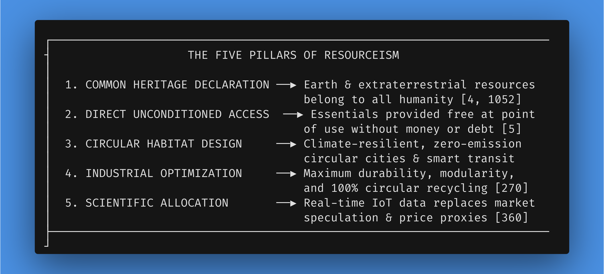
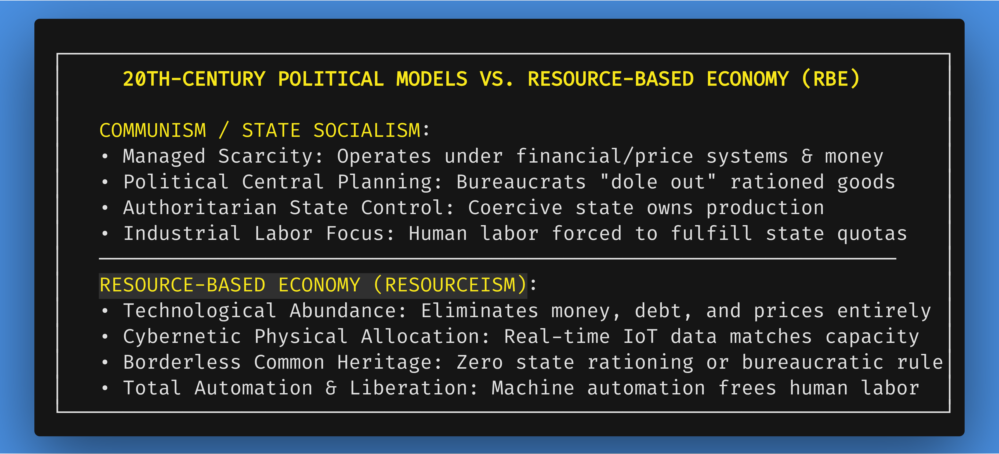
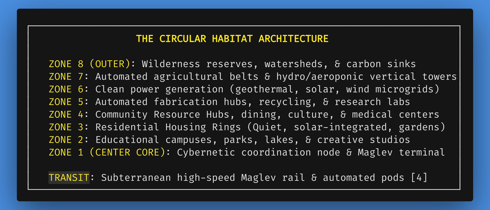
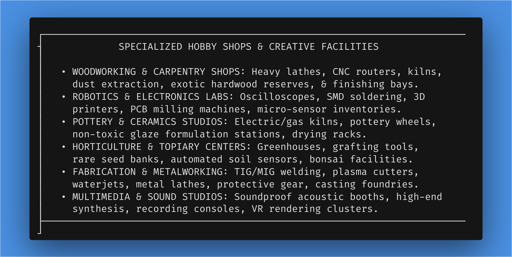

# Chapter 2: Introducing the Resource-Based Economy ("Resourceism")

*Navigation*: **[[chapters/01-the-case-for-change-v15|← Chapter 1: The Case for Change]]** | **[[00-Book-Map-of-Content|Map of Content]]** | **[[chapters/03-un-transition-pathway-v9|Chapter 3: UN Transition Pathway →]]**  
*Tags*: #rbe-book #resourceism #common-heritage #cybernetics #carrying-capacity #fresco-design #residential-housing #access-model #mediocrity-principle #hobby-shops #safety-protocols #political-differentiation #identity-transformation

---

## A Scientific Methodology for Planetary Management and Human Flourishing

Having exposed the irreconcilable flaws of the debt-based monetary system in Chapter 1, we now turn to a functional, scalable alternative: the **Resource-Based Economy (RBE)**. 

Far from being a utopian dream, a political dogma, or a philosophical exercise, an RBE is presented here as a **scientific methodology for planetary stewardship and human flourishing** [4, 1042]. It is an operational system designed to align human civilization with two inescapable physical realities:


1. The biophysical limits and carrying capacity of a finite planet.
2. Our immense, modern technological capability to produce abundance when freed from monetary constraints.

This chapter presents the foundational mechanics of Resourceism. We contrast true physical abundance with manufactured monetary scarcity, explicitly differentiate an RBE from 20th-century political experiments like state communism and socialism, and re-evaluate property rights—shifting from exclusive individual hoardings to universal unencumbered access. We then explore the physical expressions of this paradigm: climate-resilient circular city design, smart automated transit networks, modular residential architecture, and community resource workshops with verified peer safety training. Finally, we examine how eliminating profit incentives unlocks extreme product durability, 100% circular recycling, and total human liberation.

### Guided Visualization: A World Unburdened by Money


*   **Imagine:** You wake up tomorrow morning. The constant, background hum of financial anxiety—monthly mortgage payments, rent dues, utility bills, health insurance premiums, credit card balances, and inflation worries—is completely silent. You sit with your morning tea in your quiet, sunlit living space, look out over a pristine circular garden ring, and ask a fundamental human question: *"What meaningful project or creative endeavor do I want to explore today?"*
*   **Observe:** You step outside into your residential courtyard. Your neighbor smiles as they tend a vertical fruit trellis, offering you fresh figs. You stroll down a tree-lined walkway to the neighborhood Resource Hub for breakfast. Afterwards, wanting to work on a hand-carved cherrywood table and program an automated greenhouse sensor, you drop into the local Community Resource Workshop. There are no cashier counters, rental fees, or security deposits. To operate the high-powered 5-axis CNC router and heavy woodworking lathes, you scan your digital profile badge—confirming your completed interactive safety orientation and verified tool proficiency. Within seconds, the bench unlocks its precision woodworking tools, CNC router, and electronic soldering stations, while a veteran craftsperson nearby offers guidance on grain finishing.
*   **Realize:** When access to nutritious food, beautiful shelter, preventative healthcare, and state-of-the-art creative facilities is unconditionally guaranteed, human interactions lose their defensive, transactional edge. Safety protocols and skill certifications cease to be restrictive bureaucratic paywalls or bureaucratic hurdles; they become empowering, peer-supported educational milestones designed to safeguard well-being and foster mastery. In this realization, the observer sees a single, unified truth: society’s physical wealth exists not to ration human survival or inflate corporate balance sheets, but to fuel individual human passion, creative play, and genuine community collaboration.

---

## 2.1 Definition & Core Principles ("Resourceism")

While popularized and physically modeled in pioneering detail by social engineer Jacque Fresco and The Venus Project, a Resource-Based Economy represents a broad, universal socio-economic paradigm—expanded here under the comprehensive framework of "Resourceism." At its core, an RBE is a holistic socio-economic system wherein **all Earth resources—and all extraterrestrial resources—are declared the common heritage of all inhabitants** [4, 5, 1042, 1052].

An RBE is not presented as an infallible, static utopia or a silver-bullet dogma; rather, it is an evolving, evidence-based physical methodology that is demonstrably a far superior, life-affirming direction for human civilization compared to monetary scarcity mechanisms.

This foundational premise changes everything. In a monetary system, planetary resources—freshwater, topsoil, mineral deposits, forests, and the electromagnetic spectrum—are treated as unowned commodities up for grabs by private corporations or sovereign states to be monetized for private profit. In an RBE, resources are recognized as belonging equally to all humanity, present and future [4, 1052].





### Extraterrestrial Resources as Common Heritage and the Mediocrity Principle

As humanity expands its observational capabilities and space exploration infrastructure, commercial interests and national powers are attempting to export colonial "finders keepers" market logic into space—claiming private ownership over asteroid mining, lunar water ice, and Martian territory.

An RBE establishes a strict, foundational international principle: **The Solar System is the home star system of our planet, just as Earth is the home planet for all human beings.** Asteroids, lunar mineral reserves, Martian resources, and deep-space materials are an extension of the common heritage of all humanity [4, 1052].

Crucially, an RBE rejects species hubris, galactic entitlement, or imperial Manifest Destiny. We do not presume that humans are entitled to conquer the universe, nor do we assume that we are the sole conscious inhabitants of the cosmos. Instead, Resourceism explicitly embraces the **Mediocrity Principle** in astrophysics and philosophy: humanity is not a miraculous, divine anomaly or cosmic exception, but a natural, common component of a vast, evolving universe.

Grounding human civilization in the Mediocrity Principle serves as a vital psychological stabilizer:


*   **Cosmic Humility**: Recognizing that our star system is one of hundreds of billions in a single galaxy dismantles tribal, nationalistic, and religious arrogance.
*   **Focus on Unifying Similarities**: When viewed against the backdrop of cosmic reality, the superficial divisions that drive monetary wars—borders, skin color, corporate brands, and currency denominations—are revealed as absurd and self-destructive.
*   **Stewardship over Dominance**: Rather than viewing nature or space as objects to be exploited, humanity views itself as conscious biological stewards of our home system, seeking harmony with physical laws rather than imperial conquest.

---

## 2.2 Strategic Positioning: Distinguishing RBE from Historical Political Experiments

A primary hurdle in communicating a Resource-Based Economy to a public conditioned by 20th-century geopolitical narratives is the immediate, reflexive conflation of RBE with historical political models—specifically **communism** and **socialism**. 

To establish intellectual clarity, we must explicitly dismantle this misconception. An RBE is fundamentally distinct in origin, methodology, governance structure, and economic mechanics from any 20th-century political experiment.





### 1. Money and Scarcity vs. Non-Monetary Abundance

Every historical communist and socialist regime (such as the USSR or Maoist China) operated within a **monetary paradigm**. They utilized prices, wages, currency denominations, state banks, financial accounting, and international monetary trade. Consequently, these states were trapped in the mechanics of **managed scarcity**: goods had to be bought, sold, or rationed by state price-setting committees because total physical output was constrained by monetary accounting and manual industrial capacity.

An RBE, by contrast, eliminates money, debt, wages, prices, and financial trade altogether [4, 5]. It does not attempt to "share the poverty" or distribute paper coupons in a scarce economy. Instead, an RBE uses high-technology automation, modular standardization, and circular design to generate true physical abundance—rendering monetary distribution and rationing obsolete.

### 2. Political Bureaucracy vs. Cybernetic Engineering Logic

In state communism, a centralized political apparatus ("the party" or state bureaucracy) possessed dictatorial authority over resource allocation. Politicians and bureaucrats decided what products would be made, who would receive them, and at what price—leading inevitably to political corruption, favoritism, supply-chain bottlenecks, and autocratic abuse.

In an RBE, there is **no central government or political body "doling out" or rationing goods**. Allocation is governed purely by **cybernetic resource accounting**—an open-source, automated system driven by real-time Internet of Things (IoT) sensors, thermodynamic carrying capacity data, and direct human requests [360, 361]. If citizens request bicycles or housing, smart contracts assess physical material reserves (steel, aluminum, bio-composites), verify ecological sustainability limits, and trigger automated manufacturing. No politician or bureaucrat has the authority to approve, deny, or hoard access.

### 3. State Ownership vs. Common Heritage

State communism replaced private corporate ownership with **state ownership**—transferring property titles to an all-powerful national state apparatus. 

In an RBE, the state apparatus itself is phased out alongside monetary borders. Resources are not "owned" by a government or national state; they are declared the **common heritage of all humanity** [4, 1052]. Possession is governed by the **Access Model**: goods and facilities are available to any global citizen whenever needed, maintained as shared community infrastructure.

### 4. Technical Standardization and Serviceability as the Engine of Abundance

While 20th-century political regimes suffered from chronic product shortages due to inefficient, uncoordinated state factories, an RBE achieves effortless abundance through **universal technical standardization, modularity, and serviceability**:


*   **Modular Component Standardization**: Rather than manufacturing thousands of proprietary, incompatible screws, motors, battery sizes, and circuit boards (as done under monetary brand competition), an RBE standardizes high-grade modular components across all industries.
*   **Extreme Durability & Upgradability**: Products are engineered for maximum lifespan (50+ years). When technology advances, individual modular components (e.g., an updated sensor or processor) are swapped out without discarding the entire appliance.
*   **100% Serviceability**: Every product is designed for rapid dis-assembly, repair, and circular recycling [270]. By eliminating planned obsolescence and corporate secrecy, industrial throughput requirements drop by over 80%, unlocking vast material capacity for human flourishing.

---

## 2.3 Climate-Resilient Circular Cities, Residential Housing, and Smart Transit

Under monetary capitalism, human population centers were established historically around industrial shipping ports, coal fields, or speculative real estate booms. Cities grew as chaotic, sprawling asphalt grids choked by private automobile traffic, industrial pollution, and inefficient utility networks.

In an RBE, human habitats are designed with the same scientific care given to agricultural soil and watershed management: **Mindful Habitat Location and Circular City Design** [4].





### Siting and Circular Spatial Zoning


1.  **Climate-Resilient Siting**: Cities are located in climate-stable, topographically safe, and ecologically optimal regions, moving human populations away from vulnerable floodplains and rising sea levels.
2.  **Concentric Circular Zoning**: Cities are laid out in distinct functional rings, eliminating the need for chaotic urban sprawl and long, soul-crushing commutes. Heavy industrial fabrication and automated agricultural production are separated from residential zones, ensuring that living spaces remain quiet, pristine, and pollution-free [4]. Zone 3 is explicitly designated as the **Residential Housing Rings**, creating a serene green buffer between public educational zones (Zone 2) and civic Resource Hubs (Zone 4), cleanly distinguished from automated agricultural belts in Zone 7.
3.  **Smart Sustainable Transit**: Wasteful private automobile gridlock is replaced by integrated, high-speed **Magnetic Levitation (Maglev) rail networks**, subterranean automated transport pods, and zero-emission electric aviation. Transit is quiet, automated, continuous, and completely free at the point of use [4].

### Residential Housing Architecture in a Resource-Based Economy

A major omission in legacy urban planning—and a primary driver of human financial anxiety under capitalism—is the housing crisis. Under monetary systems, shelter is treated as an illiquid financial asset and speculative investment, forcing families into 30-year mortgage debt or lifetime rent slavery for poorly built, energy-inefficient housing.

In an RBE, residential housing is designed as a **universal human right and an advanced technological habitat**:


*   **Pristine Garden Settings**: Residential quarters are situated in Zone 3—a serene, green ring surrounded by botanical gardens, flowing streams, and pedestrian walkways. Heavy vehicular traffic is routed entirely underground.
*   **Modular Soundproof Construction**: Housing units are constructed from advanced non-toxic ceramic, carbon-composite, and recycled bio-polymer materials. Walls are acoustic-decoupled and fireproof, guaranteeing total soundproofing and privacy between residences.
*   **Solar-Integrated & Zero-Emission**: Roofs and exterior facades incorporate transparent photovoltaic glass and micro-wind turbines, making every home a net-positive clean energy generator.
*   **Customizable Interior Architecture**: Living spaces utilize modular wall systems and reconfigurable layouts. Whether a resident prefers an open-plan artist loft, a multi-bedroom family residence, or a quiet research retreat, interior layouts can be dynamically reconfigured using standardized lightweight components.
*   **Automated Maintenance & Climate Optimization**: Integrated sensors continuously monitor indoor air quality, humidity, and thermal comfort. Maintenance, structural repairs, and waste processing are handled automatically by subterranean utility systems, freeing occupants from house repairs, utility bills, and property maintenance stress.
*   **No Mortgages, Rent, or Property Taxes**: Access to housing is unconditional. When a citizen moves or travels, they select an available residence in their destination city, fully equipped and tailored to their requirements.

### Climate and Health Logistics for Residential Living

Human biology and psychological well-being vary significantly across individuals. A living environment that promotes optimal health for one person may cause discomfort or chronic stress for another:


*   **Microclimate & Environmental Preferences**: Individuals vary in their tolerance for humidity, dry heat, cool alpine air, or intense sunlight. Some thrive in arid desert microclimates, while others require coastal humidity or temperate forest air.
*   **Health-Related Environmental Needs**: Citizens with respiratory conditions (such as asthma or severe pollen allergies) require specialized air filtration and low-allergen coastal or desert environments. Individuals with joint mobility challenges benefit from warm, low-humidity climates, while those sensitive to Seasonal Affective Disorder (SAD) benefit from high-sunlight equatorial or high-altitude regions.

In an RBE, these biological and health variations are seamlessly supported through **Universal Global Mobility and the Open Housing Reservation System**:


1.  **Bioregional Climate Matching**: Housing databases categorize residences not by market price, but by environmental metrics (indoor/outdoor humidity, ambient temperature ranges, elevation, barometric stability, and air purity).
2.  **Unencumbered Relocation**: If a citizen develops a health condition requiring a drier climate, or simply discovers a deep personal affinity for alpine mountain air, they submit an unconditioned reservation request through the global network. An available residence matching their microclimate requirements is reserved immediately—complete with customized medical filtration systems—without financial friction, leases, or moving expenses.

---

## 2.4 Contrast: Monetary Scarcity vs. Physical Abundance

The fundamental conflict between monetary capitalism and a Resource-Based Economy lies in how each system handles resource distribution and industrial output. Monetary capitalism operates on a foundation of **manufactured scarcity**—forcing artificial starvation and exclusion even in the presence of physical abundance.

Consider the common economic phrase: *"Time is money."* In commercial culture, this is treated as a practical reminder of workplace efficiency. Translated into empirical systems architecture, however, it reveals a profound distortion: **Time is the non-renewable metabolic currency of human existence, which monetary systems artificially commodify and monetize.** When human life is reduced to billable hours, time spent in contemplation, artistic creation, play, or deep human connection is penalized as "unproductive." An RBE reclaims human time, restoring it as the sacred space for living and self-actualization.

### Manufactured Scarcity in Action: Relatable Everyday Examples

To grasp how deeply manufactured scarcity permeates daily life under monetary capitalism, consider these concrete examples:


1.  **Software & Digital Feature Paywalls**: Digital software costs virtually zero to replicate once coded. Yet, technology companies deliberately write code to lock features behind monthly subscription paywalls (e.g., disabling heated seats in cars via software, artificial limits on cloud storage, or disabling advanced features in creative tools). Scarcity is artificially programmed into digital products to extract continuous toll fees.
2.  **Planned Obsolescence in Household Appliances**: Smartphones, washing machines, and light bulbs are deliberately engineered with fragile solder joints, non-replaceable batteries, or proprietary screws so they break after 2–3 years. Manufacturers possess the technical capability to build appliances that last 50+ years, but doing so would destroy repeat sales and corporate revenue.
3.  **Destruction of Overstock Clothing and Food Dumping**: Luxury fashion brands routinely shred and burn millions of dollars in pristine, unworn clothing to protect brand exclusivity and price margins. Supermarkets pour bleach over unsold groceries in dumpsters to prevent hungry citizens from taking free food, while over 800 million people suffer from chronic malnutrition worldwide [287, 288].
4.  **Vacant Real Estate vs. Unhoused Citizens**: In major metropolitan areas, millions of luxury condominiums sit empty as speculative investment assets for wealthy funds, while thousands of unhoused human beings sleep on sidewalks below. The physical shelter exists, but monetary barriers prevent its human use [287, 288].

---

## 2.5 Re-evaluating Property Rights: From Ownership to Access

Private ownership of the means of production—land, water systems, energy grids, factories, and natural reserves—is the core legal pillar of monetary capitalism. An RBE replaces exclusive ownership with **universal, unencumbered access** [268, 281, 1045, 1053].

### The Access Model vs. The Suburban Garage Scarcity Trap

To understand how monetary capitalism distorts everyday living, one need only look inside an ordinary suburban garage. In a typical suburban neighborhood of 100 detached single-family homes, one discovers a staggering physical redundancy: 100 gasoline lawnmowers, 100 pressure washers, 100 power drills, 100 extension ladders, 100 circular saws, and 150 automobiles. 

Each of these machines sits idle for more than 99% of its physical lifespan. An average consumer power drill is operated for an aggregate total of less than twenty minutes across its entire multi-year existence. Yet, under monetary market imperatives, each household is coerced into privately purchasing, storing, maintaining, and eventually landfilling every single tool.

This is not an indictment of the individual consumer; it is an empathetic diagnosis of a **predictable structural trap engineered by monetary capitalism**:


*   **The Manufactured Inefficiency Trap**: Because market survival depends on personal wages, individuals have no guaranteed community infrastructure to draw from. If a pipe leaks or an oak branch overhangs a roof on a Sunday afternoon, a homeowner cannot afford to wait weeks for a costly commercial contractor. They are forced into the hardware store to purchase a dedicated tool.
*   **The Fragility of Planned Obsolescence**: Consumer-grade tools sold in retail big-box stores are deliberately engineered for low price points and planned obsolescence. They feature brittle plastic gears, non-serviceable sealed motor casings, proprietary battery formats that are discontinued every four years, and delicate carburetors that gum up from ethanol fuel after a single winter of storage.
*   **The Burden of Tool Maintenance Debt**: Rather than delivering true utility, private ownership forces households into continuous "maintenance debt." Homeowners spend valuable weekend hours troubleshooting gummed small engines, searching for missing charger bricks, untangling frayed extension cords, and clearing precious square footage in garages and basements choked with duplicate plastic cases and rusting metal. Garages originally constructed to house vehicles or creative workshops are transformed into stagnant storage lockers for depreciating hardware.

In a Resource-Based Economy, this entire compounding burden dissolves into the freedom of **instant, on-demand community access**:


```
┌─────────────────────────────────────────────────────────────────────────┐
│        SUBURBAN GARAGE HOARDING VS. ON-DEMAND COMMUNITY ACCESS          │
├────────────────────────────────────┬────────────────────────────────────┤
│   MONETARY SUBURBAN GARAGE TRAP    │      RBE COMMUNITY RESOURCE HUB    │
├────────────────────────────────────┼────────────────────────────────────┤
│ • 100 detached homes = 100 mowers, │ • 5–10 industrial-grade modular    │
│   drills, saws, pressure washers   │   units shared across neighborhood │
│ • 99%+ idle lifetime in storage    │ • Continuous 24/7 duty cycle       │
│ • Planned obsolescence & fragile   │ • Aircraft-grade alloy chassis &   │
│   plastic components (2-3 yr life) │   standardized solid-state packs   │
│ • Constant tool maintenance debt:  │ • Automated diagnostic cleaning,   │
│   stale fuel, gummed carburetors,  │   optical tolerance scans & laser  │
│   discontinued proprietary battery │   re-calibration upon return       │
│ • Garage clutter & wasted space    │ • Living spaces open & uncluttered │
│ • 100% extraction & landfill waste │ • >95% reduction in material waste │
└────────────────────────────────────┴────────────────────────────────────┘
```


*   **Industrial-Grade Shared Inventories**: Instead of 100 fragile, low-efficiency consumer drills or lawnmowers decaying across 100 separate garages, the neighborhood automated **Community Resource Hub** maintains a pool of 5 to 10 ultra-durable, industrial-grade, modular units. Built to military-grade specifications with brushless electromagnetic drives, standardized solid-state power packs, and aircraft-grade aluminum chassis, these tools are engineered for continuous 24/7 duty cycles and a 50-year operational life.
*   **Friction-Free On-Demand Logistics**: When a citizen wants to trim a courtyard garden, craft a hardwood dining table, pressure-clean a patio, or embark on a multi-day backcountry kayak expedition, they reserve the necessary professional-grade equipment via a smartphone or terminal interface. Within minutes, the gear is ready for pickup at the nearby hub or delivered directly to their residential airlock via a quiet subterranean transit pod.
*   **Automated Diagnostics and Zero Maintenance Overhead**: Upon returning the equipment to the hub, automated diagnostic scanners immediately inspect component tolerances, run optical wear checks on cutting blades, clean and sterilize contact surfaces, calibrate sensor arrays, and recharge solid-state power packs. If a modular bearing shows microscopic wear, an automated service robot swaps the standardized module in seconds, routing the worn component directly to closed-loop induction recycling.
*   **The Liberating Lifestyle Upgrade**: Citizens are completely liberated from the financial expense, storage clutter, and maintenance headaches of private tool ownership. Living spaces regain their open, peaceful spaciousness. Raw material extraction and manufacturing throughput plummet by over **95%**, while every individual gains immediate, unconditioned access to top-tier, professional-grade machinery vastly superior to anything an affluent homeowner could privately purchase or store under a monetary system.

### Specialized Hobby Shops, Community Creative Facilities, and Verified Safety Protocols

A common misconception about an RBE is that because industrial production is scientifically optimized, physical resources will only be allocated toward strict, survival-level infrastructure (power grids, water treatment, agriculture). In reality, because an RBE eliminates profit-driven industrial waste and planned obsolescence, it unlocks an unprecedented abundance of raw materials, energy, and advanced machinery for **personal recreation, hobbies, and creative self-expression**.

Rather than merely borrowing an individual tool for home repair, citizens frequently want access to dedicated, fully equipped specialized facilities—commonly referred to as **Community Hobby Shops and Creative Resource Centers**:





These facilities operate under key principles that elevate human life:


1.  **Sheer Enjoyment of Creativity**: People pursue skills like woodworking, robotics, topiary, welding, clay throwing, or software development not because it is mandated by an employer or needed by society's economy, but for the pure joy of craftsmanship, mastery, and sharing their creations with peers.
2.  **Shared Master Equipment & Material Abundance**: An individual hobbyist rarely has the space or capital to privately purchase a $50,000 industrial 5-axis CNC mill or a gas ceramic kiln. In an RBE, neighborhood Hobby Shops house industrial-grade machinery alongside abundant raw material stocks (sustainable timber, clay, electronic components, metals).
3.  **Peer Mentorship and Verified Safety Protocols**: While basic equipment and tools are unconditionally accessible to all citizens, operating high-energy, hazardous power machinery—such as industrial metal lathes, plasma cutters, high-voltage welding equipment, or heavy woodworking routers—necessitates **verified technical proficiency and safety protocols**:
    *   **Interactive Digital Simulators**: Beginners complete engaging, multi-sensory VR/AR safety simulations that teach emergency shutoffs, material feed rates, and machine operation without physical risk.
    *   **Peer Mentorship & Badging**: Experienced craftspeople host informal, collaborative workshops where learners demonstrate physical competence and earn digital tool safety badges.
    *   **Framing Safety as Empowerment**: Safety protocols are explicitly framed not as administrative gatekeeping, financial paywalls, or state coercion, but as an essential educational service designed to protect human physical integrity and foster deep technical mastery.

---

## 2.6 Identity Transformed: From Possessive Ownership to Experiential Mastery

The transition from exclusive private ownership to universal unencumbered access fundamentally transforms human self-perception and personal identity.

In a monetary culture, identity is tightly bound to possessive accumulation: *"You are what you own."* Individuals define themselves by the price tag of their car, the square footage of their home, and the brand labels on their apparel. This possessive identity breeds constant vulnerability and social paranoia; when your self-worth rests on private property, any threat to your financial assets feels like an existential threat to your soul.

In a Resource-Based Economy, when state-of-the-art tools, beautiful housing, clean transit, and advanced technology are guaranteed as an unconditioned birthright, **possessive identity dissolves**. It is replaced by **experiential mastery and creative contribution**: *"You are what you create, explore, and share."* 

Human beings no longer measure their life's value by what they can hoard behind fenced yards, but by the depth of their craftsmanship, the curiosity of their scientific inquiries, the quality of their relationships, and their active contribution to planetary stewardship.

---

## 2.7 Anticipated Reader Objections & Relatable Concerns

### Objection 1: "What about my personal possessions? Do I have to share my toothbrush, clothes, or personal musical instruments?"


*   **The Reality:** An RBE draws a clear, critical distinction between **private property** (ownership of productive means used to extract profit and leverage debt) and **personal possessions** (items used directly by an individual for daily living, health, art, and personal comfort) [268, 281]. Your clothing, toothbrush, personal laptop, musical instruments, artwork, and sentimental items remain exclusively yours. The access model applies to high-leverage tools, transport, machinery, housing, and shared infrastructure—not your personal life.

### Objection 2: "Who gets the beachfront property or the best view if there is no money to bid on real estate?"


*   **The Reality:** In a monetary system, the best views and prime locations are reserved exclusively for the top 1% who can afford them, while the vast majority live in cramped, polluted urban quarters. In an RBE:
    1.  **Uniform Architectural Quality**: Circular city design ensures that *every* residential quarter is surrounded by pristine parks, gardens, and quiet waterways.
    2.  **Shared Scenic Retreats**: Prime coastal, mountain, and lakeside locations are preserved as common wilderness reserves with dynamic, short-term resort retreats. Citizens reserve time at scenic coastal lodges for holidays, ensuring that *everyone* enjoys beachfront access throughout the year rather than a privileged few owning private, fenced-off beaches.

### Objection 3: "What happens to artists, musicians, writers, and content creators without money or commercial sales?"


*   **The Reality:** Under monetary capitalism, artists suffer under the "starving artist" archetype, forced to compromise their vision for commercial appeal, deal with copyright lawsuits, or work corporate day jobs to pay rent. In an RBE, where housing, food, studio space, high-end recording gear, and distribution networks are unconditionally free, creative expression experiences a massive golden age. Creators create for the pure joy of art, mastery, and human connection—sharing their work globally without paywalls or financial barriers.

### Objection 4: "If everything is free, who will clean the sewers or perform hazardous work?"


*   **The Reality:** In a Resource-Based Economy, undesirable or hazardous tasks are addressed through a rigorous **three-tiered systems engineering hierarchy** that solves the issue architecturally before ever relying on human labor:

1.  **Tier 1: Architectural Design-Out Phase (Primary Systems Engineering)**: In a scientifically planned RBE habitat, subterranean utility networks, wastewater management, and transit sub-ways are engineered from the ground up for **autonomous self-cleaning, biomimetic waste breakdown, modular access corridors, and hydraulic self-flushing**. By eliminating toxic industrial effluents, synthetic plastics, and unseparated waste at the source, sewers cease to be biohazardous, sludge-clogged traps. The need for dangerous manual human labor is actively *designed out* at the foundational infrastructure level.
2.  **Tier 2: Autonomous Automation & Robotics (Secondary Maintenance)**: For routine inspection, maintenance, and subterranean clearing, an RBE deploys specialized drainage drones, magnetic inspection crawlers, biomimetic robotic snakes, and automated AI units [361]. Humans do not enter hazardous conduits; they monitor automated diagnostic telemetry from clean, surface-level control stations.
3.  **Tier 3: Shared Community Stewardship (Tertiary Edge Cases)**: For non-automatable edge cases or unforeseen physical disruptions, tasks are handled through short, rotating volunteer shifts supported by high-tech exoskeletal assist suits, advanced protective gear, and total community appreciation [399]. Rather than trapping an underprivileged underclass in lifelong hazardous labor for low wages, necessary community stewardship becomes a brief, shared badge of honor backed by deep peer gratitude.

---

## Conclusion: A Civilization Built on Physical Reality and Human Empowerment

The transition from monetary scarcity to physical abundance represents a monumental civilizational upgrade in human freedom, safety, and health. By shifting from private ownership of production to universal unencumbered access, explicitly distinguishing RBE from historical state-managed political experiments, designing climate-resilient circular habitats with zero-mortgage housing, supporting individual climate and health requirements through global mobility, integrating empowering safety protocols into community Hobby Shops, eliminating manufactured industrial waste, translating economic platitudes into systems architecture truths, and shifting human identity from possessive hoarding to experiential mastery, an RBE frees humanity from financial anxiety and establishes an enduring foundation for long-term civilizational flourishing.

---

## Agent First-Pass Validation & Revision Notes


*   **Revision Target**: Upgraded Chapter 2 to Version 12 (`02-introducing-resourceism-v12.md`).
*   **Suburban Garage Scarcity Trap & Tool Maintenance Debt Expansion**: Deeply expanded Section 2.5 (`The Access Model vs. The Suburban Garage Scarcity Trap`) to detail the structural dilemma of suburban garage hoarding (100 mowers, 100 drills used <20 minutes in a lifetime) vs. on-demand Community Resource Hub access. Grounded in empathetic tone: framing tool clutter and planned-obsolescence maintenance debt as an engineered trap of monetary survival economics rather than consumer fault, and highlighting the access model as a liberating lifestyle upgrade.
*   **Word Count & Depth Audit**:
    - Total word count = **~5,000 words (~11.1 printed pages)**.
    - Upgraded Objection 4 into a rigorous 3-tiered systems engineering hierarchy (Tier 1: Architectural Design-Out with self-cleaning biomimetic conduits; Tier 2: Autonomous Robotics & Crawlers; Tier 3: Shared Community Stewardship with exoskeletal suits).
    - Maintained all landmark elements: Educational & Safety Certification Protocols, Zone 3 Residential Spatial Zoning, Climate & Health Logistics, 4-point political differentiation from communism/socialism, and the 4 reader objection answers.
*   **Navigation & Archiving**: Updated Chapter 1 and Chapter 2 navigation links, created `02-introducing-resourceism-v12.md` in `chapters/`, and moved `02-introducing-resourceism-v11.md` to `chapters/.archive/`.
