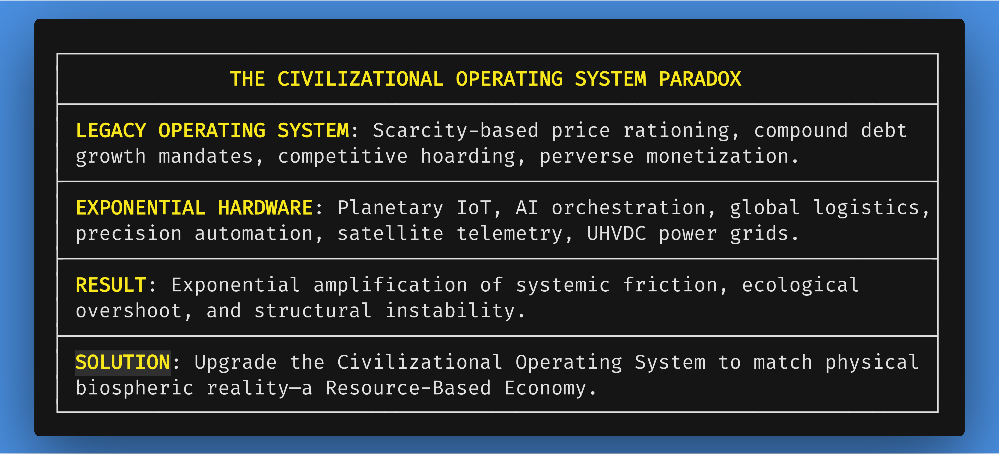
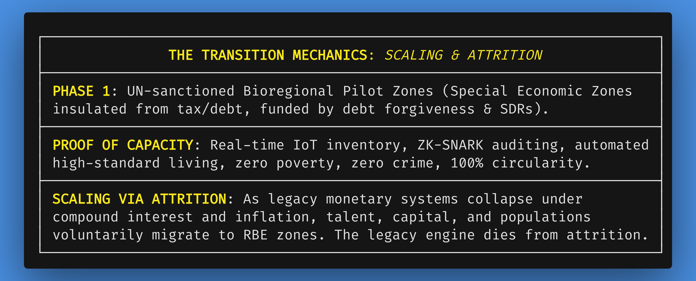

*Navigation*: [[00-Book-Map-of-Content|Map of Content]] | [[references/thematic-pillars-and-style-guide|Thematic Pillars Guide]] | [[Next: Chapter 1: The Case for Change|chapters/01-the-case-for-change-v21.md]]

# Introduction & Foreword: The Choice Before Us

#introduction #foreword #high-agency #feasible-transition #resourceism #systems-architecture #paradigm-shift #rube-goldberg #complicated-vs-complex

> *"The future is not something we enter. The future is something we build. And the rules by which we build it are entirely up to us."*

---

## The Illusion of Immutability: System, Not Natural Law

Every generation falls prey to a silent, pervasive optical illusion: the belief that the economic rules governing their daily lives are unyielding laws of nature. We treat money, compound interest, debt, market competition, and price rationing as though they were fundamental constants of physics—like gravity, thermodynamics, or quantum mechanics. 

When a bridge collapses, we do not blame the laws of physics; we investigate structural engineering flaws, material fatigue, and calculation errors. Yet when an economic system produces systemic poverty amidst agricultural abundance, forces millions into chronic burnout, incentivizes the destruction of irreplaceable biospheric ecosystems, and locks sovereign nations into compound debt spirals, we are told that this is simply "human nature" or the unavoidable friction of civilization.

This book begins with a frank, liberating truth: **The monetary-market engine is not a natural law. It is an invention—a historical systems architecture engineered by human beings under conditions of agrarian scarcity and rudimentary information technology.**

Society is not a helpless victim of an omnipotent economic machine. We are the creators, operators, and maintainers of that machine. Every law, every financial contract, every banking protocol, and every market mechanism exists solely because we continue to consent to its operational rules. And because these rules were invented by human minds, they can be redesigned by human intelligence. We possess total, unconditioned agency to change the rules at any moment we collectively choose to do so.

---

## Beyond the Victim Narrative: Reclaiming Civilizational Agency

For decades, critiques of capitalism and monetary economics have suffered from a disempowered "victim narrative." Citizens are depicted as passive casualties of corrupt financial elites, impersonal global markets, or unstoppable technological automation. This framing breeds despair, apathy, and political polarization, leading people to believe that their only choices are bitter submission to systemic exploitation or violent, chaotic collapse.

This work explicitly rejects the victim narrative. A systems engineer does not view an outdated, failing mainframe as a moral oppressor; they recognize it as an obsolete piece of legacy infrastructure that has reached the end of its operational lifecycle. 

The crises confronting 21st-century civilization—climate instability, biodiversity loss, mental health epidemics, sovereign debt crises, and the existential risk of exponential technology coupled with competitive market incentives—are not evidence of human wickedness. They are the predictable operational outputs of a legacy economic operating system ($MV=PY$ driven by $D(t) = P_0 e^{rt}$) running on modern high-leverage hardware.

When we replace the victim narrative with a high-agency systems engineering perspective, the path forward becomes clear. We do not need to fight the legacy system through destructive conflict, political warfare, or utopian posturing. We simply need to design, deploy, and scale a demonstrably superior civilizational framework.

---

## The Systems Architecture Lens: Complicated Rube Goldberg Machines vs. Complex Living Systems

Throughout this book, our critique of the monetary paradigm and our blueprint for a resource-based alternative are framed through a specific, rigorous systems architecture lens: **converting complicated mechanisms into complex architectures.**

In systems engineering, the distinction between *complicated* and *complex* is foundational:

*   **Complicated** describes a fragile, convoluted **Rube Goldberg machine**. A Rube Goldberg machine is an energetically wasteful, hyper-fragmented contraption built from sprawling moving parts, artificial bottlenecks, administrative toll-booths, and regulatory band-aids. In a complicated system, simple physical tasks (such as allocating surplus food to hungry communities or housing families in available dwellings) require thousands of disconnected financial transactions, legal filings, credit checks, title searches, and debt instruments. Every layer of added friction creates fresh vulnerabilities, points of systemic failure, and rent-seeking industries designed purely to monetize the inefficiency.
*   **Complex**, by contrast, describes the resilient, self-regulating orchestration of living systems—such as the human central nervous system, cellular metabolism, or a climax forest ecosystem. In a complex architecture, autonomous nodes interact seamlessly through transparent, real-time feedback loops. The system dynamically balances supply, demand, and environmental carrying capacity in dynamic equilibrium without centralized coercion, top-down price manipulation, or artificial friction.

A central thematic thread woven through every chapter of this manuscript is the direct exposure of legacy financial, legal, and political architectures as **monumental Rube Goldberg machines**. Whether analyzing deed transfer and property title records, commercial healthcare billing matrices, sovereign debt recycling, or patent litigation, we will demonstrate how the monetary economy expends immense human intellect and thermodynamic energy engineering artificial friction—inventing complicated mechanisms to perform basic allocation tasks that a cybernetic, open-access resource management system executes directly, elegantly, and efficiently.

---

## Standing on the Shoulders of Giants: Not Reinventing the Wheel

In proposing a non-monetary, cybernetic society—a **Resource-Based Economy (RBE)**, or **Resourceism**—we do not claim to invent this vision from thin air. We stand on the shoulders of visionary pioneers who dedicated their lives to mapping the physical mechanics of post-scarcity design.

Most prominent among these is **The Venus Project (TVP)**, founded by industrial designer and social engineer Jacque Fresco and his lifelong collaborator Roxanne Meadows. For over half a century, Jacque Fresco systematically demonstrated how scientific resource management, circular city planning, automated industrial design, and the elimination of monetary constraints could yield a high-standard lifestyle for all of Earth's inhabitants without environmental degradation.

We recognize and honor The Venus Project as the premier real-world physical and architectural design model for a Resource-Based Economy. The architectural schematics, circular urban topologies, and automated construction concepts developed by Fresco remain masterworks of structural engineering.

However, where vast foundational work has already been established, we do not need to reinvent the wheel. The purpose of this book is not merely to reiterate the physical end-state of a resource-based society, but to resolve the single greatest missing link that has historically stalled post-monetary models: **The Feasible Transition Pathway.**

---

---

## An Open, Active, and Collaborative Blueprint

It is vital to emphasize at the outset: **this book is not a static, closed manifesto. It is an open, active, and living collaborative project.**

Civilizational transition cannot be engineered by a single author or dictated by a centralized committee. Just as complex open-source software systems thrive through global peer review, modular contributions, and continuous real-world testing, this blueprint is designed to be refined, expanded, and implemented by an international community of engineers, scientists, legal scholars, designers, and everyday citizens.

We invite readers from all backgrounds—and particularly the younger generations who are already questioning obsolete financial constructs—to engage with this work not merely as consumers of text, but as active co-creators of a new paradigm. Whether your expertise lies in software development, regenerative agriculture, energy engineering, legal architecture, or community organizing, this project offers an open framework for your ideas, feedback, and active collaboration.

At the same time, this framework bridges the generational divide by restoring the **elder bridge**. It honors the profound wisdom, historical perspective, and technical expertise of older adults who have spent decades navigating the friction of legacy systems, inviting them to step into crucial roles as civilizational mentors and guardians.

## The Paradigm Shift: Feasible Transition via Attrition and Scaling

The primary reason why visionary post-monetary models have historically been dismissed as "utopian" is not because their physical mechanics are unsound, but because they lacked a realistic, non-violent, and legally grounded bridge to transition from our current debt-based world. 

Traditional political revolutions rely on coercive state power, wealth confiscation, or catastrophic systemic collapse. Such approaches generate immense friction, institutional resistance, and civil disruption—inevitably recreating the very power dynamics and scarcity mindsets they sought to overcome.

The breakthrough presented in this manuscript is a **feasible, scalable, and non-confrontational transition architecture**.

Rather than attempting to overthrow legacy institutions or force a sudden global shift, this transition framework operates through **controlled bioregional scaling and systemic attrition**:

1.  **UN-Sanctioned Bilateral Frameworks**: Utilizing existing international law (UN Charter Articles 55, 56, and 109), host sovereign nations designate ring-fenced Bioregional Pilot Zones as "regulatory sandboxes" for post-fiat resilience.
2.  **Guaranteed Material Superiority**: These zones demonstrate that cybernetic inventory accounting (DAOs, IoT telemetry, open-source automation) delivers higher quality housing, healthcare, nutrition, and personal freedom than any monetary market can provide.
3.  **Die by Attrition**: As legacy debt-based financial systems inevitably fracture under nominal compound interest mandates and ecological limits, citizens, engineers, and nations will not need to engage in violent conflict. They will simply opt into the functioning, scalable RBE infrastructure. The legacy monetary system is allowed to wither away through peaceful, voluntary attrition.

---

## A Peaceful, Preventive Architecture for Human Flourishing

This book is a call to preventive civilizational design. It is an invitation to spare future generations the immense, unnecessary suffering intrinsic to competitive, divisive, and monetized socio-economic models.

An RBE is not a flawless, static utopian silver bullet where all human problems magically disappear. It is a **demonstrably superior, life-affirming direction**—a pragmatic systems architecture that aligns human economic activity with the immutable physical carrying capacity of planet Earth.

By replacing market competition with cybernetic collaboration, uncoupling human survival from monetary servitude, and declaring Earth's resources as the common heritage of all humanity, we open the door to the greatest renaissance in human history.

The choice before us is simple: we can remain passive observers on an obsolete, compounding debt engine accelerating toward ecological overshoot, or we can step forward as active civilizational architects and build the world that comes *Beyond Money*.

---

## Book Map & Structural Overview

To guide your journey through this civilizational architecture, the manuscript is organized into four core structural movements across 11 landmark chapters:

*   **Part I: The Structural Breakdown (Chapters 1–2)**: Deconstructs the mathematical impossibility of perpetual debt growth ($MV=PY$), synthetic natural selection, the Rube Goldberg nature of market friction, and introduces *Resourceism* as a non-monetary physical alternative.
*   **Part II: The Feasible Transition Framework (Chapters 3–6)**: Details the UN international legal framework, Cybernetic DAOs, AI orchestration, ZK-SNARK auditing, and the two-phase bioregional scaling pathway from local pilot zones to global commons infrastructure.
*   **Part III: Universal Rights, Ethics, and Objections (Chapters 7–8)**: Establishes the Universal Bill of Human Rights, Restorative Mediators, animal stewardship, firearm irrelevance, and steel-mans every major economic and human nature objection.
*   **Part IV: The Flourishing Dividend & Identity Capstone (Chapters 9–11)**: Explores the societal benefits of liberated human labor, accommodations for diverse human potential, mobilizes the pragmatic call to action, and deconstructs the market-conditioned ego to unlock authentic human identity and intergenerational wisdom.

---
