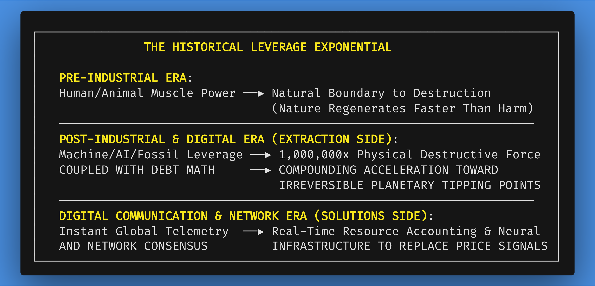
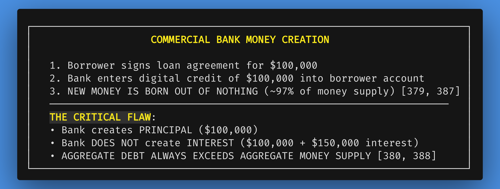
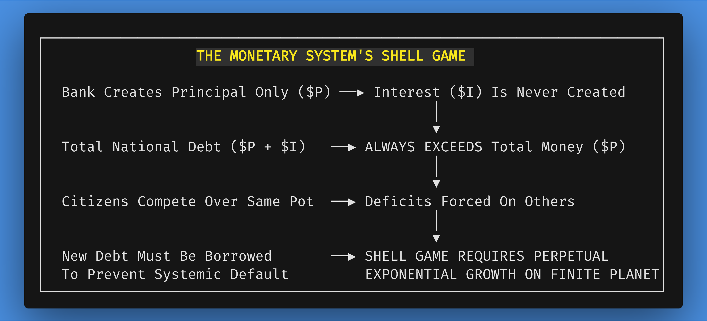
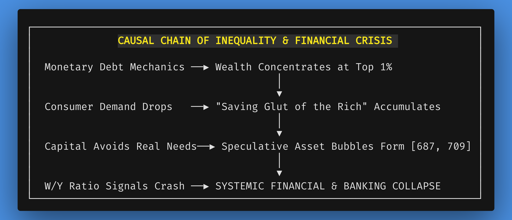
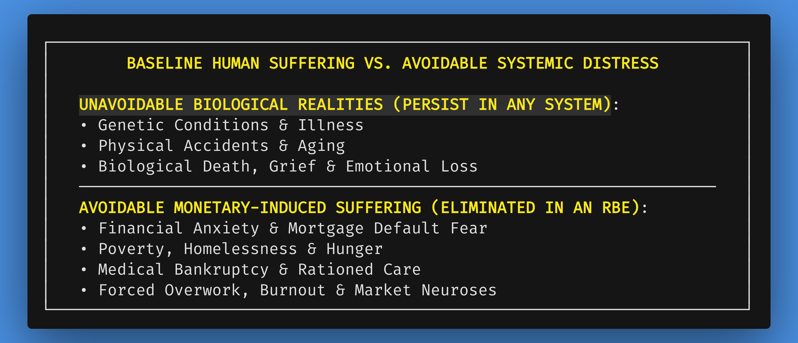
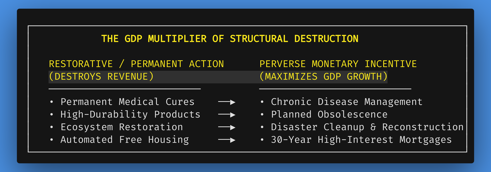
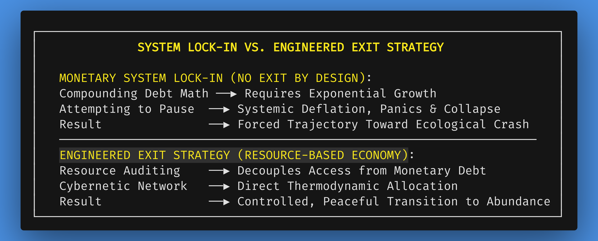

# Chapter 1: The Case for Change: Structural Failures of the Monetary Paradigm

*Navigation*: **[[00-Book-Map-of-Content|Map of Content]]** | **[[references/thematic-pillars-and-style-guide|Thematic Pillars Guide]]** | **[[chapters/02-introducing-resourceism-v13|Chapter 2: Introducing Resourceism →]]**  
*Tags*: #rbe-book #monetary-critique #debt-math #synthetic-selection #technological-leverage #mental-health #health-paradox #catastrophe-insurance #revolving-door #open-innovation #case-building #peter-principle #monetized-self #exit-strategy #founding-intent #systemic-mistrust #demographic-shifts #systems-architect #complicated-vs-complex #rube-goldberg #deed-fraud #use-access

---

## The Systems Architect Lens: Complicated vs. Complex

A viable future for human civilization will not be negotiated into existence by politicians, enforced by military power, or financed through banking syndicates. It must be engineered by systems architects, scientists, and designers who understand physical reality, thermodynamic laws, and ecological feedback dynamics.

As a systems architect working in healthcare, my professional focus is dedicated to a precise and vital discipline: **converting the complicated into the complex.** 

In systems theory, this distinction is foundational:

*   **Complicated** describes a fragile, convoluted **Rube Goldberg machine**. It is a sprawling tangle of moving parts, artificial friction, duplicitous administrative effort, bureaucratic obstacles, and coerced decision-making—where every patch introduces new vulnerabilities, failure points, and maintenance overhead to protect sectional monetary interests.
*   **Complex**, by contrast, represents the elegant, resilient orchestration of living anatomy—like the human brain, the central nervous system, or a mature forest ecosystem. In a complex system, diverse, autonomous nodes interact harmoniously through transparent feedback loops, self-regulating in dynamic equilibrium with their environment without centralized coercion or artificial scarcity.

Living and working daily within the deep structural inefficiencies of our current socio-economic paradigm—frequently witnessing duplicitous administrative effort, bureaucratic delays that stall life-saving care, perverse billing machineries, and coerced institutional decision-making—lends an unvarnished, empirical legitimacy to this thesis. We do not need to layer more complicated administrative band-aids onto an obsolete, failing economic engine. We need to step back, recognize the structural flaws of our legacy paradigm, and architect a truly complex, self-balancing civilizational operating system.

---

## The Unseen Architecture of Crisis: Money, Debt, and Planetary Limits

Humanity stands at a critical juncture in its evolutionary narrative, caught in an accelerating cascade of simultaneous crises. We witness widening wealth gaps, planetary ecological collapse, chronic mental and physical health epidemics, persistent poverty amid unprecedented technological capacity, and recurring geopolitical strife over dwindling natural reserves.

When confronted with these systemic breakdowns, public discourse, political rhetoric, and mainstream economic analysis almost universally treat them as isolated, accidental defects. We are told that poverty is a failure of individual work ethic or localized education; that environmental destruction is caused by consumer carelessness; that financial panics are triggered by rogue speculators or inadequate banking regulations; and that wars are caused by ideological villainy.

This book advances a fundamentally different thesis: **These crises are neither accidental oversights, temporary lapses in policy, nor the result of innate human flaws. They are the predictable, mathematically guaranteed, and structural outcomes of an economic engine built on debt-based fiat money and forced perpetual growth on a finite planet.** 

The invisible architecture of our monetary paradigm—invisible precisely because it is the background environment in which we are conditioned to operate—predetermines these destructive results. Just as a casino game is mathematically engineered so that the house always wins over time, our monetary architecture is engineered to guarantee wealth concentration, ecological depletion, mental health erosion, and social friction. To halt the breakdown of human civilization, we must look past superficial symptoms, cut through deep-seated cultural conditioning, and dismantle the hidden machinery pulling the levers.

### Common Idioms Translated into Systems Architecture

For generations, common folk wisdom and cultural platitudes have expressed this underlying truth in phrases that are routinely dismissed as mere clichés or naive hyperbole. 

We hear the familiar proverb: *"Money is the root of all evil."* In casual conversation, this is treated as a moralistic platitude. However, translated into precise systems architecture, it is an exact empirical statement: **The monetary mechanism is the primary institutional source of modern human suffering, social fragmentation, and biospheric destruction.** When an economic engine conditions human survival on the acquisition of symbolic debt tokens, it forces individuals and institutions into predatory behavior. Stated in precise systems architecture terms: **The monetary mechanism functions as a structural engine of systemic entropy, artificial scarcity, and biospheric degradation.** Far from being a neutral exchange medium, it operates as an institutional forcing function that systematically incentivizes resource depletion, structural violence, and ecological overshoot as necessary conditions for its own compound expansion.

Consider another ubiquitous platitude: *"Find a job you love, and you'll never work a day in your life."* In popular culture, this is offered as warm career advice. Translated into empirical systems architecture, however, it exposes a devastating structural indictment: **When human effort is aligned with intrinsic passion, self-directed curiosity, and genuine community value, "work" loses its coercive, exploitative character.** Under a monetary system, the overwhelming majority of human beings are forced to sell their finite time into occupations they do not love simply to pay for basic shelter, food, and healthcare—turning human lifespans into a transactional commodity. An RBE eliminates coerced wage labor, allowing intrinsic passion and self-directed purpose to become the primary driver of human activity.

As comedian and social critic George Carlin famously observed regarding language and consciousness:

> *"We think in language; the quality of our thought can only be as good as the quality of our language."*

When our economic discourse is constrained by deceptive euphemisms—framing debt creation as "liquidity," ecological liquidation as "wealth creation," and chronic anxiety as "market competitiveness"—our collective capacity to solve systemic crises is crippled. To construct an unassailable path forward, our diagnosis must be formulated with mathematical precision and unyielding linguistic clarity, stripping away economic obfuscation until the structural reality stands naked and undeniable.

### Guided Visualization: The Unseen Strings

*   **Imagine:** You go about your morning routine—waking up in your home, checking your smartphone, drinking coffee, and commuting to work. Each transaction, choice, and daily activity feels like an expression of personal agency. Now, close your eyes and visualize a vast, shimmering web of thin, invisible strings radiating outward from every single action you take. 
*   **Observe:** One string connects your morning coffee directly to an international commodity market where speculative traders drive up bean prices, forcing small tropical farmers off their ancestral lands. Another string pulls tightly on your paycheck, connected to a bank balance sheet where a 30-year home mortgage forces you to dedicate 40 hours every week to an occupation you might not otherwise choose. A third string links your phone screen to an algorithmic attention engine designed to provoke anxiety and consumer desire, monetizing your psychological focus for corporate advertising revenue. 
*   **Feel:** These strings are not metaphorical abstractions; they are real threads of compound interest, debt obligations, profit targets, and market imperatives. The deeper you study modern institutions, the more clearly you see that almost every line of influence traces directly back to monetary incentives—visible in the motives behind violent crime on evening news feeds, in corporate litigation filings, and in executive boardroom decisions. They tug constantly at your time, dictate the quality of your food, determine the physical layout of your neighborhood, and constrain your choices from birth to death. You may feel free, but every movement occurs within a tightly drawn grid of financial tension. This chapter cuts through those unseen strings to reveal the mathematical trap beneath.

---

## 1.1 The Technological Leverage Multiplier and The Race Against the Clock

To understand the terrifying acceleration of modern environmental destruction—and the simultaneous, unprecedented opportunity for global transformation—one must recognize a profound historical turning point: **the technological transformation of human physical and informational leverage.**

### The Natural Limits of Pre-Industrial Destruction

Before the Industrial Revolution, there was a natural, energetic boundary to the destruction human beings could inflict on planet Earth. For tens of thousands of years, human labor was bounded by muscle power—human arms, draught animals, windmills, and simple waterwheels. 

While ancient civilizations certainly caused localized environmental damage—such as topsoil depletion in ancient Mesopotamia or deforestation on Easter Island—they physically lacked the energetic leverage to destroy global biospheric cycles. A human holding an iron axe could fell only a few trees a day; a sailing ship could transport only a finite mass of timber; and a farmer behind an ox-plow could turn only a fraction of an acre per afternoon. Nature had time to regenerate because human physical leverage was small.

### Technological Leverage as a Bidirectional Multiplier

The Industrial Revolution unlocked fossil fuels (coal, oil, gas) and heavy industrial machinery, multiplying human energetic leverage by millions of times. Today, a single autonomous timber harvester fells thousands of trees per hour; a deep-sea dredging trawler scrapes hundreds of square miles of ocean floor in a day; and mega-mining excavators move mountain ranges in a single week.

Technology itself is ethically neutral—it is purely a force multiplier of human intention, institutional logic, and communication bandwidth. Technology is a direct reflection of human intention and societal design: if the underlying ideology is capital extraction, technology accelerates destruction; if the underlying ideology is biospheric stewardship and human liberation, technology automates abundance and restores balance. 

Crucially, technology does not operate in a vacuum—its deployment is dictated by the underlying monetary operating system. Because commercial bank money is created with compound interest attached, the total aggregate debt in society grows exponentially at an average mandate of ~3% per year. To avoid systemic debt defaults and banking collapse, the physical economy must grow at a matching rate. When advanced technological leverage (such as autonomous harvesters, satellite-guided mining, or AI-driven industrial robotics) is bound to this debt-mandated 3% compound exponential growth, **technology is forced to act specifically as an aggressive accelerant of extraction**. Advanced machinery is not deployed to reduce working hours or preserve habitats; it is weaponized to strip forests, deplete aquifers, scrape ocean floors, and liquidate biospheric capital at ever-increasing speeds specifically to service the geometric growth of interest-bearing debt.

Crucially, **this multiplier operates in two directions at once**:

1.  **The Destructive Extraction Multiplier**: When massive technological leverage is coupled with a debt-based monetary engine requiring 3% compound exponential growth, technology becomes an accelerant of ecological overshoot. Instead of using advanced machinery to reduce human working hours and protect ecosystems, monetary capitalism uses technological leverage to strip forests, drain aquifers, and extract minerals at ever-increasing speeds to service accelerating bank debt.
2.  **The Transformative Communication Multiplier**: Simultaneously, modern digital technology, high-speed fiber-optic networks, mesh sensors, and instant global communications shrink the human world. Crucially, instant global telecommunications do not merely share ideas—they supply the **exact technological neural network required to replace the monetary growth engine**. Historically, market prices functioned as a primitive, low-bandwidth, lagged information feedback loop to approximate supply, demand, and relative scarcity. Price signals are notoriously blind to ecological carrying capacity, thermodynamic limits, and long-term consequences. Modern instant global communications give us the physical infrastructure to measure, model, and balance resource carrying capacity, supply-chain flows, and human needs in real time without monetary exchange—rendering price-signal market allocation obsolete before corporate AI supercharges extraction.

### The Clock is Running Out: The Timing Argument

This dual nature of technological leverage creates an urgent, compounding race against time. In earlier centuries, humanity had time to debate economic theory because muscle-powered destruction was slow, but global communication was equally slow. Today, as Artificial Intelligence, autonomous robotics, and satellite-guided industrial extraction supercharge corporate efficiency, the speed of biospheric depletion is outpacing nature’s ability to regenerate.

However, because global communication technology has compressed geography and accelerated human collaboration, **we now possess the exact window of opportunity required to deploy the solution before biospheric collapse occurs.** We are approaching irreversible planetary tipping points—ocean acidification, rainforest dieback, topsoil loss, and runaway methane release. **The clock is running against us.** If we do not leverage our instant global communications to replace the monetary growth engine before AI and industrial robotics fully supercharge corporate extraction, technological leverage will permanently destroy the biospheric conditions necessary for human life.

---

## 1.2 The Mathematical Trap: Debt-Based Money Creation, Compound Interest, and the Shell Game

At the heart of systemic instability lies a simple, startling truth: modern money is not created by governments, nor is it backed by physical commodities. Overwhelmingly (~97%), it is brought into existence out of thin air by commercial banks whenever they issue a loan, with compound interest attached [379, 387].

### The Mechanism of Commercial Bank Credit Creation

When a borrower secures a mortgage, commercial loan, or line of credit, the lending institution does not transfer pre-existing funds from vaults or depositor reserves. Instead, commercial banks expand their balance sheets by simultaneously creating a loan asset and a corresponding deposit liability, effectively generating new broad money out of credit [379, 387]. As central banks such as the Bank of England and the Federal Reserve have openly acknowledged in official publications, commercial bank credit creation represents the primary origin of circulating broad money [379].

### The Inescapable Math: Competing Over the Same Aggregate Pot

While banks possess the legal privilege to create the principal amount of every loan, **they do not create the money required to pay the compound interest attached to that loan** [380, 388]. 

If a bank creates $100,000 out of nothing and lends it to you at 5% interest over 30 years, you are required to pay back over $190,000. But where does that extra $90,000 of interest money come from? It does not exist in the initial transaction. For you to find the $90,000 to pay your interest, you must enter the market and compete against everyone else to pull dollars out of their accounts. But because *their* dollars were also lent into existence as principal without interest, **all of society is competing over the same pool of aggregate money.**

To prevent widespread default across the economy, someone else in society must continuously step forward to borrow new money into existence from a bank. This new borrowing injects fresh principal into the system, which then becomes available for prior borrowers to earn and service their interest.

### The Systemic Shell Game

This creates an inescapable mathematical reality: **In a debt-based monetary system, total aggregate debt mathematically exceeds the total amount of money in existence** [380, 388]. 

Mechanically, this is a grand, systemic **shell game**. The money needed to pay off the total debt simply is not there. The system functions only as long as the shell game keeps moving—borrowing new money today to cover yesterday’s interest obligations. 

This mechanism is distinguished from a classic Ponzi scheme only in its legal legitimacy, state enforcement, and deep human belief; mechanically, it is identical. It requires an ever-expanding base of new debt (new "investors" or borrowers) to pay off the yield expectations of earlier obligations. When credit growth slows down, the shell game collapses into foreclosure, bankruptcy, unemployment, and economic recession. Because the money supply requires perpetual debt expansion to avoid collapse, the economic engine forces human society to consume the physical biosphere at an exponentially accelerating rate.

### Architectural Breakdown: The Two Conflict Equations ($MV = PY$ and $D(t) = P_0 e^{rt}$)

When viewed as an "operating system" for a debt-based fiat economy, two fundamental formulas define how money circulates, compounds, and ultimately degrades in purchasing power. To understand why monetary economies face perpetual inflation and systemic debt crises, we can unpack these equations side by side. The first equation, **Money Supply $\times$ Velocity = Price Level $\times$ Real Output** ($MV = PY$), tracks how money circulates in daily commerce. The second equation, **Total Debt = Initial Principal $\times e^{\text{Interest Rate} \times \text{Time}}$** ($D(t) = P_0 e^{rt}$), governs how money is created through continuous compound debt. When defined clearly, these two formulas reveal a catastrophic mathematical collision at the heart of modern finance:

#### 1. The Transaction Layer: The Equation of Exchange ($MV = PY$)
This formula from classical macroeconomics represents the real-time operational state of circulating transactions in the economy:

*   **$M$**: Money Supply (the total volume of circulating broad currency in the system).
*   **$V$**: Velocity of Money (the average frequency with which a unit of currency changes hands per year).
*   **$P$**: Price Level (the weighted average cost of goods and services).
*   **$Y$**: Real Physical Output (total tangible goods and services produced by society, i.e., Real GDP).

*System Logic:* The total nominal expenditure ($M \times V$) must exactly equal the total nominal value of physical output sold ($P \times Y$). If central banks and commercial banks expand the money supply ($M$) without a corresponding increase in real, physical economic output ($Y$), the price level ($P$) must rise to balance the equation. This is the mechanical definition of monetary inflation.

#### 2. The Creation Layer: Continuous Exponential Debt Growth ($D(t) = P_0 e^{rt}$)
This formula for continuous exponential compounding governs how money enters existence through commercial banking credit:

*   **$D(t)$**: Total debt obligation at time $t$.
*   **$P_0$**: Initial loan principal (the original money created out of thin air by the bank).
*   **$r$**: Contractual compound interest rate.
*   **$t$**: Time elapsed.
*   **$e$**: Euler’s number (the mathematical constant for continuous compounding, approximately 2.71828).

*System Logic:* In fiat architecture, money is created *only* when debt is issued. Because interest attaches to every loan, the system's total monetary obligation ($D(t)$) grows exponentially over time.

#### 3. The Legacy System Conflict and Devaluation Loop
The fatal flaw in monetary architecture—and the reason a transition away from it is mathematically inevitable—lies in the irreconcilable scale conflict between these two layers:

*   **The Missing Interest Deficit**: Because money is loaned into existence strictly as principal ($P_0$), but the legal contract demands principal plus compound interest ($D(t)$), the system continuously owes significantly more money than actually exists in the circulating money supply ($M$).
*   **The Infinite Growth Imperative**: To prevent mass bankruptcies and defaults caused by this mathematical deficit, the system must continuously create new debt obligations to expand $M$ so that prior debts can be serviced.
*   **The Currency Devaluation Loop**: Because debt obligations ($D(t)$) grow on an exponential curve ($e^{rt}$), $M$ is forced to expand exponentially as well. However, real human productivity and physical biospheric resources ($Y$) can only grow linearly at best, constrained by thermodynamic limits. When $M$ expands exponentially while $Y$ hits physical ecological limits, the only variable remaining to balance the $MV = PY$ equation is $P$ (Prices).

This operating system does not merely suffer from inflation as an accidental flaw—it **mathematically mandates the continuous devaluation of currency** to prevent the exponential debt curve from collapsing the banking system into total insolvency.

### Steel-Manning the Neoclassical Counter-Argument: Money Velocity and Interest Recirculation

To ensure our critique withstands rigorous economic scrutiny, we must proactively address the primary counter-argument advanced by mainstream neoclassical economists regarding money creation and interest debt.

Neoclassical economists contend that the "missing interest" argument is flawed because commercial banks do not hoard interest payments in a vault forever. Instead, banks spend their interest earnings on employee salaries, technology infrastructure, physical branch operations, executive compensation, and shareholder dividends. According to standard monetary theory, as these funds are re-spent into the broader economy, they re-circulate as income for households and businesses. Through the **velocity of money** ($MV = PY$), a single dollar of principal can theoretically circulate multiple times per year, enabling borrowers to service both principal and interest obligations without requiring continuous debt creation.

While this counter-argument appears sound in abstract monetary models, it falls apart when tested against real-world institutional mechanics and physical constraints:

1.  **Wealth Concentration and Financial Siphoning**: In practice, bank interest earnings are not 100% re-spent into the real goods-and-services economy. A massive proportion of interest revenue is retained as capital adequacy reserves, channeled into interbank money markets, or distributed to top 1% equity holders. As documented empirically in Section 1.3, capital concentrated at the top avoids productive real-economy investment and flows into speculative asset bubbles. Rather than re-circulating freely to pay off debts, interest income concentrates, worsening the aggregate debt deficit for lower- and middle-income borrowers.
2.  **Velocity Accelerates Circulation, Not Nominal Debt Clearance**: Even under an idealized theoretical scenario where 100% of bank interest income was instantly re-spent with high velocity, money velocity merely increases the *frequency of transactions* per unit of time. It does not alter contractual nominal debt growth. Total aggregate financial obligations $D(t) = P_0 e^{rt}$ grow at compound interest rates over time. For the real economy to generate the nominal revenues required to service exponentially compounding debt, either prices must continuously inflate or real physical production must continually expand.
3.  **The Unyielding Thermodynamic Wall**: Crucially, velocity is a financial abstraction that cannot multiply physical energy or biological resources. Even if high money velocity allows a fixed money supply to service growing interest payments for a limited duration, the underlying economic engine still demands continuous real-GDP expansion to maintain solvency. Because real GDP relies on physical energy, minerals, water, and soil, using money velocity to sustain compound interest math merely forces the economy to extract and consume physical biospheric capital at an ever-accelerating pace. The neoclassical defense proves to be a dangerous illusion: it mistakes financial token velocity for physical ecological sustainability.

### The Paradox of Sovereign Poverty Amidst Resource Wealth

To witness the ultimate absurdity of the debt-driven shell game, one need only observe the global macroeconomic stage. There exists a glaring paradox in modern geopolitics: sovereign nations that possess the most staggering physical wealth in natural resources (vast mineral deposits, fertile agricultural basins, abundant energy reserves) are frequently characterized by the most devastating structural poverty and crumbling domestic infrastructure.

This paradox occurs because global finance acts as a violent abstraction layer that overrides biophysical reality. A resource-rich nation's physical wealth is systematically extracted and liquidated not to feed, house, or educate its own citizenry, but to generate the fiat currency required to service insurmountable sovereign debts owed to global monetary institutions (such as the IMF, World Bank, and foreign creditors). The debt math forces these nations to export their physical biospheric capital to pay off compounding synthetic ledgers. This proves definitively that monetary economics is not a system of resource management, but a system of resource extraction—fundamentally incompatible with equitable planetary stewardship or human flourishing.

---

## 1.3 Wealth Inequality & The Psychological Health Epidemic

The structural flaw in money creation does not merely drive ecological destruction; it acts as a relentless mechanism for concentrating wealth and manufacturing widespread mental health epidemics across human societies [367, 679].

### Empirical Historical Evidence across 150 Years

Statistical evidence demonstrates that rising top 1% wealth concentration is a **statistically significant predictor of systemic financial crises** [679, 690]. Analyzing 150 years of macroeconomic data across major economies reveals that as compound interest accumulates wealth at the top, lower- and middle-income households are forced to take on massive consumer debt to maintain their standard of living.

A single standard deviation increase in top 1% wealth share growth elevates the probability of a systemic banking crisis by **3 to 8 percentage points** [670, 690]. When wealth concentrates, the real economy suffers from under-consumption, while speculative capital flows into real estate and stock bubbles, inevitably leading to systemic crashes.

### Household-Level Degradation: Malnutrition, Monetized Addiction, Housing Financialization, and Forced Choices

Beyond macro-financial crises, the monetary engine inflicts severe, everyday structural trauma directly on the household unit, forcing family life to conform to predatory economic incentives:

*   **Deficient Nutrition vs. Monetized Food Addiction**: In a monetary market, food is produced to maximize quarterly profit margins rather than human biological health. Ultra-processed, hyper-palatable foods—laden with refined sugars, industrial seed oils, and chemical additives—are extremely cheap to manufacture, highly shelf-stable, and yield immense profit margins. This drives the proliferation of "food deserts" in lower-income communities, where households are financially priced out of fresh, nutrient-dense organic produce and forced into nutrient-deficient diets. This creates a tragic double-monetization loop: first, agribusiness profits by selling cheap, addictive filler that causes widespread metabolic dysfunction (obesity, diabetes, cardiovascular disease); second, the pharmaceutical industry profits by selling lifelong therapeutic management for those exact chronic conditions.
*   **The Financialization of Housing**: Shelter is transformed from a basic physical human necessity into a high-yield speculative asset class for corporate equity funds and institutional landlords. As private equity firms buy up single-family neighborhoods and real estate monopolies artificially inflate urban land values, housing costs consume 40% to 60%+ of average household income. Millions of families are driven into chronic rent-burdened precarity, overcrowding, substandard living environments, or outright homelessness, while millions of housing units sit vacant as speculative wealth stores.
*   **Culture- and Finance-Driven Lifestyle Sacrifices**: Under monetary pressure, human decisions regarding marriage, family planning, education, elder care, and personal creativity are subordinated to financial survival. Parents are forced into multi-job work weeks, sacrificing crucial childhood development hours; young couples delay or abandon having children due to childcare costs; and elderly family members are viewed through the cold lens of financial liability rather than revered community mentors. Human culture itself is warped, converting authentic social relationships into transactional exchanges.

### The Mental Health Epidemic and The Health Paradox

Behind financial metrics lies a profound human cost: **the systematic manufacturing of mental illness, neuroses, and biological stress**. Epidemiological research (Wilkinson & Pickett, Oliver James) proves that societies with high monetary inequality suffer from dramatically elevated rates of clinical depression, anxiety, chronic burnout, substance abuse, and suicide [367].

In a monetary system, access to food, housing, healthcare, and basic human dignity is conditional and dependent on constant financial acquisition. This places the human nervous system in a state of continuous, low-grade biological survival stress. When individuals live under persistent financial precarity, the sympathetic nervous system remains perpetually activated, triggering elevated baseline cortisol secretion and systemic inflammatory responses. Over years and decades, this cumulative physiological strain—known in medical literature as high **allostatic load**—damages cardiovascular function, weakens immune responses, and alters neurochemistry. Far from an abstract economic metric, monetary inequality translates directly into physical cellular degradation and shortened human lifespans. Citizens live in perpetual fear of job loss, medical bankruptcy, or economic ruin.

Here lies the fundamental **Health Paradox**, captured eloquently by philosopher Jiddu Krishnamurti: 

> *"It is no measure of health to be well adjusted to a profoundly sick society."*

Under monetary capitalism, what passes for "normal behavior" or "successful adjustment" is frequently a destructive maladaptation to an inherently sick system. Citizens are conditioned to accept 60-hour workweeks, chronic sleep deprivation, financial anxiety, and environmental destruction as the natural price of existence. When individuals experience anxiety or depression under these conditions, the monetary system diagnoses them with personal clinical pathology, prescribing daily pharmaceuticals to adapt them back to the workplace. In truth, their psychological distress is a natural, healthy immune response to an unnatural, predatory economic environment.

---

## 1.4 Structural Perverse Incentives: Structural Friction, Open Innovation, and Built-In Failure

In a monetary economy, financial profit is generated by creating a strategic gap between supply and demand, maintaining artificial scarcity, or selling solutions to ongoing problems [270]. This creates structural **perverse incentives** that actively reward waste, inefficiency, and disease while penalizing abundance, permanence, and genuine human flourishing.

### "Pass a Law, Create a Business" and The Expanding Vacuums of Complexity
 
 Under monetary accounting, Gross Domestic Product (GDP) measures only the total dollar velocity of financial transactions, remaining completely blind to whether those transactions reflect genuine human flourishing or parasitic friction. Consequently, every social crisis, legal complexity, or regulatory hurdle represents a lucrative private business opportunity—a dynamic captured in the industry maxim: *"pass a law, create a business."*
 
 From a systems architecture perspective, this is the hallmark of a **complicated Rube Goldberg machine**. Rather than resolving an underlying issue with elegant, direct engineering, the legacy monetary system actively creates "expanding vacuums" of artificial necessity (e.g., complex financial derivatives, regulatory compliance industries, debt-servicing architectures). Every new vacuum requires a new Rube Goldberg component to patch the failing engine, accelerating thermodynamic waste and systemic fragility. Contrast this with the engineered elegance and simplicity of a cybernetic Resource-Based Economy, which removes the vacuums rather than endlessly patching them.
 
 Consider environmental compliance, tax preparation software, corporate litigation, and healthcare billing systems. Under monetary logic, these industries do not want problems solved permanently. Resolving a social problem permanently destroys a market; maintaining a problem indefinitely generates recurring quarterly revenue. GDP expands when billions are spent navigating regulatory bloat, celebrating structural friction as economic growth while real human efficiency is penalized.
 
### Income vs. Outcome
 
 This structural pathology can be summarized by a critical aphorism: **"It is about the income, not the outcome."**
 
 The legacy system prioritizes the continuous generation of monetary *income* over the actual physical *outcome*. Whether it involves designing appliances with planned obsolescence so they break and require repurchasing, or suppressing permanent medical cures in favor of lifelong daily symptom-management treatments, the system demands recurring revenue. In stark contrast, a Resource-Based Economy is structurally organized entirely around the physical *outcome*—sustainability, durability, human well-being, and absolute efficiency—rendering the concept of *income* entirely obsolete.

### Property Rights vs. Use-Access: The Deed Transfer Fraud Paradox

Nowhere is the absurdity of this complicated Rube Goldberg architecture more glaring than in the domain of property rights, real estate transactions, and the rampant emergence of **deed transfer fraud (home title theft)**.

In the legacy monetary system, there is an astounding, tragic irony: **there is less friction for a criminal to hijack a property title than there is for a legitimate homeowner to demonstrate and transfer ownership.**

Consider the immense, rent-seeking gauntlet required for a legitimate transaction:

*   To buy, sell, or refinance a residential home, owners and buyers must navigate a sprawling labyrinth of title searches digging through decades of fragmented paper records, certified notary publics, escrow agents, legal document preparations, county recording fees, and transfer taxes.
*   Because the underlying recording system is so fragile, convoluted, and prone to boundary disputes or lost records, the legacy market mandates the purchase of expensive **private title insurance policies**. 
*   This multi-billion dollar title insurance apparatus produces virtually no physical value; it exists purely to monetize the administrative friction and inherent insecurity of an archaic 19th-century recording infrastructure. The industry spends millions of dollars lobbying legislatures to preserve legal complexity, blocking transparent, instant public digital registries because eliminating the friction would immediately obliterate their revenue model.

Yet, despite this fortress of bureaucratic friction, the legacy system leaves homeowner equity catastrophically vulnerable to criminal attack:

*   County recorder offices operate under statutory mandates to act as passive document repositories. By law, county clerks verify document formatting and collect recording fees, but they **do not factually verify identity, validate legal capacity, or investigate signature authenticity**.
*   Consequently, an identity thief or organized fraud syndicate needs only to forge a homeowner's signature on a fraudulent quitclaim deed, apply a counterfeit notary stamp, and submit the filing online or at the clerk's counter for a nominal $30 recording fee.
*   Overnight, the deed to the property is legally recorded in the fraudster's name. The criminal can then immediately leverage the stolen title to extract hundreds of thousands of dollars in commercial home equity lines of credit (HELOCs), pledge the property as loan collateral, or attempt to sell the home to an unwitting cash buyer.

When the legitimate family discovers that their home title has been stolen—often when mortgage foreclosure notices or eviction deputies arrive at their door—they are plunged into an administrative nightmare. The victimized homeowner must spend tens of thousands of dollars in out-of-pocket legal fees and endure years of grueling litigation in civil court to "quiet title" and regain clear legal status over their own sanctuary. 

In classic monetary fashion, the market's response is not to repair the structural defect, but to spawn **yet another parasitic, subscription-based band-aid industry**: private "home title lock" monitoring services that charge homeowners recurring monthly fees simply to alert them after a fraudulent deed has already been recorded against their home ("make a problem, sell a solution; pass a law, create a business").

This entire paradox is the direct, unavoidable consequence of treating human shelter not as a physical sanctuary for life, but as an **alienable, tradeable financial token**. When a physical home is transformed into a speculative collateral asset on a debt-driven balance sheet, it inevitably becomes an attack vector for predatory extraction.

In stark contrast, a Resource-Based Economy completely dissolves the deed transfer fraud paradox by transitioning from abstract financial "ownership" to **transparent, immutable use-rights and physical access**:

*   **Shelter Decoupled from Collateral**: In an RBE, a dwelling is a home, a personal sanctuary, and a community resource—not a speculative financial asset. There are no paper deeds, no bank mortgages, no debt equity to borrow against, no financial liquidation markets, and no speculative buyers.
*   **Elimination of Criminal Incentive**: Because real estate cannot be bought, sold, mortgaged, or liquidated for financial gain, the incentive and mechanism for "title theft" are mathematically and structurally eliminated. A bad actor cannot "steal the deed" to a house when deeds do not exist and no market exists to monetize the property.
*   **Direct, Localized Use-Verification**: Use-access to living spaces is managed directly, transparently, and locally by the residents and their Community Resource Network. Personal sanctuary is guaranteed as an inalienable human right, protected by direct community recognition and open cybernetic allocation rather than fragile, toll-gated paper bureaucracy.

### Built-In Systemic Mistrust and the Regulatory Band-Aid Industry

Rooted deep within wage-bound survival economics lies an even more insidious structural flaw: **built-in systemic mistrust.**

When every individual's biological survival—their access to food, shelter, and medical care—is tied to earning a wage and generating profit, every economic transaction carries an unavoidable, structural conflict of interest. How can a client fully trust a healthcare provider whose revenue depends on recurring sickness? How can a consumer trust a contractor, auto repair shop, or financial advisor when that professional's personal economic survival requires maximizing extraction from the customer? When survival is wage-bound, every participant in the economy is structurally incentivized to exploit information asymmetries.

Rather than addressing the root cause—the wage-survival mandate—the monetary paradigm responds by propping up massive regulatory "band-aid" industries. Society creates consumer protection agencies, business bureaus (such as the Better Business Bureau), licensing boards, and trade oversight bodies. While these institutions claim to protect the public, they actually serve to **reinforce and legitimize the underlying monetary system**. They erect complicated legal frameworks that give predatory transactions a seal of compliance, while generating billion-dollar compliance and legal consultancies ("make a problem, pass a law, create a business"). They create a false illusion of consumer safety while ensuring that the core engine of wage-based extraction remains completely untouched.

### Catastrophes as Capitalist Correction Events

Under monetary economics, natural disasters, industrial spills, oil leaks, and warfare are recorded as **positive contributions to Gross Domestic Product (GDP)**. When a hurricane devastates a coastline, the destruction of homes and ecosystems does not register as a loss on national balance sheets. Instead, the billions of dollars spent on emergency response, demolition, insurance claims, and reconstruction generate massive corporate revenue, driving up GDP figures.

Monetary capitalism treats ecological collapse not as a tragedy, but as a **capitalist correction event**—a mechanism that forcibly destroys existing physical capital, clears market gluts, and creates fresh demand for new investment and credit issuance.

### The Healthcare Paradox: Disease Management vs. Cures and Rube Goldberg Bureaucracy

The medical-industrial complex under monetary incentives reveals the darkest application of perverse multipliers and structural inefficiency. Observe the institutional reality of modern hospitals, insurance conglomerates, and pharmaceutical corporations: while their public mission statements are filled with compassionate rhetoric, their internal operational decisions are governed strictly by revenue cycle management and quarterly margin targets. Why? Because a medical institution must operate within the same monetary construct as a commercial enterprise to stay solvent.

From a systems architect perspective, modern commercial healthcare functions as the quintessential **complicated Rube Goldberg machine**. Consider the sheer administrative friction engineered into everyday medical delivery:

*   **Billing Code Matrices and ICD/CPT Abstraction**: Every human ailment, physical consultation, and diagnostic scan is discretized into thousands of proprietary ICD-10/11 diagnostic codes and CPT procedure codes. Medical providers must employ armies of specialized billing coders, claims adjusters, and revenue cycle consultants simply to translate clinical healing into billable corporate invoices.
*   **Prior Authorization and Claims Denials**: Insurance algorithms and clinical claims adjusters systematically issue automated prior-authorization denials for basic diagnostic tests and life-saving treatments, forcing physicians and nurses to waste up to 40% of their billable clinical hours arguing on "peer-to-peer" appeals calls and completing redundant paperwork rather than treating patients.
*   **Catastrophe Insurance and Deferred Care**: High out-of-pocket deductibles and coinsurance rates transform health coverage into "catastrophe insurance." Patients are structurally coerced into delaying routine preventative screenings due to immediate financial anxiety until manageable, early-stage conditions metastasize into late-stage emergency room crises—generating massive acute-care hospital revenues while devastating human health.
*   **Coerced Institutional Decision-Making**: Hospital administrators routinely dictate clinical protocols based on insurance reimbursement rates rather than medical efficacy, coercing dedicated clinicians into short appointment windows, defensive medicine over-testing to avoid malpractice litigation, and preferred drug formularies tied to corporate rebates.

This complicated administrative machinery consumes nearly half of total health expenditure in administrative duplication, paper-pushing, and corporate profits. Worse still, the monetary engine creates an irreconcilable conflict of interest: **developing a permanent cure or providing clean, preventative living conditions destroys a recurring customer base.** Managing chronic conditions with daily lifelong pharmaceuticals, expensive recurring diagnostics, and complex surgical interventions generates continuous, high-margin cash flow. As Goldman Sachs analysts famously asked in a 2018 biotechnology report: *"Is curing patients a sustainable business model?"* Under monetary logic, the honest answer is no.

In stark contrast, a Resource-Based Economy replaces this complicated Rube Goldberg architecture with the **elegant complexity** of an open, self-balancing public health ecosystem:

*   **Decoupled Clinical Data and Open Blueprints**: Clinical data and diagnostic algorithms are decoupled from corporate silos and published as open-source human heritage. Researchers and clinicians worldwide collaborate without patent paywalls, non-disclosure agreements, or proprietary trade secrets.
*   **Preventative IoT Telemetry**: Continuous, non-invasive wearable biometrics monitor metabolic trends, inflammatory markers, and nutritional profiles in real time, detecting micro-anomalies months before symptoms manifest and auto-generating preventative nutritional or lifestyle adjustments.
*   **Automated Therapeutic Synthesis Hubs**: Local health nodes synthesize targeted therapeutics and custom medical devices via automated molecular printing and localized 3D manufacturing, dispatching care directly to patients without billing friction, insurance gatekeeping, or financial claims.

### Patent Secrecy vs. Open Innovation

Under monetary capitalism, technological innovation is imprisoned behind proprietary patents, intellectual property laws, and trade secrets. Corporations spend billions of dollars in legal battles to prevent competitors from using superior engineering designs, withholding life-saving medical formulas, battery chemistries, and agricultural patents to protect market monopolies.

In an RBE, all technological discoveries, scientific research, and engineering blueprints are instantly published as open-source human heritage. Millions of global minds can inspect, improve, and deploy innovations immediately without patent litigation, accelerating technological progress exponentially.

---

## 1.5 Systemic Failure Cases: The Revolving Door and Organizational Incompetence

The structural corruption of the monetary paradigm extends directly into public governance, regulatory oversight, and corporate management.

### Reactive Panic vs. Proactive Cybernetic Management: The Demographic Shift Case Study

A defining characteristic of monetary governance is that **it is inherently reactionary.** Because government budgets depend on fiat tax revenue, sovereign debt issuance, and volatile market growth, public institutions cannot proactively engineer long-term solutions. They can only react after structural friction explodes into social or financial crisis.

Consider how the monetary paradigm handles major population fluctuations, such as the Baby Boomer retirement wave:

*   **The Monetary Crisis of Aging Populations**: In a market economy, as tens of millions of workers leave the labor force, the monetary operating system experiences severe panic. Politicians and media warn of impending bankruptcies in Social Security, underfunded pension liabilities, exploding Medicare deficits, and declining tax bases. Because safety nets are funded by taxing current wage-earners, a shifting demographic ratio (fewer workers per retiree) threatens the monetary model with fiscal collapse. The system treats aging human beings as a catastrophic financial liability.
*   **The RBE Proactive Cybernetic Resolution**: In a Resource-Based Economy, demographic shifts are not financial crises—they are predictable physical variables in cybernetic resource allocation models. Decades before a demographic cohort reaches senior years, cybernetic inventory systems track population trends and proactively scale up automated production, robotic caregiving assistance, and accessible community housing. Because human care is completely decoupled from tax revenues and debt markets, aging populations are supported effortlessly through automated physical abundance. Rather than causing panic, demographic transitions are celebrated as a natural progression of civilizational maturity.

### The Revolving Door: Policy as Corporate Procurement

Mainstream political debate frequently laments "political corruption" and "lobbying influence" as if they were personal moral failures of individual politicians. In truth, the **revolving door** between corporate executive suites, regulatory agencies, and government cabinets is a structural necessity of monetary governance.

Consider the structural pattern: corporate CEOs, military contractors, and investment bankers transition directly into senior cabinet appointments—serving as defense secretaries drawn directly from the executive boards of major defense contractors, treasury secretaries recruited from global investment banks, and regulatory heads selected from the very pharmaceutical or energy conglomerates they are tasked with overseeing. While in public office, these officials craft foreign policy, trade agreements, and military interventions that secure international resource contracts and defense procurement budgets for their former (and future) corporate employers.

This is not a failure of regulation; it is the system working as designed. In a monetary framework where capital dictates political campaign survival, public policy naturally functions as an extension of corporate procurement.

### The Peter Principle and Workplace Case-Building

Within corporate hierarchies, organizational inefficiency is further compounded by psychological dynamics like the **Peter Principle**—the empirical observation that employees in a hierarchy tend to rise to their level of incompetence.

Because promotion in a monetary enterprise carries higher financial compensation and survival security, individuals are relentlessly driven to seek higher management roles, regardless of their actual aptitude for leadership. Furthermore, employees are forced into constant **"case-building"**—spending endless working hours producing corporate reports, slide decks, and administrative metrics designed solely to justify their salary and defend their department against budget cuts.

Beyond military budgets and corporate lobbying, monetary capitalism squanders human intellect across massive non-productive monetary administration sectors: bankers, tax lawyers, stockbrokers, ad executives, insurance claims adjusters, and debt collectors.

---

## 1.6 Addressing Common Objections and The Engineered Exit Strategy

When confronted with the proposal to eliminate money and transition to a Resource-Based Economy, critics routinely raise four predictable objections.

### Objection 1: "Isn't money and debt necessary to motivate human effort and prevent laziness?"

*   **The Reality:** Behavioral science disproves the claim that money is the primary driver of human innovation [114, 285, 286]. Human innovation is driven by intrinsic motivators: **autonomy**, **mastery**, and **purpose**. Extrinsic monetary rewards actually decrease performance on complex, creative problem-solving tasks. In a Resource-Based Economy, people participate because they are intrinsically motivated by meaningful work, social contribution, and the passion for discovery.

### Objection 2: "Can't we fix these problems through better regulation, higher taxes, and green technology?"

*   **The Reality:** Regulatory reforms fail because they do not alter the underlying debt math. If a carbon tax or environmental regulation successfully halts material economic growth, the debt-based monetary system collapses into debt-deflation, mass unemployment, and fiscal panic. Green capitalism is a contradiction in terms: you cannot regulate a system that requires infinite growth into ecological stability.

### Objection 3: "Isn't greed just fundamental human nature?"

*   **The Reality:** Human behavior is overwhelmingly shaped by environment and conditioning. A system that threatens people with homelessness, starvation, and social irrelevance **forces people to act greedily to survive**. When basic needs are guaranteed as a birthright and resource access is open, human behavior naturally shifts toward collaboration, empathy, and mutual support [399, 400, 409-416].

### Objection 4: "If the founding fathers designed our system of governance, shouldn't we work strictly within existing political institutions?"

*   **The Reality:** When political architects and constitutional framers—such as the American Founding Fathers—asserted the inherent, universal right of human beings to alter or abolish any system of governance that becomes destructive to life, liberty, and the pursuit of happiness, they could not have intended this principle to apply exclusively to formal political monarchies while exempting the monetary framework. Today, the debt-based monetary system wields far greater coercive authority over daily human survival than any 18th-century king—dictating whether a family has shelter, clean water, or medical care. 
*   Furthermore, monetary logic reduces the entire worth of a human life to a single offensive phrase: **"net worth."** To a resourcist systems architect, assigning a financial price tag to a conscious human being and evaluating their civilizational value through a bank balance sheet is an offensive degradation of human dignity. If our founding architects recognized that flawed governance systems must be replaced when they fail to serve the people, that exact logic demands replacing the monetary engine itself when it threatens the very survival of the species.

### System Lock-In and The Engineering of an Exit Strategy

A fundamental structural defect of the monetary paradigm is that **it was never engineered with an exit strategy.** System lock-in is built directly into its mathematical mechanics. 

Because total aggregate debt mathematically exceeds the total money in existence, the monetary engine requires continuous, exponential debt creation to avoid systemic collapse. If debt expansion stops, the system does not gently stabilize; it crashes into bank runs, foreclosures, and mass destitution. The system traps humanity on an accelerating treadmill: we must consume more biospheric capital tomorrow simply to pay off the debt issued yesterday.

Because the monetary paradigm lacks an internal off-ramp, attempting to reform it from within is like adjusting the seatbelts on a vehicle accelerating toward a cliff. Humanity desperately needs a deliberate, engineered exit strategy—an RBE transition framework—that systematically decouples physical survival from monetary debt before biospheric tipping points force a chaotic collapse.

Crucially, as we construct this exit strategy, we must avoid the seductive trap of digital asset speculation. In recent years, enthusiasts have proposed "cryptocurrencies" and tokenized blockchain assets as an alternative to fiat money. However, as analyzed deeply in Chapter 4, speculative cryptocurrencies merely replicate monetary scarcity, proof-of-stake interest yields, and private capital accumulation under a high-tech veneer. Replacing fiat currency with digital tokens is not an exit strategy; it is merely digitizing the cage. The true architectural off-ramp demands completely bypassing monetary calculation, utilizing non-monetary Zero-Knowledge Cryptographic Auditing and DAOs strictly for transparent physical inventory tracking, supply chain allocation, and ecological carrying capacity balance without prices or tokenized capital.

---

## 1.7 Identity & The Monetized Self: How Economic Survival Warps Personal Consciousness

Beneath all structural, mathematical, and ecological critiques of the monetary system lies its most intimate casualty: **the corruption of human identity itself.**

In a monetary society, the human self is not experienced as an intrinsically valuable node of conscious awareness, but as an economic product that must be constantly branded, marketed, and monetized to justify its physical existence. From early childhood, individuals are asked: *"What do you want to be when you grow up?"*—a question that subtly conditions children to equate their future identity not with character, passions, or virtues, but with a job title and income tier.

When survival is gated behind money, personal identity becomes a defensive shield. People cling to corporate titles, consumer status symbols, and competitive ranks to mask a deep, ambient fear of economic obsolescence. This creates a hyper-individualized, atomized, and defensive ego that views fellow human beings not as collaborators in a shared cosmic journey, but as rivals competing for scarce financial resources.

This structural warping of identity is the psychological engine that sustains the monetary paradigm. As we will trace across subsequent chapters—and synthesize fully in Chapter 10—dismantling monetary scarcity does not merely re-engineer physical logistics; it liberates the human mind, allowing human identity to evolve from a fragile market commodity into authentic self-actualization, creative mastery, and planetary stewardship.

---

## Conclusion: An Urgent Imperative for Transformation

The crises tearing at human civilization—deepening inequality, mental health epidemics, ecological collapse, healthcare degradation, and military strife—are not isolated mishaps. They are the predictable, mathematically guaranteed outputs of a debt-based monetary engine paired with exponential technological leverage. To secure human survival before the clock runs out, we must replace the engine itself with a Resource-Based Economy.

---
