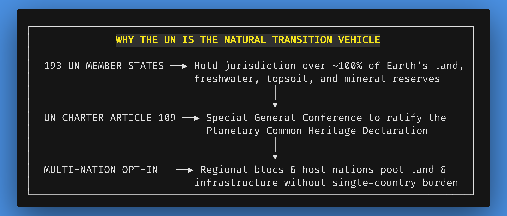
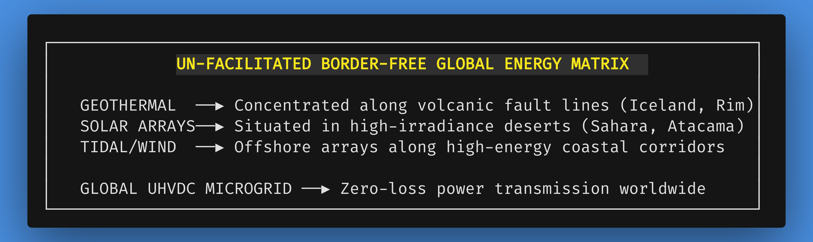

# Chapter 3: The United Nations as Facilitator: A Phased Global Transition

*Navigation*: **[[chapters/02-introducing-resourceism-v15|← Chapter 2: Resourceism]]** | **[[00-Book-Map-of-Content|Map of Content]]** | **[[chapters/04-daos-and-blockchain-v19|Chapter 4: DAOs & Cybernetic Accounting →]]**  
*Tags*: #rbe-book #un-transition #global-governance #diplomacy #article-109 #resource-pooling #sovereign-debt-offramps #trust-fund #transition-sandboxes #thermodynamic-ledgers #waste-reclamation #zk-snarks #public-health #uhvdc-grid #multi-nation-pilots #global-citizenship #complicated-vs-complex #rube-goldberg

---

## Navigating the Paradigm Shift: A Realistic Pathway for Global Transformation

Replacing a global debt-based monetary system with a Resource-Based Economy (RBE) is a monumental civilizational shift. Moving away from centuries of financial conditioning, national competition, and commercial trade cannot be accomplished through sudden, chaotic economic collapse or violent revolution. Sudden collapse breeds famine, mass panic, warlordism, and geopolitical warfare over shrinking resource reserves [362].

Instead, a successful transition requires a **voluntary, carefully managed, multi-phased diplomatic roadmap** facilitated by an established international body with universal convening power. 

From the perspective of systems architecture, the international geopolitical landscape today is the ultimate expression of a **fragile, complicated Rube Goldberg machine**. It is a dizzying labyrinth of competing sovereign jurisdictions, punitive tariff schedules, bilateral debt treaties, foreign exchange controls, weaponized financial sanctions, and IMF structural adjustment programs. When a nation falls into financial distress, the legacy paradigm does not solve the physical problem; it introduces more complicated debt-restructuring mechanisms that strip public assets, privatize freshwater aquifers, and compound interest obligations.

Resourceism replaces this convoluted friction with an elegantly **complex, cybernetic transition architecture**. This chapter outlines why the **United Nations (UN)** system provides the diplomatic architecture, administrative experience, specialized agency network, and international legal legitimacy required to guide a peaceful, stable, and voluntary global transition toward cybernetic resource stewardship [362, 450].

---

## 3.1 Why the United Nations? Grounding the Transition in Global Geographic Reality

Critics often ask: *"Why choose the United Nations as the facilitating platform for a non-monetary transition?"* The choice is neither arbitrary nor sentimental—it is grounded in unassailable geographic and geopolitical facts.

### 1. Geographic Ownership of Planetary Resources

The 193 sovereign member states of the United Nations collectively encompass **virtually 100% of the Earth's inhabited landmass, freshwater aquifers, mineral deposits, agricultural topsoil, energy reserves, and industrial manufacturing capacity**. 

There is no alternative global entity or private organization that holds jurisdictional authority over planetary resources. For a Resource-Based Economy to move from theoretical paper blueprints to physical reality, sovereign nations must voluntarily opt in to declare their territorial resources as part of the common heritage of humanity [4, 1052]. The UN is the only existing international forum where sovereign governments assemble with legal standing to negotiate, ratify, and execute multilateral treaties of this scale.



### 2. The UN General Assembly Article 109 Protocol for Charter Review

A common legal objection regarding UN participation is whether the existing UN Charter—written in 1945 amidst post-WWII geopolitical realpolitik—can accommodate a non-monetary, cybernetic common heritage paradigm. The answer lies within the UN Charter's own built-in constitutional mechanism: **Article 109**.

Under **Article 109 of the UN Charter**, member states hold the legal authority to convene a **Special General Conference for Reviewing the Charter**:

1.  **Convening the Conference**: A two-thirds vote of the General Assembly, combined with an affirmative vote of any nine members of the Security Council, formally triggers the Article 109 Protocol.
2.  **The Planetary Common Heritage Amendment**: Participating member states introduce and ratify a historic constitutional amendment: the **Planetary Common Heritage Declaration**. This amendment formally updates the UN Charter, expanding the legal concept of the "Global Commons" (traditionally applied to Antarctica, the high seas, and outer space) to encompass Earth's foundational biophysical resources, energy grids, and digital cybernetic infrastructure.
3.  **Ratification Protocol**: Once ratified under Article 109, the UN Charter creates a binding multilateral diplomatic framework for member nations to ratify dedicated **Planetary Common Heritage Treaties**—such as the Global Energy Commons Treaty, the Ocean Commons Accord, and the ZK-Audited Planetary Inventory Mandate.

### 3. Multi-Nation Opt-In and Distributed Infrastructure Pooling

The UN pathway does not require a world government, military coercion, or universal initial consensus before beginning. Furthermore, it does not place the burden of proof or land donation on a single isolated "host country." 

Instead, sovereign member nations choose to **voluntarily opt in individually or in multi-nation regional coalitions**. When a bloc of nations (for instance, a coalition of West African, Scandinavian, or South American states) opts in simultaneously, they collectively designate shared territorial regions as **UN-Sanctioned Bioregional RBE Pilot Zones**.

By pooling land, raw materials, and clean energy potential across multiple participating nations, no single country bears the risk or resource strain. In return, the UN deploys its specialized technical agencies (such as UNEP, UNCTAD, WHO, and UN DESA) to assist in constructing state-of-the-art circular infrastructure—providing the participating populations with immediate, unconditioned access to food, zero-mortgage housing, preventative healthcare, and automated transit. As non-participating neighboring nations observe the rapid rise in living standards, environmental restoration, and zero financial deficit within multi-nation RBE zones, they are incentivized to join the coalition and pool their own territories into the expanding network.

---

## 3.2 Sovereign Debt Off-Ramps: The UN Transition Trust Fund and Debt-for-Resource Decommissioning

A critical geopolitical barrier preventing nations from exploring post-monetary economics is the crushing weight of sovereign debt. Under the legacy financial architecture, developing and middle-income nations are trapped in continuous compound debt spirals ($D(t) = P_0 e^{rt}$).

### The Sovereign Debt Trap of Neoclassical Structural Adjustment

When a nation faces balance-of-payments crises or currency devaluations, international financial institutions (such as the International Monetary Fund and World Bank) impose **Structural Adjustment Programs (SAPs)**. These programs represent a classic complicated Rube Goldberg mechanism of extraction:

*   In exchange for emergency fiat loans to service prior interest obligations, debtor nations are coerced into slashing domestic healthcare, education, and social spending.
*   They are mandated to privatize state-owned water utilities, electric grids, mineral deposits, and agricultural land—selling sovereign physical assets at steep discounts to transnational corporations.
*   They are forced to re-orient their domestic agricultural and industrial sectors toward export-oriented cash crops and raw extraction to earn foreign currency (U.S. dollars or Euros) solely to pay debt interest to foreign bondholders.

This dynamic creates perpetual poverty and biospheric degradation: sovereign nations are forced to liquidate their rainforests, deplete their freshwater aquifers, and exhaust their topsoil not to feed their citizens, but to feed the compounding interest demands of private financial creditors.

```
┌─────────────────────────────────────────────────────────────────────────┐
│        SOVEREIGN DEBT TRAP VS. UN CYBERNETIC SOLVENCY OFF-RAMP          │
├────────────────────────────────────┬────────────────────────────────────┤
│    LEGACY IMF STRUCTURAL DEBT      │    UN RBE TRANSITION TRUST FUND    │
├────────────────────────────────────┼────────────────────────────────────┤
│ • Compound debt growth mandate     │ • Mathematical debt decommissioning│
│   forcing endless export extraction│   with zero financial refinancing  │
│ • Coerced privatization of public  │ • Resources declared Common        │
│   water, energy & mineral assets   │   Heritage under sovereign trust   │
│ • Austerity cuts to public health, │ • Guaranteed automated deployment  │
│   education & basic infrastructure │   of modular housing & food hubs   │
│ • Fragile sovereign bond markets & │ • Direct interconnection into the  │
│   continuous currency devaluations │   Global UHVDC renewable microgrid │
│ • Perpetual geopolitical dependency│ • Full regional material autonomy  │
└────────────────────────────────────┴────────────────────────────────────┘
```

### The UN Transition Trust Fund and Article 109 Solvency Off-Ramp

Under the UN General Assembly Article 109 framework, the UN establishes the **UN Transition Trust Fund & Planetary Debt Decommissioning Mechanism** (administered jointly by UN DESA and UNCTAD):

1.  **Voluntary Sovereign Debt Decommissioning**: When a member nation or regional bloc opts into the Planetary Common Heritage Declaration, its sovereign territorial resources (minerals, agricultural lands, watershed reserves) are formally dedicated to a UN-Sanctioned Bioregional Pilot Zone.
2.  **Debt Neutralization Protocol**: In exchange for ring-fencing sovereign resources as protected global commons, the UN Transition Trust Fund acts as a diplomatic clearinghouse. Utilizing multilateral international law and the UN Charter's supreme standing over bilateral commercial contracts (UN Charter Article 103), the participating nation decommissions its external fiat sovereign debt without default penalties, credit blacklisting, or financial embargoes.
3.  **Guaranteed Physical Infrastructure Deployment**: Rather than receiving new fiat currency loans that generate future debt, the participating nation receives direct, high-grade physical infrastructure:
    *   Autonomous vertical aeroponic produce facilities and closed-loop water synthesis plants.
    *   Interconnection into the high-efficiency Global UHVDC clean energy microgrid.
    *   Modular, zero-mortgage residential housing modules constructed from local recycled geopolymers.
    *   Open-source automated healthcare diagnostic and therapeutic clinics.
4.  **Framing as Solvency, Not Surrender**: Crucially, this mechanism is framed not as an infringement on national sovereignty, but as the **only mathematically sound solvency off-ramp** for nations facing catastrophic debt distress. Sovereign nations do not "surrender" territory; they elevate their territory into an unassailable global sanctuary, permanently protecting their people from foreign foreclosure and private financial extraction.

### UN DESA Transition Governance Sandboxes & Localized Thermodynamic Resource Ledgers

To ensure smooth administrative execution during the transition era, UN DESA (in direct partnership with UNEP and ITU) deploys **Bioregional Transition Governance Sandboxes**.

These sandboxes serve as controlled, risk-free regulatory environments where regional governments, municipal authorities, and local utility providers transition their operational systems from monetary accounting to cybernetic thermodynamic ledgers:

1.  **Parallel Ledger Operation**: During the initial sandbox phase, local municipal authorities operate dual accounting systems: the legacy monetary ledger (for interfacing with external markets) and the **Open Thermodynamic Resource Ledger**.
2.  **Telemetry Calibration**: Automated IoT sensors measure real physical carrying capacities—aquifer recharge rates, topsoil nitrogen/phosphorus balances, renewable energy generation in Megawatt-hours, and local warehouse reserves.
3.  **Decommissioning Administrative Friction**: As the accuracy and reliability of the thermodynamic dashboard are validated, the municipality systematically decommissions internal billing departments, tax collection offices, and property assessment bureaus. Workers from these bureaucratic sectors are seamlessly transitioned into engineering, community stewardship, scientific research, and educational mentorship roles.
4.  **Verifiable Non-Monetary Solvency**: By demonstrating that physical needs are met with 100% reliability and zero municipal debt, the sandbox provides concrete empirical proof of RBE viability to skeptical neighboring jurisdictions.

---

## 3.3 The Diplomatic Role of the UN in Border-Free Energy Engineering

To understand how global energy is restructured during the transition, we must first clarify the exact diplomatic role of the United Nations. The UN itself is not an energy utility company or a centralized corporate power producer; rather, it serves as the **multilateral diplomatic framework** where sovereign states negotiate binding cross-border infrastructure treaties, establish universal engineering standards, and guarantee the protection of international commons.

### The Problem: Geopolitical Fragmentation of Energy Infrastructure

Under monetary capitalism, energy generation is severely crippled by sovereign national borders, private fossil fuel cartels, and geopolitical rivalries [216, 456]. Nations routinely construct inefficient, polluting coal or gas power plants within their own borders simply to avoid energy dependency on neighboring countries. Meanwhile, energy transmission lines stop at national boundaries, and oil pipelines or maritime oil choke-points become battlegrounds for military domination.

### The UN Solution: Cross-Border Treaties and Thermodynamic Resource Allocation

In an UN-facilitated RBE transition, member states utilize UN General Assembly diplomatic protocols to ratify the **Global Energy Commons Treaty**. This treaty strips energy generation of nationalistic and commercial borders, engineering global power based purely on physical geography, climate efficiency, and thermodynamic law:



*   **Geothermal Volcanic Hubs**: Geothermal power plants are concentrated along major tectonic fault lines (e.g., Iceland, the East African Rift, and the Pacific Ring of Fire) where Earth's internal thermal energy is accessible with maximum thermodynamic efficiency.
*   **High-Irradiance Desert Solar Arrays**: Industrial-scale, automated solar arrays are installed in uninhabitable high-irradiance deserts (e.g., the Sahara Desert, Atacama Desert, and Australian Outback).
*   **Offshore Wind & Tidal Corridors**: High-yield wind and tidal turbine arrays are positioned along open ocean corridors.

### What is a Global UHVDC Microgrid? Plain-Language Explanation

A critical component of this global energy matrix is the **Global Ultra-High-Voltage Direct Current (UHVDC) Microgrid**:

> **Understanding UHVDC in Plain Language:**  
> Traditional regional power grids use Alternating Current (AC) electricity, which suffers massive energy losses (over 15–20%) when transmitted over long distances, making it impossible to send power across continents or oceans.  
> **Ultra-High-Voltage Direct Current (UHVDC)** technology transmits electrical current at extreme voltages (exceeding 1.1 million volts DC) over lightweight underground and undersea cables. This reduces electrical resistance losses to virtually zero over thousands of miles.  
>  
> By interconnecting regional renewable hubs into a **Global UHVDC Microgrid**, solar electricity generated during midday in the sun-drenched Sahara Desert or South American Atacama Desert is transmitted instantly across oceans to power nighttime metropolitan hubs in Asia or Europe—with less than 2-3% total transmission loss. The Global UHVDC Microgrid eliminates the need for massive, toxic battery storage banks by balancing solar and wind energy dynamically across day and night hemispheres in real time.

Through UN diplomacy, participating states guarantee that UHVDC transmission corridors cross international borders unencumbered, recognized legally as protected global public infrastructure.

---

## 3.4 Zero-Knowledge Cryptographic Auditing and Decoupled Public Health

As the UN facilitates global cybernetic data networks, two critical operational concerns emerge: (1) preserving absolute personal privacy against state or corporate surveillance, and (2) managing global public health emergencies without market bureaucracy.

### Zero-Knowledge Cryptographic Auditing (ZK-SNARKs) in Resource Management

In an automated resource accounting network, citizens and sovereign member states must be able to audit total planetary resource reserves, factory outputs, and supply-chain movements with 100% mathematical certainty. However, this level of transparency must never be achieved by sacrificing personal privacy or tracking individual residential movements.

To solve this, the UN cybernetic protocol integrates **Zero-Knowledge Succinct Non-Interactive Arguments of Knowledge (ZK-SNARKs)**:

*   **Mathematical Proof Without Data Disclosure**: ZK-SNARKs allow a computer system to mathematically prove that a statement is true without revealing any underlying private details. For instance, a regional logistics node can mathematically prove to the global network that an automated greenhouse produced 10,000 units of organic produce and delivered them to neighborhood hubs—verifying total inventory accuracy—without disclosing *who* requested or consumed individual food items.
*   **Zero Location Tracking**: Individual housing reservations, transit requests, and tool usage are verified cryptographically at the local edge node. The global network receives cryptographically verified aggregate throughput metrics while personal movement logs, residential locations, and personal habits remain completely private and unrecorded.

### Decoupling Public Health from Market Bureaucracy

In the legacy monetary paradigm, global public health responses—such as pandemic mitigation, vaccine development, and therapeutic distribution—are severely compromised by patent disputes, national vaccine hoarding, pharmaceutical profit margins, and corporate price-gouging. During health crises, monetary states compete over life-saving supplies, while corporations withhold clinical data behind patent paywalls to maximize shareholder dividends.

Under UN-facilitated RBE protocols, public health is managed through the **Open Health Commons framework** (led by WHO and UNEP):

1.  **Open-Source Clinical Therapeutics**: All medical research, gene sequencing data, diagnostic tools, and pharmaceutical formulas are immediately published on open, unencumbered global research networks. Scientific teams worldwide collaborate in real time without non-disclosure agreements or patent lawsuits.
2.  **Instant Global Logistics Deployment**: When a novel biological pathogen is identified, automated pharmaceutical synthesis units in participating bioregions receive digital formulation blueprints instantly. Automated distribution pods deliver diagnostic kits and therapeutics directly to community health nodes without commercial negotiation, customs fees, or national hoarding.
3.  **Eradicating Profit from Sickness**: Sickness ceases to be a lucrative corporate business model. Medical care focuses purely on preventative wellness, environmental detoxification, and rapid, open-science therapeutic solutions.

---

## 3.5 Leveraging UN Specialized Agencies

The United Nations possesses an extensive administrative network of specialized technical agencies already accustomed to managing global data, environmental tracking, and international logistics. During the RBE transition, these agencies are repurposed from monitoring scarcity to orchestrating abundance:

1.  **UNEP (United Nations Environment Programme)**: Leads the **Global Planetary Resource Inventory**, utilizing satellite telemetry, ZK-audited data feeds, and Internet of Things (IoT) sensor arrays to measure global freshwater reserves, topsoil depth, forest canopy, and mineral deposits in real time [235, 371].
2.  **UNCTAD (United Nations Conference on Trade and Development)**: Operates the **Dual-Interface Economic Clearinghouse**, managing the non-monetary trade interface between expanding RBE zones and remaining monetary nations during the transition era [235, 371].
3.  **UN DESA (United Nations Department of Economic and Social Affairs)**: Drafts multilateral treaties for resource pooling, oversees the UN Transition Trust Fund for sovereign debt decommissioning, and coordinates social integration frameworks [236, 372, 451].
4.  **ITU (International Telecommunication Union)**: Establishes global open-data standards, zero-knowledge privacy protocols, and decentralized mesh network communications for real-time cybernetic resource accounting [237].
5.  **WHO (World Health Organization)**: Manages the Open Health Commons, coordinating open-science medical research, disease prevention, and automated therapeutic distribution.

---

## 3.6 The Monetary Waste Reclaiming & Material Reclamation Program

A vital component of Phase 1 and Phase 2 of the UN-led transition is the **Monetary Waste Reclaiming & Material Reclamation Program**. 

Decades of monetary capitalism, planned obsolescence, and consumer trash have left behind astronomical landfills, rusting automobile graveyards, abandoned industrial factories, and millions of tons of discarded e-waste containing gold, copper, lithium, and rare earth elements.

Under UN technical supervision, specialized automated reclamation facilities recycle discarded consumer waste back into high-grade industrial raw materials:

*   **E-Waste Urban Mining**: Discarded electronics are processed using high-precision automated robotics to extract rare earth minerals, gold, and copper—reducing the need for destructive new mining by over 70%.
*   **Landfill Methane & Plastics Reclamation**: Legacy landfills are sealed, harvested for methane gas energy, and mined for bio-composite and polymer recycling.
*   **Military Hardware Repurposing**: Decommissioned military tanks, warships, and artillery are melted down into high-tensile structural steel for Maglev transit rails, wind turbine towers, and circular city housing frames.

---

## 3.7 Global Citizenship & The Dissolution of Nationalistic Identity

As sovereign nations pool their resources into UN-sanctioned bioregional zones and participate in border-free energy microgrids, a profound cultural and psychological shift unfolds: **the dissolution of parochial nationalistic identity.**

For centuries, national identity was forged through geopolitical competition, military borders, and monetary flags. Citizens were conditioned to view people born across imaginary geographic lines as economic rivals or potential military enemies.

Through the UN transition pathway, as citizens travel freely across bioregional zones without passports, visas, or currency exchange fees, they experience a felt sense of **universal global citizenship**. Identity evolves from provincial tribalism ("I am a citizen of Country X") into ecological stewardship ("I am a conscious human inhabitant of planet Earth"). National flags and borders fade naturally into historical artifacts, replaced by a shared human commitment to planetary flourishing and cosmic exploration.

---

## Conclusion: A Diplomatic Bridge to a Sustainable Future

The United Nations provides the pragmatic, multi-phased diplomatic bridge required to carry human civilization from monetary competition to cybernetic abundance. By anchoring the transition in sovereign multi-nation coalitions, leveraging UN General Assembly Article 109 to ratify the Planetary Common Heritage Declaration, establishing sovereign debt off-ramps through the UN Transition Trust Fund, deploying border-free global UHVDC energy microgrids, utilizing Zero-Knowledge Cryptographic Auditing to guarantee absolute personal privacy, decoupling public health from corporate market bureaucracy, repurposing specialized UN agencies, reclaiming legacy industrial waste, and cultivating universal global citizenship, the UN transition pathway ensures a peaceful, orderly, and scientifically grounded shift toward a Resource-Based Economy.

With the international diplomatic bridge established, the next operational challenge is computational: *How does a planetary civilization coordinate millions of real-time material requirements, balance carrying capacities, and maintain uncorruptible inventory records without market prices or centralized bureaucrats?*

In Chapter 4, we examine the computational core: **Cybernetic Accounting, DAOs, and AI**, exploring how tokenless distributed ledgers, domain-isolated reputation systems, and thermodynamic relief valves replace monetary calculation with verifiable physical truth.

---
