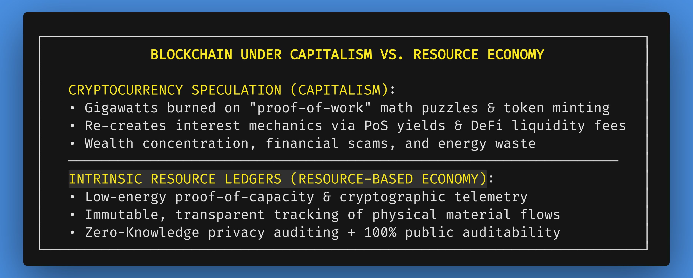
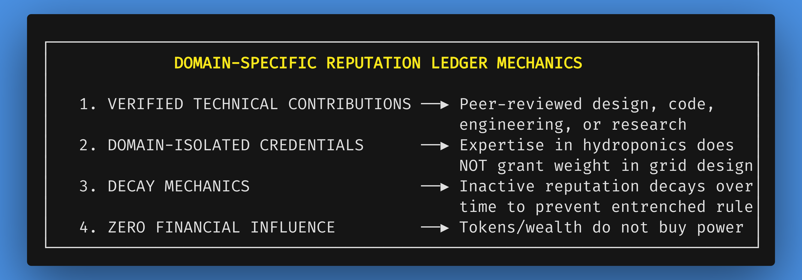

# Chapter 4: Cybernetic Accounting, DAOs, and AI in a Resource-Based Economy

*Navigation*: **[[chapters/03-un-transition-pathway-v11|← Chapter 3: UN Transition]]** | **[[00-Book-Map-of-Content|Map of Content]]** | **[[chapters/05-phase-1-piloting-the-transition-v8|Chapter 5: Phase 1 Piloting →]]**  
*Tags*: #rbe-book #cybernetic-accounting #daos #blockchain-absurdity #duplicative-overlap #datacenter-drain #thermodynamic-relief #ai-orchestration #resource-tracking #transparency #reputation-ledgers #crypto-interest #zk-snarks #public-health-daos #identity-of-mastery #demand-registration #hoarding-prevention #mrp-demand-signals #circularity-lockouts #complicated-vs-complex #rube-goldberg

---

## Cybernetic Accounting vs. Price Discovery: The Infrastructure of Trust

A Resource-Based Economy (RBE) cannot rely on good intentions alone; it demands a scalable, technologically rigorous infrastructure for coordinating global production, supply chains, and distribution. For centuries, orthodox economic theory claimed that monetary market prices were the only viable mechanism for allocating resources and coordinating human labor. Yet, as established in prior chapters, market pricing systematically ignores catastrophic environmental damage [1060, 1068], rewards planned obsolescence [270, 1047], and rations basic necessities by bank balance rather than human need [4, 5, 1052].

When diagnosing the structural collapse of debt-based monetary systems (as outlined in Chapter 1), skeptics frequently ask: *If we eliminate money, prices, and capital accumulation, what prevents chaos? How can society track inventory, verify honesty, and prevent corruption without financial accounting?*

Through the lens of systems architecture, our current market and computing infrastructure represents another massive, **complicated Rube Goldberg machine**. Today, global industry operates within a dizzying maze of proprietary enterprise software, incompatible ERP systems, encrypted financial trading protocols, speculative blockchain networks, and multi-gigawatt ad-tech server farms. Every institution builds private computational silos to defend intellectual property, maximize billable transactions, and extract rent from artificial digital scarcity.

Resourceism replaces this fragmented computational waste with an elegantly **complex, open-source cybernetic architecture**. This chapter demonstrates how modern computing tools—Decentralized Autonomous Organizations (DAOs), transparent tokenless distributed ledgers, Zero-Knowledge Cryptographic Auditing (ZK-SNARKs), domain-isolated reputation systems, and ethical Artificial Intelligence—provide the precise operational framework needed to orchestrate planetary resource allocation directly, honestly, and in real time without prices, debt, or political bureaucracy.

### Guided Visualization: The Global Sensor Pulse


*   **Imagine:** You are viewing planet Earth from orbital perspective at night. Instead of dark continents, visualize a glowing, interconnected nervous system of soft, pulsing blue light lines tracing every coastline, mountain range, river basin, and city center.
*   **Observe:** A pulse of light flashes across an ocean: automated ocean buoys are registering changes in water temperature and salinity. Another pulse ripples through an agricultural valley: soil moisture sensors are transmitting hydration and nitrogen levels to regional farming nodes. In a circular city, an automated workshop signals that a batch of recycled titanium has arrived from a decommissioned transit car, updating the open-access material database in milliseconds.
*   **Feel:** There are no stock market tickers, no currency exchange rate fluctuations, and no debt interest calculations running in the background. The computational power of the planet is not wasted on high-frequency financial trading or advertising algorithms. It is functioning as a calm, unified biological nervous system—listening to the physical Earth, measuring its carrying capacity, and coordinating human abundance with mathematical elegance.

---

## 4.1 Dismantling the Economic Calculation Problem: Corporate Planning and Duplicative Overlap

In classical free-market economics, the primary intellectual defense against non-monetary resource allocation is the **Economic Calculation Problem (ECP)**, originally formulated by Austrian economist Ludwig von Mises in 1920 [113, 284].

### The Austrian Critique and Its Historical Flaws

Mises argued that without monetary market prices established through private property exchange, an economy cannot rationally allocate scarce resources among competing uses. Without price signals, Mises claimed, economic planners are blind to consumer preferences and opportunity costs, inevitably leading to catastrophic misallocations, shortages, and economic chaos [113].

While this critique was a valid indictment of 1920s-era Soviet central planning (where bureaucratic ministries attempted to manually calculate millions of prices and quotas with paper ledgers), it commits a fundamental category error when applied to modern cybernetic engineering. Market prices are not magic; they are merely **primitive, low-bandwidth, lagged informational signals** that attempt to approximate supply, demand, and relative scarcity. Today, digital computation, Internet of Things (IoT) telemetry, and automated supply chains measure physical reality directly—with infinitely greater precision than volatile price tags.

### Modern Corporate Planning vs. The Tragic Waste of Duplicative Competition

The ultimate irony of the Economic Calculation Problem is that modern multi-national capitalist corporations—such as Amazon, Walmart, Toyota, and Apple—**internally operate as massive, highly planned non-market economies** [1047, 1052]. 

Within Walmart's global supply chain, individual departments and distribution warehouses do not buy and sell intermediate goods to one another using internal price bidding. They do not trade components on an internal stock exchange. Instead, they utilize **Material Requirements Planning (MRP)** software, automated inventory sensors, and predictive algorithms to track physical goods from supplier to shelf in real time. Corporate capitalism has already proven that cybernetic planning at planetary scale is vastly superior to market pricing; it simply traps that planning within private corporate silos for private profit.

Furthermore, market competition produces catastrophic computational and physical waste through **duplicative overlap**:

```
┌─────────────────────────────────────────────────────────────────────────┐
│        MARKET DUPLICATIVE OVERLAP VS. CYBERNETIC COMMONS EFFICIENCY     │
├────────────────────────────────────┬────────────────────────────────────┤
│     MONETARY MARKET COMPETITION    │      RBE OPEN-SOURCE COMMONS       │
├────────────────────────────────────┼────────────────────────────────────┤
│ • 50 competing smartphone brands   │ • Universal open-hardware standard │
│   w/ 50 proprietary software silos │   w/ modular, swappable components │
│ • Billions wasted on legal patents,│ • 100% open-source scientific R&D  │
│   trade secrets & ad campaigns     │   accessible to all global teams   │
│ • Massive duplicative datacenters  │ • Consolidated low-energy compute  │
│   running ad-tracking & click fraud│   focused on physical optimization │
│ • Massive physical waste & planned │ • >85% reduction in industrial and │
│   obsolescence across all sectors  │   computational resource throughput│
└────────────────────────────────────┴────────────────────────────────────┘
```

Consider the global automotive or technology sectors: fifty separate corporations design fifty separate, incompatible versions of the same basic product (e.g., smartphones, electric vehicle drivetrains, or cloud operating systems). Each company builds proprietary software stacks, files thousands of defensive patents, employs armies of corporate lawyers to litigate patent infringements, and spends billions on advertising to convince consumers that their slightly tweaked variant is superior. 

In a Resource-Based Economy, all product blueprints, software code, and engineering schematics are published as open-source human heritage. Global engineering teams collaborate on a unified, modular, and highly durable architecture, eliminating redundant R&D waste and reducing industrial material throughput by over **85%**.

### Cascading Downstream Resource Drain: Compute Proliferation & The Thermodynamic Relief Valve

This market duplication extends directly into the computational infrastructure itself. In the monetary paradigm, digital technologies—rather than liberating humanity—have triggered an unprecedented crisis of **cascading downstream resource drain**:


1.  **The Datacenter Energy & Water Crisis**: Under monetary incentives, massive datacenter campuses consume hundreds of gigawatts of electricity and billions of gallons of clean municipal drinking water for cooling. This compute capacity is not used to solve climate change or cure diseases; it is squandered on high-frequency algorithmic financial trading, cryptocurrency mining, scraping user data for targeted advertising, and training redundant, proprietary commercial AI models to compete over corporate market share.
2.  **The Silicon & Rare Earth Bottleneck**: Because hardware companies engineer devices for 2–3 year replacement cycles, compute hardware accelerates the rapid depletion of rare earth minerals (gallium, indium, neodymium, lithium). Millions of tons of specialized semiconductors and circuit boards are landfilled annually due to planned obsolescence.

In an RBE, cybernetics acts as a **thermodynamic relief valve**:


*   **Computational Consolidation**: Eliminating financial trading, digital ad-tech, click-fraud tracking, and cryptocurrency speculation eliminates over **60% to 70% of global compute workloads overnight**.
*   **Decoupled, Closed-Loop Data Architecture**: Datacenters are redesigned using direct-to-chip liquid geothermal cooling and co-located exclusively with renewable baseload energy hubs (e.g., geothermal fault zones and hydro corridors). 
*   **Modular Hardware Longevity**: Compute server blades and microchips are standardized, socketed, and engineered for 20+ year duty cycles, recycled through closed-loop hydrometallurgical reclamation.

### Material Requirements Planning (MRP) Demand Signals & Protocol-Level Circularity Lock-Outs

To understand how an RBE executes industrial allocation without price signals, consider how **Material Requirements Planning (MRP) Demand Signals** function in practice:


1.  **The User Request Flow**: When an engineering guild or individual artisan initiates a physical fabrication project (e.g., building a specialized solar glider or a custom scientific spectrometer), they submit a digital Bill of Materials (BOM) to the local **Cybernetic Inventory DAO**.
2.  **Automated Carrying Capacity & Reserve Verification**: The open DAO software queries real-time telemetry from regional material hubs via Zero-Knowledge proofs (ZK-SNARKs). It verifies that the requested alloys, optical sensors, and carbon composites are available within local reserves and confirms that harvesting or synthesizing those materials will not violate bioregional carrying capacity thresholds.
3.  **Domain-Isolated Technical Evaluation**: For large-scale industrial projects requiring metric tons of structural metals or high-purity semiconductors, the project proposal is evaluated by domain-isolated technical reputation ledgers (Section 4.4). Qualified peers review the engineering schematics for structural safety and material efficiency, ensuring that rare planetary resources flow to viable, life-affirming endeavors.

#### Protocol-Level Circularity Lock-Outs: Enforcing Zero-Waste at the Compiler Stage

A revolutionary feature of RBE cybernetic manufacturing is the **Protocol-Level Circularity Lock-Out**:


*   Under monetary capitalism, environmental regulations rely on fallible, corruptible human inspectors who issue fines long after toxic waste has already been dumped or planned obsolescence has already shipped to consumers.
*   In an RBE, circularity and non-toxicity are **hard-coded directly into the automated manufacturing compiler**.
*   When a designer submits a 3D CAD blueprint or production sequence to an automated fabrication plant, the compiler runs automated architectural integrity and disassembly checks:
    *   *Disassembly Verification*: The compiler verifies that every component can be disassembled using standard automated robotic tools in under 60 seconds without destroying constituent materials.
    *   *Toxicity Scan*: The compiler verifies that all polymers, coatings, and adhesives are 100% non-toxic, bio-derived, or fully recyclable in closed-loop induction furnaces.
    *   *Automatic Lock-Out*: If a blueprint specifies non-separable glues, unrecyclable composite resins, or proprietary sealed casings, **the manufacturing system triggers an automatic protocol lock-out**. The fabrication machines will not execute the production run until the engineer updates the design to meet 100% circularity standards.

Through protocol-level lock-outs, planned obsolescence and toxic manufacturing are eradicated at the software architecture level—rendering environmental degradation physically impossible within the production pipeline.

### Hardware-Oracle Bridges and Cybernetic Inventory Telemetry

The conceptual framework for a tokenless Cybernetic Inventory DAO requires grounding in rigorous physical telemetry to completely bypass human data entry (and the associated risks of fraud or error). In an RBE, the physical state of the world automatically updates the cybernetic ledger via **hardware-oracle bridges**.

To understand this pragmatic realism, consider the exact cryptographic verification sequence when a batch of recycled aluminum arrives at a regional Community Resource Hub:


1.  **Physical Ingestion & Telemetry:** An autonomous transport vehicle docks at the hub. As the material unloads, physical state changes trigger IoT sensors. Optical sorting cameras use spectrographic analysis to verify the material's composition (e.g., 99.8% pure recycled aluminum), while networked warehouse scales verify the exact metric tonnage.
2.  **Hardware-Oracle Attestation:** These physical sensors act as hardware-oracles. The sensors cryptographically sign the data packets locally (using embedded secure enclaves) and transmit the precise material composition and weight to the Cybernetic Inventory DAO. 
3.  **Immutable Ledger Update:** The DAO receives the cryptographically signed data, verifies the signature against the registered hardware sensors, and automatically increments the regional aluminum inventory balance on the public, immutable resource ledger. 

Because the ledger update is directly tied to automated physical telemetry—without requiring a human clerk to type in a manifest, sign a receipt, or approve an invoice—the "trust" problem inherent in monetary ledgers is structurally eliminated. The data is an objective reflection of physical reality.

### Resolving Demand Registration and Hoarding Without Price Signals

Critics frequently press the economic calculation critique one step further, raising a vital practical question: *If prices are removed, how does an RBE register human demand? Without prices rationing access, what stops a citizen from requesting 50 televisions or hoarding scarce resources?*

In a monetary economy, "market demand" is a severely distorted signal: it measures *ability to pay* rather than human need. A billionaire purchasing five luxury yachts registers as high "demand," while millions of impoverished families lacking clean water register as zero "demand." An RBE replaces price-based rationing with direct, transparent **demand registration and physical allocation parameters**:


1.  **Differentiating Access Typologies**: Human requirements are registered across three distinct functional categories:
    *   *Essential Personal Access*: Unconditioned, high-priority access to housing, nutrition, healthcare, education, clothing, and personal communication devices.
    *   *Shared / On-Demand Access*: High-standard access to shared equipment—transportation pods, specialized tools, recreational gear, scientific instruments, and vacation retreats—available instantly through local Community Resource Hubs.
    *   *Custom & Industrial Resource Allocation*: Material allocations for complex personal projects, scientific research, or community construction.
2.  **The Psychology of Hoarding vs. On-Demand Abundance**: Hoarding is not an inherent human instinct; it is a defensive reaction to chronic monetary scarcity and fear of future deprivation. When goods are guaranteed, high-quality, and continuously accessible at local hubs without financial cost or resale value, hoarding becomes psychologically irrational. Storing 50 televisions in a private living room yields zero financial benefit, wastes living space, and provides no social status.
3.  **Personal Access Parameters and Algorithmic Review Queues**: For personal access goods, cybernetic software applies physical sanity parameters grounded in biological requirements, household capacity, and regional resource availability. If an individual submits a request for 50 televisions, the system does not employ coercive police or price barriers. Instead, the request triggers an algorithmic verification flag: the system prompts the user to specify the functional requirement (e.g., outfitting a public community media center vs. a private bedroom). Requests for specialized or high-volume items are routed to open community project queues for peer review.
4.  **Circular Return Accountability and Item Telemetry**: High-value tools, electronics, and vehicles carry open cryptographic passports. If a shared item remains inactive or unused in a private residence for an extended duration, the cybernetic inventory system sends automated prompts requesting its return to the local hub for maintenance and re-allocation—maximizing resource velocity and ensuring 100% utility.
5.  **Domain-Isolated Reputation for Raw Industrial Allocation**: When individuals or research teams request large quantities of scarce raw materials (e.g., metric tons of copper, lithium, or high-purity silicon for an experimental energy project), allocation is calibrated by verified technical competence and peer review on project DAOs (Section 4.4) rather than personal monetary wealth. This guarantees that industrial resources flow to viable, ecologically sound projects rather than wasteful speculation.

---

## 4.2 Cryptocurrency, Interest Mechanics, and Intrinsic Blockchain Accountability

In recent years, blockchain technology—originally conceived as a decentralized, immutable distributed ledger—has been co-opted by monetary capitalism into a tragic display of energetic and technological absurdity.

### Equating Fiat Interest with Cryptocurrency Staking and Yield Farming

To understand why cryptocurrency fails as a liberating force under capitalism, we must analyze how the ancient monetary mechanic of **interest** is replicated in digital currencies:

> **Connecting Fiat Interest to Cryptocurrency Mechanics:**  
> Under traditional monetary capitalism, **interest** is a fee charged on debt or money lent, requiring compounding growth that outpaces physical resources and concentrates wealth in the hands of lenders.  
>  
> In cryptocurrency and decentralized finance (DeFi), interest is mathematically re-created through mechanisms like **Proof-of-Stake (PoS) staking yields, liquidity pool lending rates, and algorithmic token emission rewards**:  
> 1.  **Proof-of-Stake Yields Mirror Capital Compound Interest**: In PoS crypto networks, holders who lock up large amounts of digital capital automatically receive a percentage yield ("interest") paid in newly minted tokens. Just as fiat interest enriches wealthy holders without labor, PoS yields compound wealth for large token holders ("whales"), concentrating governance power and digital asset control.  
> 2.  **Price Volatility & Transaction Fee Speculation**: Crypto transactions incur variable gas and network fees, while token prices fluctuate wildly. Speculators extract yield from price volatility—functioning identically to high-interest predatory lending by extracting value from users who need liquid tokens for transactions.  
> 3.  **Algorithmic Scarcity vs. Physical Reality**: Like fiat central banks manipulating interest rates to enforce monetary scarcity, crypto protocols hard-code artificial token supply caps. This replicates monetary hoarding, speculative bubbles, and wealth inequality under a high-tech veneer.



### Zero-Knowledge Cryptographic Auditing and Repurposing Blockchain for Intrinsic Honesty

Stripped of monetary speculation, token minting, and interest yield mechanics, blockchain's underlying architecture—an immutable, append-only, distributed cryptographic ledger—provides the exact anti-corruptible infrastructure required for universal public resource tracking. In an RBE, DAOs and ZK-SNARK ledgers contain **zero tokens, zero financial yields, and zero market mechanics**; they function purely as tokenless, non-monetary Material Requirements Planning (MRP) and carrying capacity protocols:


1.  **Corruption Elimination**: Every raw material extraction, manufacturing step, and community distribution is cryptographically logged on open ledgers. No bureaucrat, faction, or administrator can alter records, forge titles, or hoard assets [237, 373, 452].
2.  **Zero-Knowledge Privacy Auditing (ZK-SNARKs)**: To prevent surveillance state overreach, resource allocation DAOs integrate zero-knowledge proofs. Users submit cryptographic proofs verifying their eligibility for housing, transit, or workshop tools without exposing their personal identities, travel movement histories, or daily habits to the public network. Inventory and environmental capacity are audited with 100% mathematical integrity, while personal privacy remains unassailable.
3.  **Digital Twin Lifecycles**: Every physical asset—from solar panels to medical scanners—receives a cryptographic identifier tracking its origin materials, maintenance history, and circular recycling protocol [270, 1047].
4.  **Low-Energy Consensus**: In an RBE, energy-intensive "proof-of-work" mining is replaced by lightweight **proof-of-capacity and cryptographic telemetry verification**, reducing energy consumption by 99.9% while guaranteeing absolute transparency.

---

## 4.3 Decoupling Public Health DAOs from Market Bureaucracy

In legacy monetary medical infrastructure, clinical research, diagnostic manufacturing, and pharmaceutical distribution are fractured across proprietary corporate silos and crippled by administrative overhead. As detailed in Chapter 1, modern commercial healthcare operates as a complicated Rube Goldberg machine where nearly half of all health expenditure is consumed by ICD/CPT billing coders, claims adjusters, prior-authorization gatekeepers, and revenue cycle management algorithms designed to maximize financial extraction rather than patient wellness.

In a Resource-Based Economy, public health is liberated from market bureaucracy and orchestrated through decentralized **Open Health DAOs**:


*   **Decoupled Clinical Data & Universal Research Blueprints**: All medical trial data, gene sequencing algorithms, diagnostic neural networks, and chemical synthesis blueprints are published immediately on open, immutable cryptographic ledgers. By decoupling clinical knowledge from corporate patents and non-disclosure agreements, medical researchers worldwide collaborate on real-time epidemiological and therapeutic breakthroughs, eliminating duplicative corporate R&D silos and patent evergreening.
*   **Elimination of ICD/CPT Billing Friction & Administrative Duplication**: Because health services carry zero monetary price tags, ICD-10/11 diagnostic codes and CPT billing codes are completely eliminated. Physicians, nurses, and medical researchers are freed from typing billing justification notes into electronic record systems or defending treatments on peer-to-peer insurance appeals calls. 100% of clinical effort is focused directly on patient care, preventative diagnostic analysis, and medical innovation.
*   **Preventative IoT Biometrics & Early Interventions**: Integrated, non-invasive wearable telemetry continuously monitors metabolic, cardiovascular, and environmental bio-markers in opt-in participants. Automated diagnostic algorithms analyze population health trends, detecting micro-anomalies months before clinical symptoms manifest and notifying residents and local health nodes to deploy targeted preventative lifestyle, nutritional, or environmental remedies.
*   **Automated Medical Supply Logistics & Synthesis Hubs**: Regional health DAOs monitor local hospital and community clinic inventory levels through real-time IoT telemetry. When diagnostic kits, surgical supplies, or specialized pharmaceuticals are required, automated synthesis hubs produce and dispatch targeted medical supplies directly to community health nodes via autonomous micro-logistics—eliminating insurance pre-authorizations, corporate markups, and supply chain artificial scarcity.

---

## 4.4 Governance Mechanics: Domain-Specific Reputation Ledgers and DAOs

A key question from skeptics regarding decentralized governance is: *"How do DAOs prevent mob rule, popularity contests, or superficial rating systems?"*

To prevent the toxic dynamics of modern social media (where "likes," "thumbs-up," and viral outrage dictate popularity), an RBE utilizes **Domain-Specific Technical Reputation Ledgers** [161].




*   **Domain Isolation**: A citizen's reputation score is strictly isolated to their verified domain of competence. Demonstrating high competence in agronomy or hydroponics grants technical voting weight on agricultural optimization proposals, but zero weight on electrical grid design or structural engineering.
*   **Peer Verification & Review**: Technical credentials are earned through tangible, peer-verified contributions: designing efficient open-source code, authoring peer-reviewed ecological research, or mentoring apprentices in Community Resource Workshops.
*   **Decay & Non-Transferability**: Reputation credentials cannot be bought, sold, inherited, or transferred. Reputation decays over time if an individual ceases active participation, preventing the emergence of an entrenched, non-productive technocracy.

---

## 4.5 The Role of Artificial Intelligence as an Ethical Companion

Under monetary capitalism, Artificial Intelligence is deployed as an instrument of corporate extraction: automating jobs to slash labor costs, profiling consumers for targeted advertising, and optimizing financial trading algorithms.

In a Resource-Based Economy, AI is repurposed as an **ethical companion and labor liberation engine**:


1.  **Automating Drudgery**: AI models handle complex, repetitive physical and administrative tasks—monitoring automated vertical farms, optimizing Maglev transit scheduling, and managing subterranean sewage processing—liberating humans for creative exploration and scientific discovery [361].
2.  **Thermodynamic Optimization**: AI algorithms model complex planetary feedback loops in real time, calculating the exact ecological carrying capacity and material costs of proposed civil projects before physical construction begins.
3.  **Transparent Decision Architecture**: AI systems are open-source and deterministic. They do not hold sovereign authority or make moral judgments; they act as transparent calculators that provide empirical data models to human DAOs.

---

## 4.6 Governance & The Identity of Mastery: Moving Past Social Popularity

The implementation of domain-specific reputation ledgers transforms human social incentives.

In monetary social systems, status is derived from conspicuous consumption, financial net worth, or viral social media popularity. This incentivizes sensationalism, shallow vanity, and toxic status competition.

In an RBE, where material abundance is unconditionally guaranteed, social recognition is earned exclusively through **the identity of mastery**: technical excellence, artistic depth, scientific discovery, and generous mentorship. By isolating reputation to verified domains of craftsmanship and contribution, society eliminates the demagogue's path to power. Human ambition is channeled into the collaborative expansion of human knowledge and planetary well-being.

---

## Conclusion: Verifiable Truth and Collaborative Liberation

Cybernetic accounting, tokenless DAOs, and ethical Artificial Intelligence provide the computational foundation for a Resource-Based Economy. By replacing the distorted pricing mechanism with direct IoT resource telemetry, eliminating the catastrophic waste of market duplication and compute proliferation, repurposing blockchain into an anti-corruptible public ledger, decoupling public health from bureaucratic coding, and structuring governance through domain-isolated reputation, cybernetics solves the Economic Calculation Problem and establishes an unshakeable infrastructure of truth and trust.

Having established the computational and governance framework, the next practical question is implementation: *How do we deploy this infrastructure on the ground in real-world geographic pilot zones?*

In Chapter 5, we explore **Phase 1: Piloting the Transition**, detailing site selection criteria, closed-loop vertical agriculture, dual-use infrastructure conversion, and the practical decoupling of pilot communities from the monetary economy.

---
