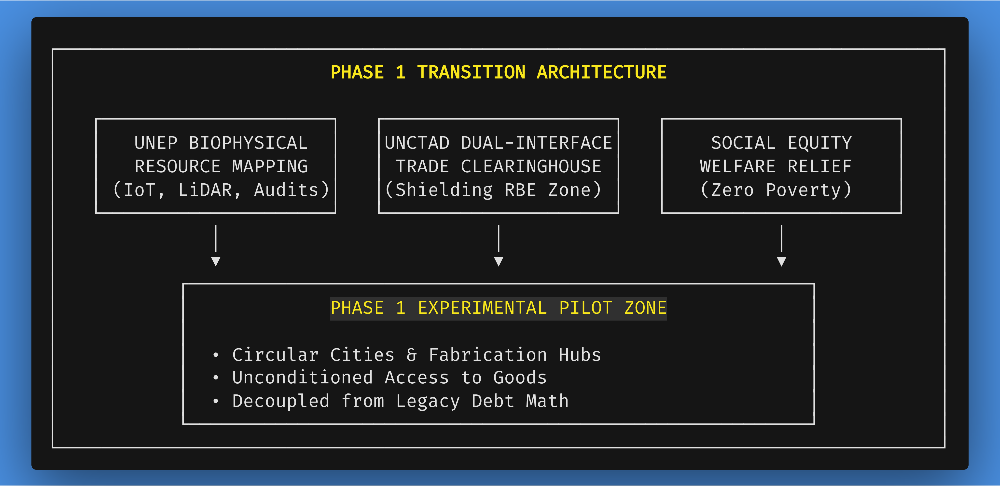
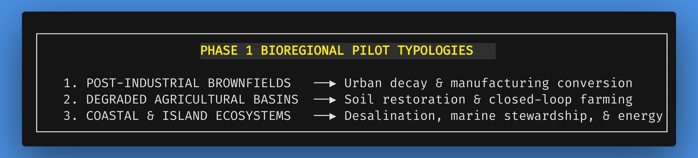

# Chapter 5: Phase 1: Piloting the Transition – Foundations and Frameworks

*Navigation*: **[[chapters/04-daos-and-blockchain-v19|← Chapter 4: Cybernetic Accounting]]** | **[[00-Book-Map-of-Content|Map of Content]]** | **[[chapters/06-phase-2-scaling-up-global-governance-v10|Chapter 6: Phase 2 Scaling →]]**  
*Tags*: #rbe-book #phase-1-pilots #bioregional-hubs #experimental-zones #food-sovereignty #vertical-agriculture #precision-fermentation #dual-use-infrastructure #red-tape-contrast #unep-mapping #unctad-clearinghouse #social-equity #identity-in-transition #institutional-pivot #cybernetic-lockout #complicated-vs-complex #rube-goldberg

---

## The Groundwork of Abundance: Operational Mechanics of Initial RBE Pilots

The transition from a debt-based monetary economy to a Resource-Based Economy (RBE) cannot be executed as a mere theoretical blueprint drawn on paper, nor as a sudden, chaotic global decree. In complex human adaptive systems, civilizational paradigm shifts succeed only when people can observe tangible, measurable, and life-affirming improvements in their daily lives, personal security, and physical well-being [362, 451]. Skepticism toward radical economic reorganizations is natural and historical; humanity has suffered through centuries of ideological promises that delivered bureaucratic totalitarianism, artificial scarcity, or structural exploitation [399]. Therefore, an RBE must be proven through living, empirical demonstration.

From a systems architecture perspective, municipal urban management under monetary capitalism is a **complicated, fragile Rube Goldberg machine**. It relies on labyrinthine zoning boards, arbitrary permit hurdles, private developer tax abatements, fragile transnational food supply chains, and reactive policing to manage artificial scarcity. Every economic stressor requires complicated administrative patches that introduce fresh points of failure.

Resourceism replaces this convoluted friction with an **elegantly complex living systems design**.

Phase 1 of the United Nations-facilitated transition roadmap establishes the foundational infrastructure and localized pilot zones that serve as living laboratories for non-monetary resource management [235, 371]. By designating specific geographic territories within host sovereign nations under bilateral international treaties, Phase 1 tests cybernetic inventory accounting, automated closed-loop food production, 100% circular industrial design, and unconditioned citizen access under real-world biophysical conditions [235, 371]. 

This chapter details the operational mechanics of Phase 1. It outlines the criteria for site selection across diverse bioregions, localized food sovereignty through vertical aeroponics and precision fermentation, the specialized roles of UN agencies such as the United Nations Environment Programme (UNEP) and the United Nations Conference on Trade and Development (UNCTAD), the social equity mechanics that immediately relieve national state welfare burdens, the conversion of legacy dual-use infrastructure and military bases into automated disaster relief and RBE fabrication hubs, the stark contrast between municipal zoning "red tape" and IoT-verified structural safety, and the localized living labs that showcase the indisputable superiority of an RBE to a watching world.



---

---

## 5.1 Site Selection Criteria & Bioregional Pilot Typologies

The selection of initial Phase 1 pilot zones is guided by scientific, diplomatic, and ecological criteria designed to test the RBE framework under diverse real-world conditions while minimizing geopolitical friction [235, 371]. Host nations volunteer territorial zones in exchange for complete UN-backed infrastructure modernization and immediate social welfare expenditure relief [360, 451].



### 1. Host Nation Qualification & Diplomatic Protocols

To qualify for hosting a Phase 1 Pilot Zone, a sovereign nation enters into a bilateral multilateral accord with the UN General Assembly and the UN Economic and Social Council (ECOSOC) [233, 235]. The qualification protocol requires:


*   **Territorial Designation**: The host state designates a contiguous geographic territory ranging from 1,000 to 10,000 hectares, granting the zone special legal status under UN international administration [235, 371].
*   **Voluntary Civilian Participation**: Resident populations within the designated zone choose voluntarily whether to participate in the Phase 1 non-monetary framework or relocate to nearby legacy municipal zones with full financial compensation funded by the UN Transition Trust [235, 360]. The UN Transition Trust Fund itself is capitalized prior to the collapse of fiat through sovereign debt forgiveness treaties, legacy carbon taxes, international Special Drawing Rights (SDR) reallocations, and direct endowment grants from participating nations seeking to de-risk their own domestic transition.
*   **Legal & Tax Insulation**: The host state agrees to exempt the pilot zone from all domestic corporate, sales, income, and property taxes, as well as monetary debt collection mechanisms within the zone's borders [235, 371]. In exchange, all state welfare costs for citizens inside the zone drop to zero.

### 2. Why Legacy Institutions and the UN Pivot: Systemic Self-Preservation and De-Risking

Skeptics frequently attack this transition framework at its most vulnerable point, asking: *Why would legacy international institutions like the UN, or sovereign host states heavily embedded in monetary capitalism, ever greenlight a non-monetary, debt-free pilot zone? Why would established authorities back an experiment that demonstrates their own systemic obsolescence?*

The answer lies not in romantic idealism or sudden moral conversion, but in **pragmatic institutional self-preservation and systemic de-risk mitigation**:


1.  **Cascading Sovereign Debt Panics and Ecological Overreach**: Sovereign states and international bodies face an unprecedented confluence of insoluble crises—compounding sovereign debt spirals, climate feedback loops, agricultural failures, and supply chain fragmentation. Traditional monetary levers (quantitative easing, austerity, debt restructuring) are proving mathematically incapable of resolving these physical breakdowns. Facing rising social instability and fiscal paralysis, host states seek viable "out-of-the-box" resilience models.
2.  **The Controlled "Sandbox" Paradigm**: Just as financial central banks create "regulatory sandboxes" to test disruptive financial software in ring-fenced environments without risking global bank runs, sovereign nations view Phase 1 pilot zones as controlled, isolated **resilience testbeds**. Volunteering depressed, post-industrial brownfields or high-debt municipal zones allows host states to trial post-fiat survival infrastructure without dismantling national financial systems overnight. If the pilot succeeds, it provides a safe off-ramp; if it falters, the host nation suffers zero financial exposure.
3.  **Eradication of Aid Corruption and Foreign Exchange Flight**: International development agencies (UNEP, UNCTAD, UNDP) routinely see billions of dollars in monetary aid lost to currency devaluation, interest servicing, and local administrative corruption. A non-monetary pilot zone guarantees that 100% of international physical aid directly translates into physical infrastructure, clean water, and energy systems without monetary leakage.
4.  **Fulfilling Blocked Mandates**: UN charter bodies whose core existential mandates (climate stabilization, poverty elimination, disease eradication) are perpetually choked by monetary underfunding recognize that non-monetary pilot zones unlock direct thermodynamic execution, transforming them from helpless observers into architects of planetary resilience.

### 3. The Three Primary Bioregional Typologies

To ensure the cybernetic accounting software and circular infrastructure frameworks are universally scalable, Phase 1 establishes pilots across three distinct bioregional typologies [235, 371]:

#### Typology A: Post-Industrial Urban Brownfields


*   *Objective*: Demonstrate the rapid conversion of abandoned industrial infrastructure, contaminated urban soils, and high-unemployment populations into high-tech, zero-emission circular communities.
*   *Key Interventions*: Soil phytoremediation using hyperaccumulating plants, disassembly and recycling of structural steel, installation of district-scale geothermal microgrids, and conversion of vacant factory floors into open fabrication laboratories [270, 371].

#### Typology B: Degraded Agricultural Basins


*   *Objective*: Demonstrate ecological soil regeneration, water table restoration, and high-yield automated food production without synthetic pesticides or petrochemical fertilizers.
*   *Key Interventions*: Conversion of chemical monoculture fields into biodiverse agroforestry, deployment of IoT soil-moisture telemetry, construction of closed-loop vertical aeroponic complexes, and automated micro-drip irrigation linked to local weather radar engines [235, 371].

#### Typology C: Coastal and Island Territories


*   *Objective*: Demonstrate energy and water autonomy in resource-constrained or ecologically vulnerable marine environments.
*   *Key Interventions*: Deployment of ocean thermal energy conversion (OTEC) units, wave-energy harvesters, solar-powered multi-stage flash desalination facilities, and automated marine sanctuary monitoring to restore depleted local fisheries [235, 270, 371].

### 4. Technical Architecture Specs: Urban Transit Loops, Food Modules, and Living Quarters

To provide concrete structural clarity, Phase 1 pilots deploy standardized, modular civil engineering blueprints:


1.  **Circular Urban Transit Loops**:
    *   *Subterranean Induction Conduits*: All freight, bulk material transit, and maintenance robotics operate in standardized 3.5-meter subterranean utility corridors located directly beneath the city rings.
    *   *Surface Maglev Pod Loops*: Quiet, zero-emission magnetic levitation passenger pods glide on continuous, grade-separated circular guideways connecting residential rings (Zone 3) with educational facilities (Zone 2) and community fabrication centers (Zone 4). Pods arrive on-demand within 60 seconds via automated scheduling algorithms.
2.  **Automated Vertical Food Production Modules**:
    *   *Aeroponic Stacks*: Standardized 12-story automated vertical agriculture towers generate up to 20,000 kg of fresh leafy greens, legumes, and vine fruits daily per module using 95% less water than open-field monoculture.
    *   *Closed-Loop Nutrient Recovery*: High-efficiency anaerobic digesters convert organic community food scraps into sterile liquid bio-nutrients, cycling 100% of organic nitrogen and phosphorus back to root systems in an unbroken metabolic loop.
3.  **Modular Soundproof Residential Quarters**:
    *   *Architectural Composition*: Living quarters are fabricated using non-toxic geopolymer ceramics and structural carbon-composite frames, decoupling exterior temperature extremes and delivering 100% acoustic isolation between living units.
    *   *Reconfigurable Interior Layouts*: Interior partition walls, acoustic baffles, and cabinetry are standardized modular components that occupants can easily reconfigure using lightweight magnetic lock joints as family or creative requirements evolve.

#### The Resident Onboarding Experience: Stepping into Post-Monetary Life

Consider the step-by-step experience of a family transitioning from a legacy debt-burdened municipality into a Phase 1 Pilot Zone:


*   **Arrival & Sanctuary Reservation**: Upon arrival, the family registers their digital profile at the Community Welcome Hub. They select an available residence matching their space and microclimate preferences—with zero security deposits, no lease contracts, no credit checks, and zero mortgage obligations.
*   **Automated Move-In Logistics**: Standardized furnishings, high-grade appliances, and requested interior configurations are delivered directly to the residence via subterranean transit pods. 
*   **Immediate Decompression**: The crushing psychological weight of monthly rent payments, utility bills, health insurance premiums, and grocery expenses vanishes instantly. 
*   **Community Integration**: The family receives an orientation to local Community Resource Hubs, tool workshops, and wellness clinics, immediately stepping into the role of empowered civilizational co-creators.

---

## 5.2 Bioregional Food Sovereignty: Closed-Loop Vertical Agriculture & Precision Fermentation

Under monetary capitalism, food production is dominated by a fragile, environmentally destructive global corporate monoculture. Industrial agribusiness relies heavily on energy-intensive synthetic nitrogen fertilizers (via the fossil-fuel Haber-Bosch process), chemical pesticides that deplete pollinator populations, and long-distance diesel freight logistics. 

This model produces three systemic vulnerabilities:


1.  **Massive Biospheric Degradation**: Agricultural runoff creates vast oceanic hypoxic "dead zones" (e.g., in the Gulf of Mexico and Baltic Sea), while topsoil is being eroded 10 to 40 times faster than its natural replenishment rate.
2.  **Supply Chain Fragility & Speculative Inflation**: Food travels an average of 1,500 to 2,500 miles from farm to consumer. Global commodity speculation and supply bottlenecks cause violent food price swings, triggering artificial food shortages and creating urban "food deserts" where low-income families are financially priced out of fresh produce.
3.  **Extravagant Waste**: Over 30% to 40% of all food produced under capitalism is discarded, bleached, or landfilled along commercial supply chains to preserve market price floors [287, 288].

```
┌─────────────────────────────────────────────────────────────────────────┐
│       MONETARY AGRIBUSINESS VS. RBE BIOREGIONAL FOOD SOVEREIGNTY        │
├────────────────────────────────────┬────────────────────────────────────┤
│   MONETARY INDUSTRIAL MONOCULTURE  │     RBE CLOSED-LOOP FOOD HUBS      │
├────────────────────────────────────┼────────────────────────────────────┤
│ • Fossil-fuel synthetic fertilizers│ • 95% less water via closed-loop   │
│   causing toxic oceanic dead zones │   vertical aeroponics & LED arrays │
│ • 1,500–2,500 food miles & diesel  │ • Co-located within walking        │
│   distribution bottlenecks         │   distance of residential rings    │
│ • Commodity price speculation &    │ • Zero food price inflation &      │
│   engineered urban food deserts    │   elimination of food deserts      │
│ • 30–40% food waste dumped into    │ • 100% biological compost loop &   │
│   landfills to protect price floors│   precision microbial fermentation │
└────────────────────────────────────┴────────────────────────────────────┘
```

In a Phase 1 RBE Pilot Zone, food production is radically localized, automated, and decoupled from petrochemical volatility through **Closed-Loop Vertical Agriculture and Precision Fermentation Hubs**:


*   **Co-Located Vertical Aeroponic Towers**: Multi-story automated vertical farm towers are integrated directly into Zone 3 and Zone 4 of the circular habitat—within a short, pleasant walking distance of every residential housing ring. Utilizing closed-loop nutrient mists and tuned LED spectrums, these facilities produce 10 to 20 times the yield per square meter compared to traditional farming, while using **95% less water** and zero synthetic pesticides.
*   **Precision Microbial Fermentation**: To supply complete protein, essential lipids, and complex micronutrients without livestock deforestation or ocean overfishing, pilot zones utilize automated precision fermentation bioreactors. Microorganisms powered by clean geothermal electricity convert simple carbohydrate feedstocks into bio-identical proteins, dairy, and culinary ingredients with extreme thermodynamic efficiency.
*   **Total Food Security as a Public Birthright**: Food is never bought, sold, or metered. Citizens pick up fresh organic greens, heirloom vegetables, fruits, and nutritious meal ingredients directly from neighborhood culinary hubs or harvest them from community edible permaculture belts. Food price inflation and food desert geography are permanently eradicated on day one of pilot operation.

---

## 5.3 The Role of UNEP: Biophysical Resource Mapping & Circular Guidelines

The United Nations Environment Programme (UNEP) serves as the primary scientific authority in Phase 1, responsible for establishing the empirical foundation of the pilot economy:

### 1. Conducting the Physical Resource Inventory
UNEP deploys satellite spectral imaging, aerial lidar drones, and ground IoT sensors to map the pilot territory's physical assets [235, 371]:


*   Total annual freshwater precipitation and aquifer recharge rates.
*   Geothermal gradient maps, solar irradiance curves, and wind corridors.
*   Recycled structural metals and building materials embedded in legacy structures.
*   Topsoil organic matter and local timber growth cycles.

### 2. Programming Carrying Capacity Thresholds into Allocation Engines
UNEP environmental scientists translate raw sensor telemetry into algorithmic carrying capacity limits [235, 371]. These limits define the maximum rate at which local resources can be harvested without causing environmental degradation. For instance, the allocation engine permits groundwater extraction only up to 80% of the verified monthly aquifer recharge rate, preserving a 20% safety margin for ecological systems [371].

### 3. Enforcing 100% Circular Building and Industrial Guidelines via Cybernetic Lock-Outs
UNEP establishes strict, automated circular manufacturing standards across all pilot fabrication centers [270]:


*   *Component Modularity*: All physical goods must be designed for rapid robotic disassembly, modular maintenance, and upgradeability.
*   *Material Non-Toxicity*: The use of toxic glues, unrecyclable composite resins, and persistent chemical pollutants is strictly prohibited at the compiler level via automated manufacturing lock-outs.
*   *Closed-Loop Recycling*: Every manufactured product carries an immutable digital passport specifying its material composition and automated end-of-life recycling sequence.

---

## 5.4 Dual-Use Infrastructure Conversion: From War Apparatus to Regenerative Hubs

A significant historical obstacle to human flourishing under monetary capitalism is the staggering proportion of industrial capacity, scientific intellect, and physical equipment consumed by national military establishments. Trillions of dollars are expended designing tanks, fighter jets, missile complexes, and naval warships whose sole purpose is destruction [216, 456].

In Phase 1, host nations begin the systematic **Dual-Use Conversion of Military Infrastructure**:


1.  **Military Base Conversion**: Decommissioned naval stations, airfields, and military logistics depots are transferred to UN administration and converted into regional **RBE Fabrication Labs and Disaster Relief Hubs**.
2.  **Industrial Hardware Repurposing**: Military heavy engineering equipment—tank chassis, armored transport frames, and naval hulls—is melted down into high-grade structural steel and titanium for clean Maglev transit rails, automated vertical farm towers, and circular city structures.
3.  **Human Talent Liberation**: Military engineers, logistics coordinators, and technical operators transition from waging war into orchestrating automated disaster response, renewable energy installation, and ecological habitat restoration.

---

## 5.5 The "Red Tape" Contrast: Municipal Zoning vs. IoT-Verified Structural Safety

A common point of daily frustration for citizens under monetary municipal governance is the overwhelming, costly, and bureaucratic "red tape" required to build or modify shelter.

Consider the contrast between building a simple home addition under legacy municipal zoning versus inside a Phase 1 RBE Pilot Zone:

### Legacy Municipal Zoning Friction


*   **Months of Bureaucratic Permits**: Homeowners must pay thousands of dollars in permit fees, submit paper blue-prints to municipal boards, wait 6–12 months for bureaucratic reviews, endure zoning disputes with neighbors, negotiate mortgage financing, and hire licensed contractors bound by commercial markups.
*   **Arbitrary Zoning Restrictions**: Municipal building codes are frequently driven by speculative real estate values, restrictive single-family zoning laws, and historic preservation paywalls rather than physical safety or ecological performance.

### Streamlined RBE IoT-Verified Safety Protocols

In a Phase 1 pilot zone, construction and housing modifications operate on **IoT-verified structural safety protocols**:


*   **Instant Generative Engineering**: A citizen designing a living space addition uses an open-source architectural app. The generative software automatically formats the design using standardized, modular components that conform to physical load-bearing, acoustic, and thermodynamic safety laws.
*   **Real-Time Material Ledger Check**: The app cross-references the requested materials with UNEP's regional inventory, confirming material availability in real time.
*   **Automated Robotic Fabrication & Safety Verification**: Once the design passes automated structural simulation, robotic fabrication pods prepare the modular components. Assembly is completed with verified mechanical precision, monitored by embedded IoT sensors that verify structural integrity instantly—bypassing months of paper red tape while guaranteeing far higher physical safety standards.

---

## 5.6 The Role of UNCTAD: Non-Monetary Trade Models & Decoupling

One of the most frequent practical questions raised by political economists and structural engineers is: *How can an isolated non-monetary RBE pilot zone function in a world where surrounding nations still operate on monetary capitalism? How does the pilot obtain specialized technology, rare earth metals, or specialized medical equipment from external markets that demand cash payment?*

The United Nations Conference on Trade and Development (UNCTAD) resolves this challenge by operating the **Dual-Interface Trade Clearinghouse** [235, 371].


### The Dual-Interface Trade Clearinghouse Mechanics

The UNCTAD Clearinghouse acts as an adaptive economic diaphragm between the internal non-monetary mechanics of the RBE pilot zone and the external monetary world [235, 371]:


1.  **Generation of High-Value Physical Surpluses**: Utilizing high-efficiency automation, clean energy grids, and open-source industrial designs, the RBE pilot zone produces specialized physical surpluses [235, 371]. These surpluses include green hydrogen fuel, ultra-high-purity recycled rare earth elements, open-source medical diagnostics software, high-yield organic crops, or advanced modular building components.
2.  **Surplus Monetization**: UNCTAD takes custody of these physical surpluses at the pilot zone boundary and sells them on external global commodity markets at prevailing market prices [235, 371].
3.  **The UN Transition Trust Fund**: All fiat currency revenues (US Dollars, Euros, Yen, RMB) generated from these external sales are deposited directly into an audited UN Transition Trust Fund [235, 371].
4.  **Procurement of External Capital Imports**: When the RBE pilot zone requires advanced capital equipment that it cannot yet manufacture internally (e.g., 3-nanometer semiconductor lithography equipment or specialized surgical robotics), the pilot zone's engineering DAO submits a physical procurement request [235, 371]. UNCTAD uses hard currency from the Trust Fund to purchase the equipment on world markets.
5.  **Complete Citizen Shielding**: The imported equipment is delivered across the pilot boundary and entered into the zone’s physical inventory ledger as a decommodified asset [235, 360, 371]. Citizens, scientists, and engineers inside the pilot zone never touch money, write checks, handle foreign currency, or pay import tariffs. From the perspective of the pilot zone citizen, the imported lithography machine simply arrives at the local fabrication hub, ready for public use [235, 360, 371].

---

## 5.7 Social Equity Mechanics: Immediate Relief for State Welfare Systems

The diplomatic catalyst that compels sovereign governments to host Phase 1 pilot zones is not necessarily altruism or philosophical conversion; it is **immediate fiscal and administrative relief** [360, 371, 451].

In legacy monetary economies, state and national governments allocate massive portions of their annual budgets—often 40% to 60% of total public expenditure—attempting to manage the chronic symptoms of poverty, inequality, and economic dislocation [399, 451]. These expenditures include welfare casework bureaucracies, food stamp processing, uncompensated emergency medical care, and police/prison systems.

When a host nation designates a depressed region as a Phase 1 Pilot Zone, participation opens voluntarily to struggling families, low-income citizens, unemployed workers, unhoused individuals, and veterans [360, 371, 451]:


1.  **Immediate Unconditioned Access**: Upon entering the pilot zone, citizens receive immediate, unconditioned access to modern modular housing, fresh organic food from distribution centers, clean renewable energy, high-speed internet, and comprehensive medical care [2, 399, 451].
2.  **Elimination of Means-Testing Bureaucracy**: There are no income audits, drug tests, job-search mandates, or paperwork requirements. Because goods are distributed as physical public assets, the entire administrative apparatus designed to police and monitor poor people is disbanded [399, 451].
3.  **Host Nation Fiscal Windfall**: The host government experiences an immediate, permanent drop in localized social expenditure [360, 451]. Municipal police costs drop as property crime disappears; public hospital emergency rooms see trauma and stress-induced illness rates collapse; and state welfare disbursements are eliminated inside the zone.

---

## 5.8 Identity in Transition: Navigating the Shift from Wage Earner to Co-Creator

Stepping into a Phase 1 pilot zone triggers a profound psychological transformation in how individuals experience their personal identity.

For decades under monetary capitalism, individuals were psychologically conditioned to view themselves as passive **wage earners** and **consumers**. Self-worth was tied to surviving employee reviews, securing paychecks, and defending individual career titles against corporate layoff risks.

In a Phase 1 pilot zone, where housing, food, energy, and medical care are unconditionally guaranteed as a fundamental birthright, the defensive "wage earner" identity dissolves. Citizens undergo an identity transition:


*   **Rediscovering Human Agency**: Released from survival panic, individuals realize that their time belongs to them. They cease viewing activity through the lens of "what pays the bills" and begin asking: *"What problem do I want to solve? What craft do I want to master?"*
*   **From Employee to Civilizational Co-Creator**: Individuals transition from passive employees into active co-creators of civilizational infrastructure. Whether contributing to automated vertical farming, open-source medical software, or circular urban construction, citizens experience their work as a direct, meaningful contribution to human flourishing.

---

## Conclusion: The Empirical Proof of Concept

Phase 1 provides the irrefutable, living proof that a Resource-Based Economy is not a utopian fantasy or an unworkable theory, but a vastly superior, scientifically grounded method for organizing human civilization [362, 451]. 

By establishing localized pilot zones across diverse bioregions, deploying closed-loop vertical food sovereignty, conducting UNEP biophysical mapping, converting dual-use military infrastructure into disaster relief and RBE fabrication hubs, replacing bureaucratic zoning red tape with IoT-verified safety, shielding citizens through the UNCTAD Clearinghouse, relieving state welfare budgets, and empowering human identity from wage earner to civilizational co-creator, Phase 1 creates an irresistible demonstration effect [235, 360, 371, 451]. 

As citizens in surrounding monetary nations observe the total eradication of poverty, stress, crime, and environmental decay inside the pilot zones, the political demand for global transition becomes overwhelming—setting the stage for Phase 2 planetary scaling [236, 372].

In Chapter 6, we explore this planetary scaling: **Phase 2: Scaling Up and Global Resource Governance**, mapping how isolated bioregional pilots interconnect into transcontinental Maglev corridors, global UHVDC microgrids, deep-bore geothermal telemetry, and the Oceanic Commons.

---
