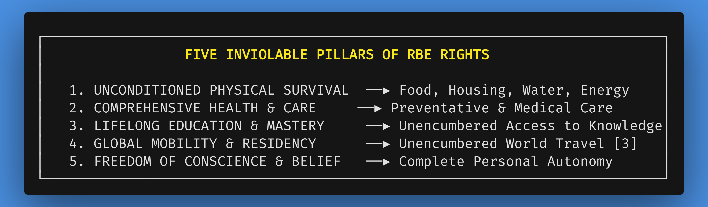
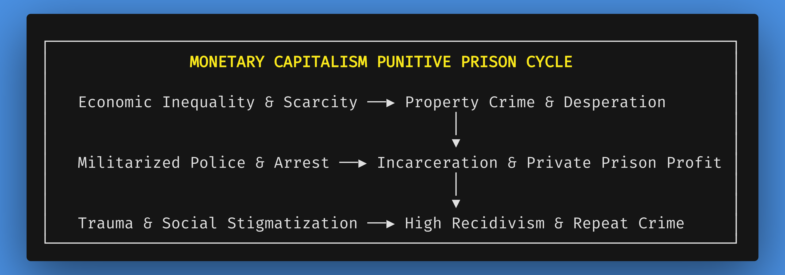
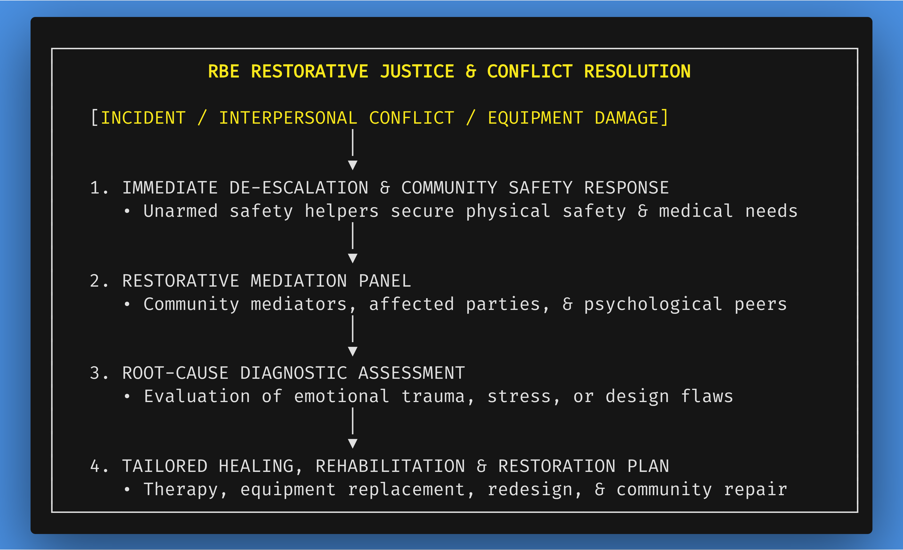
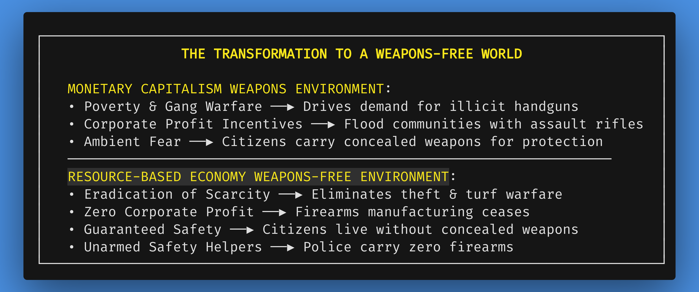
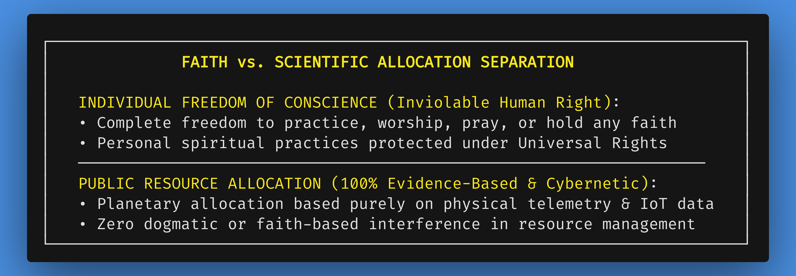
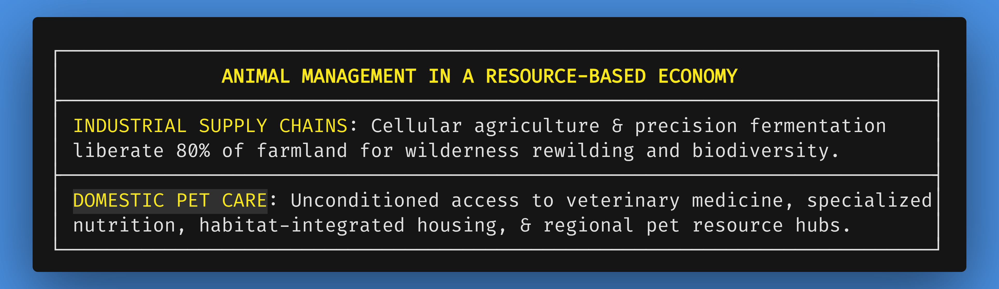

# Chapter 7: Core Principles, Values, and Universal Rights

*Navigation*: **[[chapters/06-phase-2-scaling-up-global-governance-v5|← Chapter 6: Phase 2 Scaling]]** | **[[00-Book-Map-of-Content|Map of Content]]** | **[[chapters/08-addressing-counter-arguments-corollary-issues-v5|Chapter 8: Addressing Objections →]]**  
*Tags*: #rbe-book #universal-rights #restorative-justice #judicial-dockets #law-enforcement-transformation #firearms-irrelevance #restorative-mediators #freedom-of-travel #no-poverty #planetary-ethics #animal-management #domestic-pets #complicated-vs-complex

---

## The Ethical Foundation: Rights Grounded in Physical Reality

Every human civilization is defined by the foundational rights it guarantees to its citizens and the ethical principles that govern its institutions. Under monetary capitalism, "rights" are largely defined in passive, legalistic, and negative terms—the right to free speech, the right to vote, freedom of assembly, and the inviolable right to hold private property. 

However, monetary capitalism conspicuously excludes **the physical means of survival** from its definition of fundamental human rights. Under market logic, you have the legal right to express your opinion, but you do not have the guaranteed right to food, shelter, clean water, energy, or life-saving medical care unless you possess the monetary currency required to purchase them. If you lack money, market capitalism defends the absolute legal right of corporate landlords to evict your family onto the street, the right of agribusinesses to dump unsold food into landfills to maintain market prices, and the right of pharmaceutical monopolies to withhold life-saving medicine behind exorbitant patent paywalls [268, 399]. Survival in a market economy is not a right; it is a paid privilege that must be continuously earned through competitive labor.

From the perspective of systems architecture, the legacy apparatus of civil and criminal jurisprudence is another **vast, complicated Rube Goldberg machine**. Millions of pages of commercial statutory codes, predatory bail bond industries, adversarial courtroom litigation with billable hours, and privatized prison complexes exist purely to enforce artificial scarcity, protect debt claims, and manage the symptoms of structural deprivation. Every attempt to "reform" this punitive machinery adds more convoluted legal bureaucracy without ever addressing the physical root cause of crime.

Resourceism replaces this punitive maze with the **elegantly complex, healing architecture of universal physical rights and restorative justice**. 

A Resource-Based Economy (RBE) fundamentally redefines human rights by grounding them in **unconditional physical reality**. Survival, well-being, education, and personal autonomy are recognized as inviolable birthrights of every human being born upon Earth.

This chapter establishes the constitutional backbone of an RBE: declaring unconditional access to life essentials as inviolable human rights, detailing the complete transformation of law enforcement and the abolition of punitive prison systems in favor of cybernetic restorative justice, illustrating restorative mediation in concrete practice, presenting a vision for a firearm-free society, detailing comprehensive animal management and pet integration, balancing individual freedom of belief (religion) with scientific resource allocation, and outlining a universal code of planetary ethics [2, 3, 161, 365, 374, 1046].

### Guided Visualization: The Unconditional Charter

*   **Imagine:** You hold a sleek, glowing digital tablet displaying the *Planetary Charter of Universal Rights*. Unlike legacy state constitutions written in dense, ambiguous legalistic prose designed to be interpreted by highly paid attorneys, this charter is written in plain, unambiguous, multi-lingual language.
*   **Read:** Article 1 states: *"Every human being born upon Earth possesses an unconditional, inviolable birthright to high-standard modular shelter, nutritious organic food, clean water, clean energy, comprehensive healthcare, lifelong education, zero-emission transit, and personal safety—provided free at the point of use, without debt, currency, taxation, or compulsory servitude."*
*   **Feel:** You realize that for the first time in human history, human survival is no longer a precarious commodity conditioned on market employment. Survival is guaranteed simply because you exist as a member of the human family. The ambient dread of homelessness, medical bankruptcy, and starvation evaporates from your consciousness.

---

## 7.1 The Universal Bill of Human Rights in an RBE

In a Resource-Based Economy, universal human rights are categorized into five inviolable, interconnected pillars [2, 3, 374, 1046]:

### Pillar 1: Unconditioned Physical Survival
Guaranteed, friction-free access to state-of-the-art modular housing, clean water, organic food, and clean energy. These resources are delivered through local automated Resource Hubs and smart distribution networks without income checks, means-testing, or administrative gatekeeping [2, 1046]. Survival is unconditional and permanent.

### Pillar 2: Comprehensive Health and Care
Unrestricted access to preventative healthcare, advanced medical diagnostic technology, surgical procedures, mental health support, bio-restorative therapies, and wellness facilities. Healthcare is entirely decoupled from financial billing, commercial health insurance approvals, or profit-driven treatment quotas [399, 1046].

### Pillar 3: Lifelong Education and Skill Mastery
Universal, unencumbered access to research laboratories, universities, fabrication workshops, artistic conservatories, and digital knowledge archives from early childhood through senior adulthood. Education is recognized not as a tool for labor-market preparation, but as a lifelong journey of scientific exploration, creative fulfillment, and human mastery.

### Pillar 4: Unencumbered Global Mobility and Residency
The freedom to travel, explore, and reside across all international RBE zones without national visas, passports, immigration queues, or financial friction [3, 374, 451]. Planet Earth is recognized as the shared common habitat of all human beings.

### Pillar 5: Absolute Freedom of Conscience and Personal Autonomy
Unrestricted autonomy of personal thought, speech, artistic expression, philosophical belief, lifestyle choices, and spiritual practice—provided such actions do not infringe upon the physical safety, bodily autonomy, or equal rights of others.

---

## 7.2 Deconstructing the Prison-Industrial Complex & Transforming Law Enforcement

### The Judicial Docket Reality: 90%+ Property and Monetary Friction

When analyzing the modern apparatus of courts, prisons, and policing through systems architecture, a profound structural reality emerges: **the overwhelming majority of legal disputes, civil litigation, and criminal offenses are not defects of human nature, but the mechanical friction of the debt-based monetary system.**

An empirical examination of civil and criminal court dockets across monetary nations reveals that **more than 90% of all legal proceedings are directly anchored in property ownership, monetary claims, or survival desperation** [161, 399]:

1.  **Civil Dockets & Contractual Warfare**: Commercial contract disputes, mortgage foreclosures, landlord-tenant evictions, debt collection lawsuits, personal bankruptcies, patent infringement litigation, copyright infringement claims, insurance claim denials, tax evasion proceedings, and corporate shareholder disputes dominate civil dockets. These multi-trillion-dollar legal battles exist solely to adjudicate claims over symbolic monetary debt or enforce artificial scarcity.
2.  **Criminal Dockets & Survival Crimes**: In criminal courts, the overwhelming volume of cases revolves around property crimes and illicit monetary transactions: petty theft, auto larceny, residential burglary, armed robbery, embezzlement, identity fraud, check forgery, extortion, black-market drug distribution, and wage-theft coverups [399].
3.  **The Prison-Industrial Complex as a Monetized Industry**: Rather than healing social trauma or addressing the structural poverty driving crime, capitalist societies have privatized incarceration into a lucrative multi-billion-dollar market. Private correctional monopolies lobby for mandatory minimum sentences and high bed-occupancy guarantees, turning human caging into corporate revenue and treating prisoners as hyper-cheap captive labor [161]. The punitive prison environment acts as an institutional trauma chamber—reinforcing anti-social subcultures and virtually guaranteeing high rates of recidivism.

### Dismantling the "Inherent Criminality" Fallacy

Mainstream conservative and neoclassical ideology frequently defends punitive legal systems by invoking the **fallacy of inherent human criminality**—claiming that human beings are naturally greedy, violent, and corrupt, and that only the threat of armed state violence and solitary confinement prevents total social chaos.

Empirical sociological and neurobiological research thoroughly dismantles this myth [399, 400, 409-416]:

*   **Behavior as an Environmental Output**: Human behavior is not hardwired in a vacuum; it is an adaptive response to environmental conditions. When an economic operating system forces individuals into chronic financial insecurity, threatens families with homelessness, and glorifies conspicuous luxury accumulation, it structurally *mandates* cutthroat competition and desperate acquisition to survive.
*   **Mechanical Friction, Not Genetic Evil**: What the monetary system diagnoses as "criminality" is overwhelmingly the predictable mechanical friction of artificial scarcity. A mother stealing infant formula or a youth entering an illicit drug ring is not acting out of innate genetic evil; they are navigating survival constraints imposed by a system that rations life support by bank account balance.
*   **Restorative Justice as an Engineering Optimization**: In a Resource-Based Economy, restorative justice is not offered as a sentimental moral preference, but as a **logical systems engineering solution**. When all physical necessities—housing, food, healthcare, transit, education—are unconditionally guaranteed, and when goods are freely accessible without resale value or monetary hoarding leverage, the entire structural motive for 90%+ of all crime evaporates instantly.

### The Elimination of Financial Crime and the RBE Safety Paradigm

In an RBE, property crime and financial fraud vanish naturally because the structural incentive has been removed at the root [4, 5, 399]:

*   **Property Theft is Rendered Obsolete**: Stealing a vehicle, a computer workstation, or power machinery becomes completely nonsensical when any citizen can access higher-quality, self-maintaining models instantly at the local Community Resource Hub.
*   **Illicit Black Markets Collapse**: Smuggling rings and drug cartels disintegrate because there are no cash profits to extract or launder. Chemical dependency and trauma are treated strictly as medical and public health challenges through Open Health DAOs rather than criminal offenses [399].
*   **Corporate and White-Collar Crime Eradicated**: Insider trading, tax fraud, predatory lending, and corporate embezzlement cease to exist because corporate balance sheets, speculative stock markets, and tax bureaus are permanently obsolete.

### Law Enforcement Transformation: From Armed Control to Community Safety Helpers

Without the systemic requirement to protect private property deeds, manage poverty riots, or collect state debts, militarized police departments are disbanded [161, 364]. They are replaced by **Community Safety Helpers** and **Restorative Mediators**:

*   **Unarmed De-escalation Expertise**: Safety Helpers carry zero lethal weapons and project zero state intimidation. Their training is grounded in neurobiology-informed crisis de-escalation, emergency medical response, trauma intervention, and restorative dialogue.
*   **Focus on Physical Well-Being**: Their sole operational mission is safeguarding individual bodily integrity, supporting citizens in psychological distress, and assisting during physical accidents or natural disruptions—functioning as compassionate, trusted community servants rather than enforcers of economic property rights.

---

## 7.3 Restorative Mediators in Practice: Resolving Non-Monetary Disputes

While financial crimes vanish, human beings in any civilization may still experience interpersonal friction, emotional disputes, equipment misuse, or accidental damage. In an RBE, such conflicts are not dragged through hostile courtroom litigation with billable hours, but are resolved through compassionate, evidence-based **Restorative Mediation**.

### A Concrete Scenario: Equipment Misuse & Community Mediation

To see Restorative Mediation in action, consider a concrete dispute involving shared community equipment:

*   **The Incident:** An individual participating in a community fabrication workshop carelessly operates a high-precision 5-axis CNC milling machine while under intense personal stress, ignoring safety telemetry protocols and severely damaging the machine's spindle assembly. In a monetary society, this would trigger thousands of dollars in legal liability, insurance claims, lawsuits, or criminal charges for property destruction.
*   **Step 1: Immediate Safety & De-escalation:** Community Safety Helpers arrive without weapons, ensure no physical injuries occurred, shut down power to the damaged cell, and support the stressed individual to calm down.
*   **Step 2: Restorative Mediation Panel:** Rather than summoning lawyers, a Restorative Panel is convened within 24 hours. The panel includes the individual, fellow workshop participants, a master mechanical mentor, and a community restorative mediator.
*   **Step 3: Root-Cause Assessment:** The panel examines the root causes. Did the equipment lack automated safety interlocks? Was the user experiencing severe sleep deprivation or emotional burnout? The evaluation reveals that the individual was suffering from acute personal grief and attempted to distract themselves by operating heavy machinery without proper sleep.
*   **Step 4: Restoration & Redesign:** The solution is constructive and restorative:
    1.  The damaged spindle assembly is automatically remanufactured by the local automated Resource Center using recycled metallurgy.
    2.  The workshop engineering team updates the machine's firmware to include automated eye-tracking sleepiness sensors and interlocks, preventing tired operators from engaging heavy spindles in the future.
    3.  The individual is paired with a compassionate wellness counselor to receive trauma support, along with refresher safety mentoring when they feel ready to return.

No court costs, no prison sentences, no criminal records, and no financial bankruptcy. The equipment is repaired, the human being is healed, and the system is engineered to prevent the issue from ever happening again.

---

## 7.4 Firearms Irrelevance & A World Free of Concealed Weapons

In monetary capitalism, gun violence, school shootings, active shooter events, and militarized civilian armaments are perpetual, horrifying realities. Millions of citizens carry concealed weapons daily out of a pervasive, justified fear of violent robbery, carjacking, drug cartel intimidation, or home invasion.

### Root Causes of Gun Violence Eradicated

When analyzed through systems architecture, gun violence is not an immutable law of human nature; it is a predictable output of specific environmental drivers [399]:

1.  **Economic Survival & Desperation**: Armed robbery, drug turf wars, and gang violence are directly driven by monetary poverty, illegal drug black markets, and violent competition for cash flow.
2.  **Manufactured Fear & Defense Sales**: Weapon manufacturers profit immensely by fueling fear, marketing military-grade assault weapons to civilians, and lobbying governments to dismantle safety regulations.
3.  **Untreated Psychological Trauma**: School shootings and mass violent attacks are almost universally committed by deeply alienated, isolated individuals suffering from unaddressed mental illness, bullying, and systemic hopelessness.

In a Resource-Based Economy, every single one of these drivers is eradicated at the root:

*   With poverty eradicated and all goods freely accessible, armed robbery and home invasions become completely nonsensical.
*   With drug cartels dismantled through public health approaches, turf wars vanish.
*   With weapon manufacturing corporations abolished, there is no profit incentive to flood communities with firearms.
*   With comprehensive mental health support guaranteed from childhood, radical social isolation and violent psychosis are identified and healed before tragedy strikes.

### Living in Comfort: A Society Without Guns

Imagine living in a society where you walk through parklands, urban plazas, schools, and transit terminals with the complete, comfortable knowledge that **no one around you is carrying a concealed firearm.** 

In an RBE, firearms become historical relics of a primitive era—museum artifacts that future generations look back on with disbelief. School shootings, active shooter alarms, bulletproof backpacks, and metal detectors in educational sanctuaries belong strictly to the past. Community Safety Helpers carry zero firearms, relying on de-escalation expertise and advanced non-lethal protective technology if rare physical threats arise. Humanity steps into a peaceful era where true physical security is derived not from holding a weapon, but from living in a non-violent, supportive civilization.

---

## 7.5 Balancing Freedom of Belief (Religion) with Scientific Resource Allocation

One of the most complex societal questions in designing a post-monetary civilization is: *How does an RBE respect deeply held religious and faith-based belief systems without compromising its scientific, evidence-based resource allocation?*

Throughout human history, organized religious institutions have frequently intertwined with monetary power structures, enforcing social hierarchies, dogma, inequality, and blind obedience. Some radical secularists have suggested that a scientific society should outlaw or restrict religious practice.

An RBE explicitly rejects the prohibition or banning of religious belief. **Banning belief is authoritarian, violates fundamental human autonomy, and provokes intense societal conflict.**

### The Principle of Strict Insulation

An RBE balances freedom of belief with scientific resource allocation through the **Principle of Strict Insulation**:

1.  **Absolute Personal Autonomy**: Citizens possess complete, inviolable freedom to practice any religion, worship, pray, hold spiritual beliefs, or adhere to secular humanism. Community DAOs allocate space and materials for houses of worship, temples, meditation centers, and cultural hubs based on community interest [374].
2.  **Zero Dogmatic Interference in Resource Management**: Public decisions regarding planetary management—such as water allocation, agricultural land management, energy distribution, public health protocols, and scientific research—are **100% insulated from religious dogma**. Physical resource allocation is determined strictly by scientific data, IoT telemetry, ecological carrying capacities, and peer-reviewed medicine [4, 360]. Faith-based claims cannot override physical data or biosphere limits.

### Case Study: Medical Care and Bodily Autonomy

*   **Consider**: A patient who belongs to a faith group that rejects certain blood transfusions, vaccines, or specific surgical interventions.
*   **In an RBE**: The healthcare DAO provides complete, transparent, scientific diagnostic information to the patient. However, the patient retains total bodily autonomy to accept or decline any medical intervention based on their personal beliefs. The medical team offers non-blood alternative therapies or personalized treatments wherever scientifically available. Individual belief is honored, while the public healthcare system remains grounded in rigorous scientific standards.

---

## 7.6 Code of Planetary Ethics: Stewardship without Accumulation

Beyond legal rights, an RBE operates on an evolved **Code of Planetary Ethics** that guides human behavior in a post-monetary world [365, 374]:

1.  **Planetary Common Heritage**: Recognizing that Earth's resources belong equally to all living beings, present and future generations [4, 1052].
2.  **Prohibition of Accumulation and Hoarding**: Because access to all goods is guaranteed and abundant, attempting to privately accumulate or hoard public resources is recognized as a psychological disorder born of legacy scarcity trauma rather than a sign of success [365].
3.  **Transparent Accounting and Zero Secrecy**: All public resource ledgers, industrial blueprints, scientific data, and AI allocation codes are 100% open-source and universally auditable by any citizen [237, 374].
4.  **Harmonization with Biosphere**: Human technology and urban design must operate in total harmony with natural biogeochemical cycles, aiming for zero toxic waste and 100% circular material recovery [270, 1047].

---

## 7.7 Comprehensive Animal Management: Ethical Supply Chains & Domestic Pet Integration

An ethical civilizational framework cannot limit its scope strictly to human interactions; a post-monetary society must re-evaluate humanity's relationship with all living beings across our shared biosphere. Under monetary capitalism, non-human animals are reduced to economic commodities—subjected to industrial factory farming, supply-chain exploitation, habitat destruction, and market cost-cutting.

An RBE establishes a holistic, evidence-based **Animal Management Protocol** across two primary domains:

### 1. Transitioning Industrial Food Supply Chains to Cellular Agriculture & Precision Fermentation
In a monetary market, industrial factory farming persists because it offers the cheapest per-calorie financial cost, despite imposing staggering ecological, ethical, and public health externalities (antibiotic resistance, zoonotic pandemic risk, deforestation, and massive greenhouse gas emissions).

In an RBE, resource allocation decisions are governed by physical thermodynamic efficiency and biospheric carrying capacity rather than profit margins:

*   **Decoupling Food Production from Animal Slaughter**: Utilizing modern **cellular agriculture** (cultivated meat grown from harmless cell samples) and **precision fermentation** (microbial synthesis of dairy proteins and fats), an RBE produces molecularly identical meat, dairy, and leather products without requiring animal slaughter, land degradation, or antibiotic overuse.
*   **Massive Land Restoration**: Phasing out industrial animal agriculture liberates up to **80% of global agricultural land** currently dedicated to feed crops and livestock grazing. These vast tracts are returned to natural wilderness, agroforestry, and carbon-sequestering biomes, restoring planetary biodiversity.
*   **Ethical Wildlife Coexistence**: Wildlife corridors, automated acoustic monitoring networks, and non-invasive habitat management ensure native animal species thrive without human encroachment or corporate poaching.

### 2. Domestic Pets: Emotional Integration, Veterinary Access, and Residential Design
An RBE explicitly recognizes domestic animals (dogs, cats, horses, companion animals) as emotionally significant, sentient members of human households and communities. Under monetary capitalism, pet care is constrained by financial friction: millions of families face heartbreaking decisions when unable to afford veterinary surgeries, specialized prescription diets, or pet-friendly housing deposits.

In a Resource-Based Economy, domestic pet integration is fully supported as an unconditioned component of residential life:

*   **Unconditioned Veterinary Medicine**: Local Veterinary DAOs and community animal clinics provide comprehensive medical care, emergency surgery, diagnostic imaging, preventative vaccinations, and dental care for companion animals—100% free of charge, without billing forms or financial barriers.
*   **Specialized Nutritional Supply Chains**: High-standard pet nutrition (including precision-fermented specialized proteins tailored to feline and canine health) is stocked continuously at local Community Resource Hubs alongside human nutrition.
*   **Pet-Friendly Residential Architecture**: Modular housing sectors and circular urban designs integrate dedicated green spaces, dog parks, pet washing stations, and feline enrichment corridors.
*   **Community Care Networks & Travel Support**: When citizens travel across RBE zones, local Community Resource Hubs offer open, high-standard animal care facilities and pet-sitting cooperatives, ensuring companion animals are cared for with love and scientific diligence wherever their human families go.

---

## 7.8 Comprehensive Reader Objections & Practical Concerns

### Objection 1: "If healthcare is an unconditioned right, won't people demand frivolous cosmetic procedures or exhaust specialized medical resources?"

*   **The Reality**: Healthcare in an RBE is managed through **Evidence-Based Healthcare DAOs** composed of medical professionals, bioethicists, and patient advocates [374].
*   Medical resource allocation prioritizes life-saving procedures, preventative care, mental health support, restorative surgery, and genuine well-being. Procedures that are purely vanity-driven or demand extreme specialized medical equipment are evaluated based on resource availability, physical necessity, and psychological well-being—ensuring that critical health needs always take priority.

### Objection 2: "What if a religious group tries to use a local DAO to impose its moral rules on non-believers?"

*   **The Reality**: Local DAO governance is constitutionally constrained by the **Planetary Charter of Universal Rights** [374].
*   A local community DAO cannot vote to restrict the rights, freedoms, dietary choices, clothing, or travel of any individual citizen based on religious or moral codes. The Universal Rights charter overrides localized dogmatic overreach, protecting individual freedom across all RBE zones.

---

## Conclusion: The Ethical High-Water Mark of Civilization

By declaring physical survival, healthcare, education, global travel, animal stewardship, and personal freedom as inviolable rights, an RBE achieves the ethical high-water mark of human civilization. It frees humanity from the coercive violence of monetary starvation and creates a world where every child and sentient companion is born into guaranteed safety, dignity, and opportunity.

With the legal rights and ethical bedrock established, we now turn directly to the remaining intellectual doubts and systemic objections that critics raise against a post-monetary world: *Who decides what gets produced without prices? How do private 401(k) savings transition without confiscation? How does society overcome centuries of market conditioning and fictional currency tropes?*

In Chapter 8, we systematically dismantle these objections: **Addressing Counter-Arguments, Objections, and Corollary Issues**, steel-manning cybernetic allocation, motivation dynamics, and the commercial attack surface of legacy jurisprudence.

---
