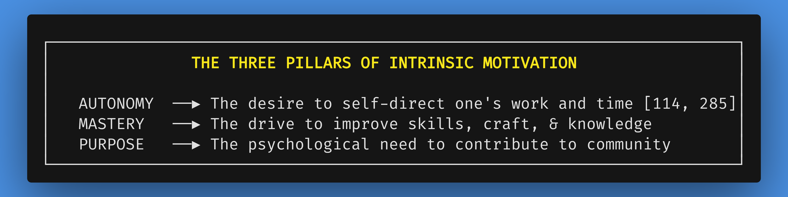
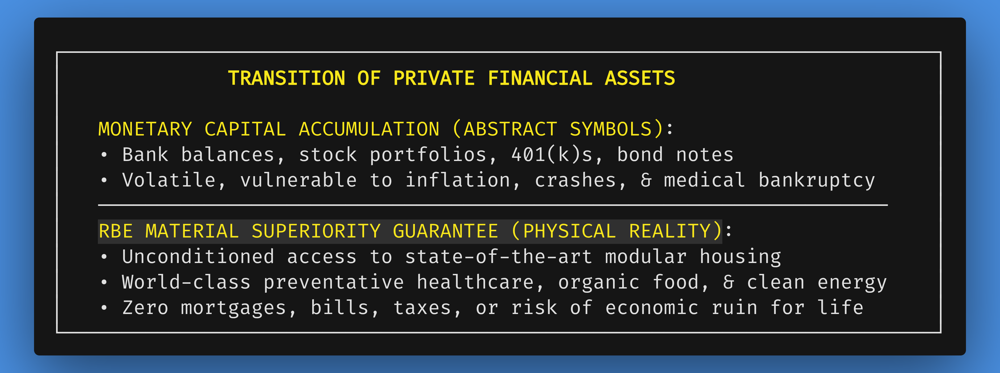
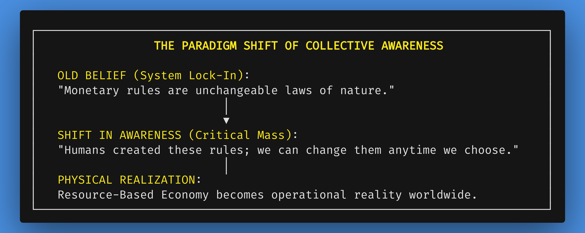
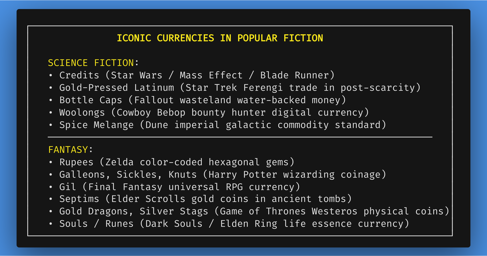
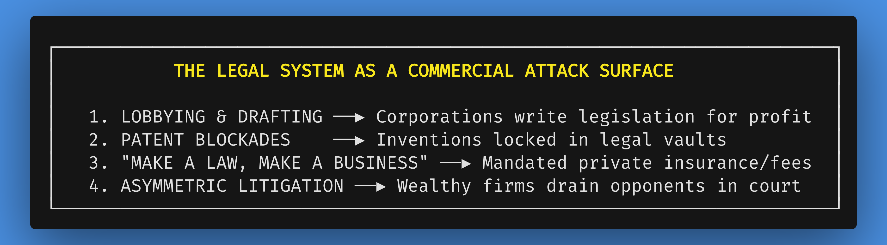
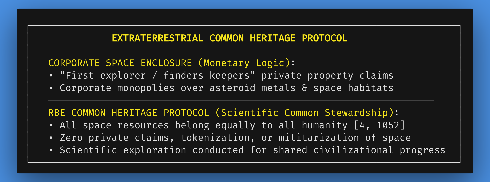
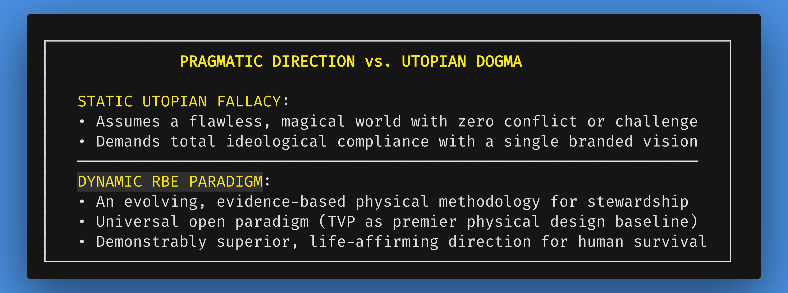

# Chapter 8: Addressing Counter-Arguments, Objections, and Corollary Issues

*Navigation*: **[[chapters/07-core-principles-values-universal-rights-v3|← Chapter 7: Universal Rights]]** | **[[00-Book-Map-of-Content|Map of Content]]** | **[[chapters/09-human-flourishing-dividend-v2|Chapter 9: Human Flourishing →]]**  
*Tags*: #rbe-book #objections-handled #human-nature #legal-system-attack-surface #financial-asset-transition #ideas-change-world #sci-fi-currencies #motivation #space-commons #pragmatic-realism

---

## Dismantling Skepticism through Empirical Rigor and Structural Logic

A paradigm shift as profound as the transition from a debt-based monetary engine to a Resource-Based Economy inevitably confronts deep-seated intellectual skepticism. For generations, citizens, economists, legal scholars, and political theorists have been socialized entirely within the conceptual walls of monetary capitalism. As a result, when presented with a post-monetary, cybernetic alternative, critics raise a series of predictable objections regarding human nature, work incentives, legal order, financial asset transitions, firearms, sci-fi cultural tropes, space resources, national security, and practical logistics.

A truly revolutionary, paradigm-shifting book must not evade these difficult objections; it must meet them directly with **empirical evidence, behavioral science, system dynamics, and water-tight structural logic**.

This chapter systematically addresses the major counter-arguments and corollary issues surrounding an RBE: dismantling the myths of human laziness and greed, revealing the transition strategy for private financial assets, illustrating how ideas change the world when collective awareness shifts the "rules," analyzing sci-fi and fantasy media's failure of imagination regarding money, revealing the legal system as a commercial attack surface, detailing the practical irrelevance of firearms in a post-monetary world, establishing the legal status of extraterrestrial space resources, outlining the peaceful phase-out of standing armies, and distinguishing pragmatic directional realism from utopian silver-bullet fallacies [114, 216, 285, 287, 364, 375, 1052].

### Guided Visualization: The Hall of Objections

*   **Imagine:** You are walking down a quiet, vaulted corridor lined with heavy stone doors. Above each door is carved a major historical objection to human liberation: *"People Are Naturally Lazy," "What Happens to My Savings?", "You Can't Change the System Rules," "Even Sci-Fi Shows Need Money," "The Legal System Keeps Order," "We Need Weapons for Protection," "Space Belongs to the First Explorer,"* and *"An RBE Is Just a Utopian Fantasy."*
*   **Observe:** You open the doors one by one. Inside is not chaos or unworkable idealism, but empirical behavioral science, open-source projects operating at global scale, real-time physical telemetry managing resource loops without price proxies, historical evidence exposing how monetary institutions manufacture the very problems they claim to solve, and the profound realization that humans can change civilizational rules anytime we choose.
*   **Realize:** One by one, the heavy stone doors crumble into dust. The objections were never immutable laws of human nature or unbridgeable engineering barriers; they were psychological symptoms of living in a prison built on artificial scarcity and commercial conditioning.

---

## 8.1 Human Incentives & Motivation: Dismantling the "Human Nature" Myth

### The Fallacy of the Greedy, Lazy Human

The most common objection to a Resource-Based Economy is: *"If people receive housing, food, healthcare, and education free for life, why would anyone work? Won't everyone just sit around and do nothing? Human nature is naturally greedy and selfish."*

This objection rests on two fundamental errors: conflating **human behavior** with **human nature**, and assuming that human motivation requires the whip of monetary starvation or the carrot of financial riches.

Modern behavioral science, neuroscience, and epigenetics conclusively prove that human behavior is profoundly plastic [114, 285]. What is commonly called "human nature" is overwhelmingly a reaction to the social environment. In a monetary system characterized by artificial scarcity, intense wealth inequality, and precarious survival, humans exhibit defensive, greedy, and competitive behaviors because the environment rewards those traits. When you place human beings in an environment built on scarcity and zero-sum competition, claiming that greed is "human nature" is like placing fish in polluted water and claiming that sickness is "fish nature."

### The Invisible Web: Cultural Conditioners of Zero-Sum Rivalry

To understand why people believe human nature is inherently competitive, we must reveal the **invisible web** of cultural conditioning that operates subtly across modern society. 

From early childhood, individuals are immersed in social institutions designed to normalize territorial conquest, rivalry, and zero-sum outcomes:

*   **Competitive Sports as Cultural Conditioners**: Consider the role of spectator sports like American football, rugby, or soccer. At their core, these games condition the populace in the mechanics of occupying territory, capturing points, defending borders, and viewing human interaction as a zero-sum contest where one team's victory *requires* another's defeat. While sports provide physical health and recreation, their cultural dominance reinforces the subconscious belief that society is an arena of competing teams battling for scarce wins.
*   **Classroom Grading and Curved Ranking**: School systems grade children on competitive curves, teaching students to view their peers not as collaborators, but as rivals competing for limited top marks and university admissions.
*   **Corporate Hierarchy & Status Games**: Workplace career ladders force employees to compete against colleagues for promotions, bonuses, and title upgrades, embedding zero-sum rivalry into daily adult existence.

This invisible web conditions people to accept market competition as natural and inevitable, masking the reality that human beings are capable of immense empathy, mutual aid, and voluntary collaboration when freed from artificial scarcity.

---

## 8.2 The Transition Strategy for Private Financial Assets: Banks, Stocks, and Savings

A frequent, anxious objection from citizens in monetary societies is: *"What happens to my hard-earned savings, my retirement 401(k), my stocks, or my property deeds during the transition to an RBE?"*

This fear stems from living in a system where losing financial savings means poverty, homelessness, and starvation. To ease this anxiety, the RBE transition framework utilizes an explicit **Asset Transition Strategy** based on the principle of **Guaranteed Material Superiority**.

### Replacing Symbolic Claims with Physical Abundance

1.  **Symbolic Tokens vs. Real Access**: Money, bank balances, and stock certificates are merely symbolic claims on future material goods and services. People hoard money not because they love paper digits or database entries, but because they fear future insecurity. In an RBE, the symbolic claim is superseded by **direct, guaranteed physical access**.
2.  **Zero-Risk Retirement Security**: In monetary capitalism, a lifetime 401(k) or pension can be wiped out overnight by market crashes, currency inflation, or a single major medical catastrophe. In an RBE, retirement anxiety is eliminated permanently. Every senior adult is guaranteed high-standard housing, gourmet organic dining, advanced healthcare, and community integration without spending a single dollar.
3.  **The Phased Asset Retirement Protocol**: During Phase 1 and Phase 2 transition pathways, private savings are not "confiscated" or "taxed." Rather, as public Resource Centers expand to provide free, high-quality housing, food, energy, healthcare, and zero-emission transit, the purchasing power of money becomes irrelevant. Citizens naturally stop spending savings because everything they need is freely accessible at a far higher standard than commercial markets ever provided. Symbolic savings naturally fade into historical obsolescence as physical abundance renders money useless.

---

## 8.3 Ideas Can Change the World: Collective Awareness and Changing the Rules

A subtle form of cynicism holds that: *"The current economic system is too massive and deeply entrenched; a small group of people cannot change the rules of society."*

History and system dynamics prove the exact opposite: **Civilizational rules are not laws of physics; they are collective social constructs.** Human beings created the rules of feudalism, monarchies, gold standards, and central banking—and human beings can change those rules the moment a critical mass of awareness realizes a superior approach exists.

### The Founding Intent to Overhaul Destructive Systems

When historical framers—such as the American Founding Fathers—wrote that citizens have the inherent right to throw off destructive systems and institute new governance, they recognized that human social contracts must evolve when they no longer serve the people. 

Today, the monetary system is failing all people except the ultra-wealthy elite who hold the highest "net worth." But as citizens realize that money is an artificial rulebook enforcing manufactured scarcity, the spell of monetary necessity dissolves. When a critical mass of humanity understands that a Resource-Based Economy offers a scientifically sound, thermodynamically grounded, and equitable path forward, the shift in belief transforms into physical civilizational reality.

---

## 8.4 Sci-Fi & Fantasy's Failure of Imagination: Iconic Fictional Currencies

It is a fascinating cultural paradox that even our most visionary science fiction authors and fantasy world-builders—capable of imagining faster-than-light warp drives, teleportation, magic spells, and intergalactic empires—frequently suffer from a total **failure of imagination regarding money**.

In story after story, futuristic civilizations with limitless technological leverage or magical power are still depicted as slaving away for physical coins, digital credits, or commercial gold. 

### Breakdown of Iconic Fictional Currencies

1.  **Credits (Star Wars & General Sci-Fi)**: The undisputed default currency of science fiction. In *Star Wars* (Republic or Imperial Credits) and properties like *Mass Effect* and *Blade Runner*, "credits" serve as digital chits, showing that even galaxy-spanning civilizations are assumed to require commercial money.
2.  **Gold-Pressed Latinum (Star Trek)**: In *Star Trek’s* United Federation of Planets, humanity has abandoned money in a post-scarcity economy. However, the writers created the hyper-capitalist Ferengi species who trade in Gold-Pressed Latinum—a rare liquid metal suspended in worthless gold bars—to mirror 20th-century capitalist greed.
3.  **Bottle Caps (Fallout)**: In a post-nuclear apocalypse where advanced technology was destroyed, survivors use Nuka-Cola bottle caps as currency because the technology to counterfeit them was lost in the Great War, backed initially by water merchants.
4.  **Woolongs (Cowboy Bebop)**: Interplanetary digital currency driving the bounty hunter crew of the Bebop, who are perpetually broke and hunting criminals just to afford food and ship fuel.
5.  **Spice Melange (Dune)**: The most valuable commodity in the known universe. Because Spice extends life, unlocks prescience, and enables interstellar navigation, it acts as the ultimate backing standard for galactic feudal wealth.
6.  **Rupees (The Legend of Zelda)**: Brightly colored hexagonal gems serving as Hyrule's currency, with value determined by color (Green = 1, Blue = 5, Red = 20, Gold = 300).
7.  **Galleons, Sickles, and Knuts (Harry Potter)**: The physical coinage of the wizarding world, intentionally parodying pre-decimal British money (29 bronze Knuts = 1 silver Sickle, 17 Sickles = 1 gold Galleon).
8.  **Gil (Final Fantasy)**: The universal currency spanning high-fantasy medieval kingdoms and cyberpunk metropolises in *Final Fantasy*.
9.  **Septims (The Elder Scrolls)**: Gold coins named after Emperor Tiber Septim, littered throughout ancient tombs and bandit camps in Tamriel.
10. **Gold Dragons, Silver Stags, Copper Pennies (Game of Thrones / ASOIAF)**: Highly detailed physical coinage measuring noble wealth and peasant poverty in Westeros.
11. **Souls / Runes (Dark Souls & Elden Ring)**: A dark twist where the life essence of defeated enemies doubles as both currency to buy weapons and experience points to level up.

### Overcoming the Failure of Imagination

This ubiquitous reliance on fictional money reveals how deeply commercial conditioning saturates human culture. Writers use money as an easy narrative shortcut to generate dramatic conflict (debt, poverty, greed, bank heists).

However, *Star Trek’s* portrayal of the Federation stands out as a rare beacon: a post-scarcity society where human beings work not for money or survival, but for self-improvement, scientific discovery, and civilizational advancement. A Resource-Based Economy takes that visionary science fiction concept and grounds it in real-world physical engineering, proving that discarding money is not a fantasy, but a necessary step for human evolution.

---

## 8.5 The Legal System as a Commercial Attack Surface

### Revealing the Puppet Strings of Jurisprudence

Under monetary capitalism, public discourse presents the legal system as an impartial, noble pillar of justice designed to protect citizens, enforce fairness, and punish wrongdoers. 

However, a systemic analysis reveals a far darker reality: **the legal system is a constantly evolving attack surface actively exploited and weaponized by commercial interests** [378, 399].

Because of the intimate, symbiotic relationship between commercial capital and government institutions, the law is not merely exploited through existing loopholes; it is **actively bought, drafted, and shaped with enormous sums of money** to benefit corporate profit margins and protect market monopolies [378].

### Mechanisms of Commercial Legal Exploitation

1.  **"Make a Law, Make a Business"**: Commercial interests routinely lobby governments to enact mandates, regulations, and licensing requirements that create captive consumer markets. From mandatory private automobile insurance and complex tax-filing compliance software to privatized medical certification networks, legislative bodies pass laws that instantly generate multi-billion-dollar private revenue streams.
2.  **Patent Secrecy vs. Open Innovation**: Under the guise of protecting "intellectual property," corporations use patent law to hoard scientific breakthroughs, suppress competing technologies, and block open innovation. Thousands of clean energy patents, medical treatments, and high-efficiency designs are purchased by dominant firms and buried in legal vaults to protect legacy product lines.
3.  **Asymmetric Legal Warfare**: Wealthy corporations utilize armies of specialized corporate attorneys to wage attrition warfare in courtrooms—draining small inventors, local communities, and underfunded public regulatory agencies through endless motions, depositions, and legal fees until opponents surrender.
4.  **Regulatory Capture and Loophole Engineering**: Corporate lobbyists write the very regulatory codes intended to oversee their industries, embedding intentional loopholes, tax shelters, and liability shields that socialize environmental damage while privatizing corporate profits.

In an RBE, because money, private asset accumulation, and commercial profit are eliminated, the legal system as a commercial attack surface vanishes entirely. Public resource allocation is transparent, open-source, and governed by cybernetic physical telemetry rather than manipulative legal codes.

---

## 8.6 Extraterrestrial Resources: Extending Common Heritage to Space

As humanity develops space travel and asteroid mining technology, corporate firms and national powers are attempting to apply colonial "finders keepers" market logic to celestial bodies—claiming private property deeds over lunar ice, Martian soil, and platinum-rich asteroids.

An RBE explicitly rebuts this corporate enclosure: **Asteroids, lunar reserves, Mars, and all extraterrestrial resources are an extension of the Common Heritage of All Humanity** [4, 1052].

Space resources cannot be privately owned, tokenized, or claimed by any corporation or nation. Asteroid mining and space exploration are conducted collectively to supply clean raw materials to global RBE manufacturing ledgers, protecting Earth’s ecosystems while expanding human scientific knowledge [4, 1052].

---

## 8.7 Phasing Out Standing Armies and Militarized Police

In monetary capitalism, nation-states maintain massive standing armies and militarized police forces. Armies exist to secure foreign energy reserves, defend corporate trade routes, and project currency dominance [216, 456]. Police forces exist primarily to protect private property deeds, collect debts, enforce evictions, and manage the symptoms of poverty [399].

In an RBE, as global resources are managed as common heritage under the UN roadmap and property crimes vanish, standing armies and militarized police become obsolete [216, 364, 375, 453]:

*   **Redirection of Military Intellect**: The $2.44 trillion in annual global military expenditure—and the millions of soldiers, engineers, and strategists involved—are redirected toward terraforming deserts, cleaning oceans, building Maglev networks, and exploring space [216, 453].
*   **Community Safety Helpers**: Militarized police are replaced by trained community safety helpers and restorative justice mediators focused on mental health support and peaceful conflict resolution [161].

---

## 8.8 Pragmatic Realism vs. Utopian Dogma: RBE as a Directional Civilizational Upgrade

A final, subtle objection often raised against a Resource-Based Economy is the charge of **utopianism**—the claim that any proposed socio-economic model promising an end to poverty, money, and war must be an impossible, fragile fantasy or a dogmatic ideology tied to a single design school.

### Dismantling the "Utopian Silver-Bullet" Fallacy

This criticism fundamentally mistakes a **direction of travel** for a **static paradise**:

1.  **Evolutionary Direction, Not Static Perfection**: A Resource-Based Economy does not claim to establish a flawless world free of all human conflict, grief, or personal challenges. Rather, it represents a far superior, life-affirming direction for human civilization—replacing an unsustainable monetary mechanics built on debt compounding and artificial scarcity with an evidence-based framework aligned with biophysical limits.
2.  **A Universal Paradigm Beyond Single Organizations**: While pioneered and physically modeled in remarkable architectural detail by social engineer Jacque Fresco and The Venus Project (TVP), RBE is an open, universal paradigm. TVP provides an invaluable real-world physical benchmark and baseline design, but the principles of common heritage, direct unconditioned access, and cybernetic resource allocation belong to all humanity.
3.  **Pragmatic Realism**: An RBE is an evolving, iterative methodology. Just as medical science continuously improves its protocols based on new empirical data without claiming absolute finality, an RBE uses real-time telemetry and scientific consensus to continuously optimize planetary stewardship and human flourishing.

---

## Conclusion: Water-Tight Logic for Civilizational Upgrade

By systematically dismantling every major intellectual objection—from motivation myths and private asset transitions to ideas changing the world, sci-fi currency tropes, legal system attack surfaces, firearms irrelevance, space resource rights, military phase-outs, and utopianism fallacies—this chapter establishes the water-tight logical foundation of a Resource-Based Economy. An RBE is not a fragile idealism; it is a robust, scientifically grounded, and peaceful civilizational upgrade.

---
