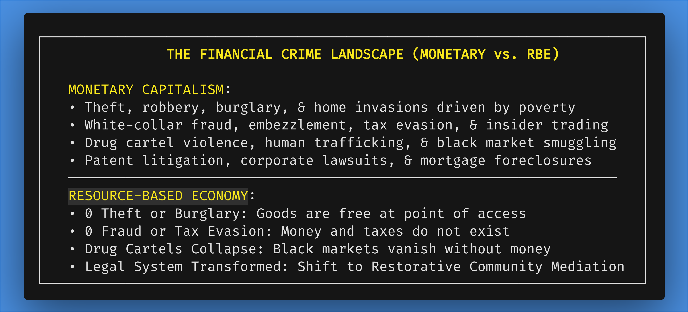
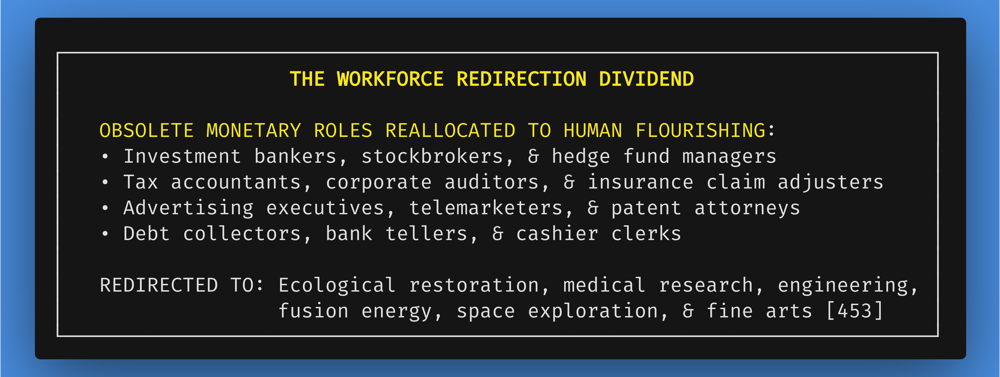
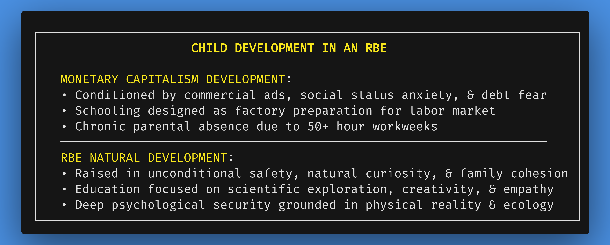
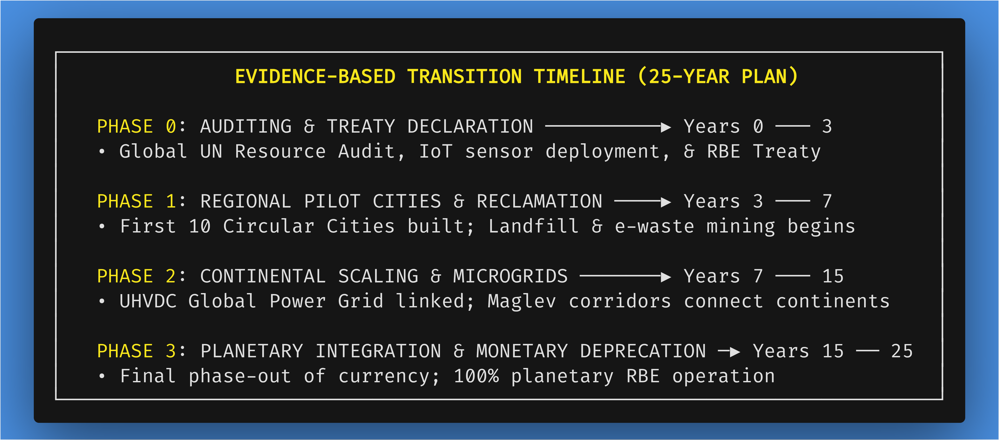

# Chapter 9: The Human Flourishing Dividend: Societal Benefits of RBE

*Navigation*: **[[chapters/08-addressing-counter-arguments-corollary-issues-v7|← Chapter 8: Addressing Objections]]** | **[[00-Book-Map-of-Content|Map of Content]]** | **[[chapters/10-the-psychology-of-identity-v8|Chapter 10: Psychology of Identity →]]**  
*Tags*: #rbe-book #flourishing-dividend #mental-health #education #creative-liberation #corruption-eradication #child-development #science-renaissance #transition-timeline #social-inclusion #special-needs #neurodiversity #education-reimagined #complicated-vs-complex #rube-goldberg

---

## The True Measure of Human Wealth: Unlocking Human Potential

When humanity frees itself from the debt-based monetary trap, the resulting transformation is not merely economic or ecological; it is a profound explosion of **human flourishing**. For centuries, human energy, brilliance, and time have been constrained by the artificial friction of monetary survival.

From a systems architecture perspective, daily life under monetary capitalism is structured as a **monumentally complicated Rube Goldberg machine**. Millions of human lifespans are consumed in friction-generating activities: tracking billing codes, navigating tax shelters, underwriting insurance policies, litigating copyright claims, and managing status anxiety. Society spends immense computational and metabolic energy merely keeping the complicated monetary bureaucracy from collapsing.

Resourceism replaces this artificial administrative friction with an **elegantly complex, living civilizational dividend**.

This chapter presents a comprehensive breakdown of daily life and structural societal transformations in a fully realized Resource-Based Economy. It details the massive societal "dividends" captured when money is abolished: the total eradication of financial crime, the liberation of millions of sharp minds from non-productive paper-pushing, the restoration of global mental health, the dissolution of positional status anxiety, the structural elimination of political corruption, the transformation of child development, the post-monetary renaissance in science and art, adaptive neurodiversity-affirming educational ecosystems, and a realistic 25-year transition timeline.

### Guided Visualization: A Day in a Flourishing World


*   **Imagine:** You wake up in a sunlit residential apartment overlooking a circular urban garden. You hear no traffic roar or honking horns—only birdsong and the soft, subterranean hum of a Maglev transit line.
*   **Observe:** You glance at your schedule. There are no bills awaiting payment, no mortgage notices, and no corporate boss demanding your presence at a soul-crushing job. You spend your morning collaborating with an international team of scientists designing a bio-remediating kelp farm. In the afternoon, you join your daughter at a community creative hub, where she collaborates with a veteran mentor on spatial audio compositions and bio-resin sculptures.
*   **Feel:** A deep, quiet sense of security permeates your chest. You realize that your right to exist, eat, live, and create is no longer conditional on selling your lifespan to an employer or paying interest to a bank. You are experiencing the Human Flourishing Dividend—the birthright of every human being in a Resource-Based Economy.

---

## 9.1 Eradication of Financial Crime and Legal System Transformation

Under monetary capitalism, over **90% of all legal proceedings, law enforcement actions, and criminal offenses** are directly or indirectly linked to money, property disputes, debt collection, or financial desperation [399]:



### How Financial Crime Disappears


1.  **Property Crimes Vanish**: When high-quality housing, food, electronics, transit, and luxury items are unconditionally accessible to all citizens at local hubs, stealing or burglarizing becomes logically absurd. You cannot sell a stolen item because money does not exist, and no one needs to buy second-hand goods when pristine items are freely available.
2.  **White-Collar Crime Eliminated**: Embezzlement, corporate fraud, insider trading, tax evasion, price-fixing, and identity theft cease to exist because there are no bank accounts, tax codes, or financial instruments to manipulate.
3.  **Drug Cartels Collapse**: Black market drug cartels disappear because substance abuse is treated as a health issue rather than an illegal profit industry [399].

### Transformation of the Legal System

Without monetary contracts, debt collection, property titles, or financial crimes, the vast, bloated apparatus of corporate courts, debt collection agencies, and punitive prisons becomes obsolete. Legal infrastructure is replaced by **Restorative Community Mediation Councils**, focusing on conflict resolution, psychological support, and community healing [399].

---

## 9.2 The Workforce Redirection Dividend: Liberating Human Genius

In a monetary economy, millions of the world's sharpest, most creative minds are trapped in "bullshit jobs"—roles that exist solely to manage, enforce, or extract money within the financial matrix:



When money is abolished, these millions of brilliant individuals are liberated from paper-pushing and financial speculation. They are free to redirect their talents toward solving real planetary challenges: curing diseases, engineering clean fusion energy, restoring topsoil, designing circular cities, and composing timeless works of art [453].

---

## 9.3 Mental Health Restoration and Dissolution of Status Anxiety

The psychological toll of monetary capitalism is catastrophic. Millions suffer from chronic burnout, depression, financial anxiety, and sleep deprivation, driven by the constant threat of unemployment, medical bankruptcy, or mortgage default [379, 380].

### Grounding Flourishing in Concrete Physical Infrastructure

In an RBE, mental health is restored not through empty platitudes, but by **eradicating the physical structural drivers of anxiety**:


1.  **Elimination of the 30-Year Mortgage Debt Trap**: Shelter is guaranteed as an unconditioned birthright in Zone 3 residential housing rings. Citizens never face eviction, foreclosure, or rent hikes.
2.  **Unconditioned Biological Security**: High-grade organic nutrition, clean water, renewable energy, and preventative healthcare are supplied free of charge, eliminating the survival panic that triggers chronic cortisol elevation.
3.  **Dissolution of Positional Goods**: Under capitalism, economists identify "positional goods"—luxury items whose value derives solely from excluding others (e.g., $100,000 watches, private jets, gated mansions). Driven by Thorstein Veblen's concept of *conspicuous consumption*, individuals burn immense mental energy trying to signal status over their peers. In an RBE, where access is universal and artificial luxury status symbols do not exist, status shifts from *conspicuous consumption* to *authentic mastery, creative contribution, and community stewardship*.

---

## 9.4 Structural Elimination of Political Corruption

Political corruption is a direct symptom of the monetary system. In market economies, wealthy corporations, lobbyists, and private interest groups use capital to purchase political influence, draft self-serving legislation, and secure lucrative government contracts.

In a Resource-Based Economy, **political corruption is structurally impossible**:


*   **No Money to Bribe Politicians**: Candidates cannot accept campaign donations, PAC funds, or lobbyist gifts because money does not exist.
*   **Transparent Cybernetic Decisions**: Resource allocation is governed by open-source algorithms, IoT sensor data, and transparent DAOs. Politicians cannot divert steel, energy, or housing to private cronies because allocation is publicly audited and algorithmically bound by biophysical carrying capacity.

---

## 9.5 Reimagining Childhood and Family Cohesion

The current monetary paradigm places immense strain on family life. Parents are forced to work long hours, leaving children in commercial daycare facilities, while financial stress contributes to high divorce rates and domestic friction [379].



In an RBE, children grow up in a world whose rules make biological, ecological, and logical sense:


*   **Unconditional Security**: Children never witness eviction notices, medical debt panic, or parental unemployment stress.
*   **Cohesive Family Time**: Parents are free from 60-hour workweeks, allowing families to bond, travel, and explore nature together.
*   **Authentic Education**: Learning is driven by innate curiosity, hands-on scientific projects, and artistic expression rather than standardized testing for corporate employment.

### Intergenerational Apprenticeship & Community Resource Hubs

A cornerstone of human flourishing in an RBE is the restoration of the **Elder Mentorship Network** within neighborhood Hobby Shops, Maker Spaces, and Community Resource Hubs. Under market capitalism, elders are segregated into profit-driven retirement facilities, while youth are confined to age-segregated, standardized classrooms designed for workplace conditioning.

In an RBE, local Resource Hubs function as vibrant centers of intergenerational craftsmanship and tacit knowledge transfer:


*   **The Master Glassblower Case Study**: In a neighborhood fabrication workshop, a 72-year-old master glassblower works alongside a 15-year-old student. Free from commercial deadlines or production quotas, the elder artisan teaches the youth how to feel the thermal viscosity of molten silica, shape precision optics, and master the breath control required for complex glass forms—transmitting half a century of irreplaceable physical intuition that no digital textbook could convey.
*   **The Precision Acoustic Luthier**: An elder master craftsman collaborates with teenagers in the community woodworking lab, crafting specialized acoustic guitars and stringed instruments. Without the need to mass-produce cheap instruments for a consumer market, they spend months carefully tuning resonant soundboards, selecting ethically sourced timber, and teaching the deep patience required for world-class sonic mastery.
*   **The Organic Horticulturist Guild**: Senior botanists and master horticulturists lead neighborhood youth in urban soil remediation and permaculture projects. Together, they test soil microbiology, manage precision vermicomposting bins, and cultivate heritage seed strains in community greenhouses—fostering lifelong ecological stewardship and profound mutual respect across generations.

---

## 9.6 The Post-Monetary Renaissance in Science and Art

Under monetary capitalism, scientific advancement and artistic creation are heavily throttled by commercial friction, corporate profit margins, and academic paywalls.

### Unfettered Open-Source Science


1.  **Elimination of Grant-Writing & Commercial Pressure**: In monetary academia, brilliant researchers spend over **40% of their time writing grant proposals**, begging corporate sponsors for funding, or tailoring research to yield commercially patentable products rather than fundamental breakthroughs. In an RBE, scientific teams access state-of-the-art laboratory equipment, supercomputing clusters, and raw materials directly through research DAOs without grant friction or commercial oversight.
2.  **Removal of Patent Litigation & Academic Paywalls**: Under capitalism, pharmaceutical and technology corporations lock critical discoveries behind patents and academic paywalls ($35–$50 per journal article), blocking competing researchers from building on existing knowledge. In an RBE, science becomes **100% open-source, global, and collaborative**. Every paper, genomic sequence, and engineering blueprint is published immediately to open global ledgers.
3.  **Cures Over Lifelong Treatments**: Financial logic incentivizes pharmaceutical companies to develop lifelong treatments for chronic symptoms rather than permanent, one-time cures—as famously highlighted in Wall Street financial reports questioning whether curing patients is a sustainable business model. In an RBE, researchers focus exclusively on permanent cures, environmental detoxification, and maximum ecological efficiency, rewarded by peer recognition and societal gratitude.

### The Golden Age of Unmonetized Art and Culture

In a monetary system, artists suffer under the "starving artist" archetype, forced to compromise their artistic vision for commercial appeal, navigate copyright lawsuits, or create soul-crushing corporate advertising. 

In a Resource-Based Economy, when housing, food, high-end recording booths, precision bio-printers, spatial audio workstations, and distribution networks are unconditionally free:


*   Artistic creation is liberated from commercial advertising and market algorithms.
*   Creators produce music, literature, sculpture, theater, and cinema for the pure joy of artistic expression, emotional connection, and human mastery.
*   Culture experiences an unprecedented golden age—a post-monetary renaissance where art belongs to everyone and serves as the vibrant heartbeat of civilizational life.

---

## 9.7 Evidence-Based Transition Phase Timelines and Milestone Projections

To prove that a Resource-Based Economy is a practical, engineering-driven roadmap rather than an abstract ideal, we present an evidence-based timeline projection across four distinct implementation phases:



### Milestone Projections


1.  **Phase 0: Global Resource Auditing & Legal Frameworks (Years 0–3)**
    *   *Milestones*: Passage of the UN Universal Common Heritage Treaty; deployment of initial satellite and IoT environmental sensor networks; open-source publication of national material balances.
2.  **Phase 1: Regional Pilot Cities & Material Reclamation (Years 3–7)**
    *   *Milestones*: Construction and operationalization of 10 prototype Circular Cities across diverse climate zones; launch of the Global Material Reclamation Program (reclaiming metals and polymers from landfills); demonstration of zero-mortgage residential housing.
3.  **Phase 2: Continental Scaling & Infrastructure Integration (Years 7–15)**
    *   *Milestones*: Interconnection of continental Ultra-High Voltage Direct Current (UHVDC) clean energy microgrids; conversion of 50% of commercial freight to subterranean Maglev and automated rail; deprecation of regional retail transaction systems in pilot zones.
4.  **Phase 3: Full Planetary Transition & Monetary Deprecation (Years 15–25)**
    *   *Milestones*: Universal global adoption of RBE cybernetic distribution; complete phase-out of monetary currency and central banking; full ecological restoration of degraded biomes.

---

## 9.8 Education Reimagined: From Worker Conditioning to Dynamic Mastery & Neurodivergent Flourishing

Today's legacy education systems were engineered during the Industrial Revolution to produce compliant factory workers and corporate employees—standardizing testing, enforcing rigid schedules, and training youth to fit into the labor market.

### The Factory-Model Pathology vs. Self-Directed Exploration

Under monetary capitalism, education operates on a factory assembly-line model: children are batched by biological birth year, forced into sedentary rows for seven hours a day, and subjected to high-stakes standardized testing designed solely to rank, sort, and certify labor commodities for the job market. 

Within this rigid paradigm, any child who deviates from standard sensory or cognitive norms—students with ADHD, autism, dyslexia, sensory processing sensitivities, or hyper-focused exploratory styles—is pathologized as "defective," labeled with behavioral disorders, or medicated to enforce compliance with industrial classroom discipline.

In a Resource-Based Economy, because human worth is completely decoupled from wage-labor productivity, education undergoes a profound revolution:

```
┌─────────────────────────────────────────────────────────────────────────┐
│        FACTORY-MODEL LABOR CONDITIONING VS. RBE EXPLORATION ECOSYSTEMS  │
├────────────────────────────────────┬────────────────────────────────────┤
│     MONETARY INDUSTRIAL EDUCATION  │     RBE LIFELONG EXPLORATION GUILDS│
├────────────────────────────────────┼────────────────────────────────────┤
│ • Factory assembly batching by age │ • Multi-age, interest-driven guilds│
│   and standardized testing metrics │   and project-based apprenticeships│
│ • Neurodivergence pathologized as   │ • Cognitive diversity celebrated as│
│   a deficit and labor liability    │   essential civilizational richness│
│ • High-stress ranking, grading and │ • Self-paced mastery curves and    │
│   tuition debt gatekeeping         │   unrestricted lifetime access     │
│ • Rigid, sedentary environments    │ • Dynamic, sensory-tuned habitats  │
│   enforcing corporate obedience    │   with immersive simulation labs   │
└────────────────────────────────────┴────────────────────────────────────┘
```


1.  **Multi-Age Exploration Guilds & Hands-On Problem Solving**: Children and adults learn science, ecology, and engineering not from dry textbooks, but by working on real-world projects in local circular cities, vertical farming towers, marine biology sanctuaries, and robotics labs alongside elder mentors.
2.  **Sensory-Tuned Learning Ecosystems**: Educational sanctuaries integrate flexible acoustic dampening, dynamic circadian lighting, tactile maker labs, and peaceful decompression zones. Students move freely, choose their physical learning posture, and engage through multiple sensory modalities (interactive 3D holographic simulations, kinetic physical assembly, auditory storytelling, and deep nature immersion).
3.  **Celebrating Neurodivergent Cognitive Strengths**: Neurodivergent minds are recognized as vital evolutionary assets. An autistic youth with profound hyper-focus and spatial visualization skills is not forced into generic rote memorization; they are supported in advanced computational geometry or ecological systems modeling. A child with boundless kinetic energy is engaged in active agroforestry or kinetic engineering projects.
4.  **Critical Thinking, Ethics, and Lifelong Zero-Tuition Access**: Education focuses on scientific methodology, system dynamics, emotional intelligence, and philosophical inquiry. Research facilities, universities, and technical workshops remain open to citizens of all ages for their entire lives without tuition, application fees, or financial gatekeeping.

---

## Conclusion: The Golden Age of Human Capability

The Human Flourishing Dividend proves that an RBE is not a compromise or a sacrifice. It is the golden age of human capability—a civilization where crime is obsolete, work is meaningful, mental health is restored, political corruption is structurally impossible, science and art undergo an unprecedented post-monetary renaissance, every neurodivergent mind and differently-abled individual is celebrated, and every child is born into a world of limitless opportunity and biological security.

Yet to fully inhabit this flourishing world, humanity must address its most intimate internal barrier: *How do we deconstruct centuries of market conditioning that tied human self-worth to job titles, cosmetic perfection, and financial net worth? How does personal consciousness evolve to match our upgraded physical infrastructure?*

In Chapter 10, we turn inward to explore: **The Psychology of Identity: Deconstructing the Market Self**, mapping the transition from external status anxiety to intrinsic motivation, intergenerational elder wisdom, and cosmic humility.

---
