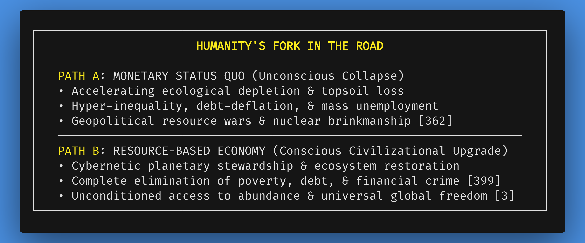
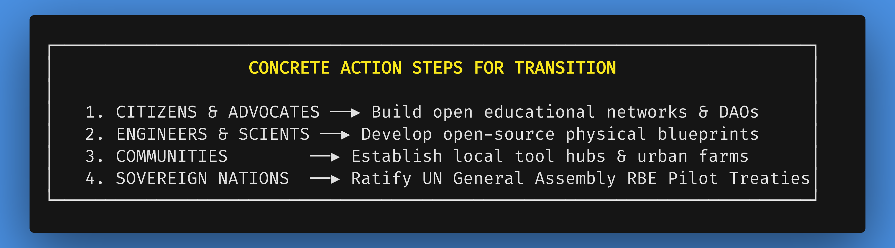

# Chapter 11: Mobilizing the Transition: A Call to Action for Global Citizenry

*Navigation*: **[[chapters/10-the-psychology-of-identity-v6|← Chapter 10: Psychology of Identity]]** | **[[00-Book-Map-of-Content|Map of Content]]** | **[[references/thematic-pillars-and-style-guide|Thematic Pillars Guide]]**  
*Tags*: #rbe-book #call-to-action #planetary-stewardship #future-heritage #pragmatic-realism #civilizational-upgrade #civilizational-architect #capstone #epilogue

---

## The Threshold of a New Epoch: Channeling Psychological Liberation into Action

We stand at a monumental civilizational threshold. Having systematically dismantled the debt-based monetary engine and forged the internal operating system of post-monetary identity in Chapter 10, we now channel this internal psychological liberation into the ultimate, active capstone of this book: **a pragmatic call to action for global citizenry.**

The conclusions established across the 11 chapters of this blueprint are inescapable:

1.  **The Monetary System is Incurably Terminal**: A debt-based monetary engine requiring 3% compound annual growth on a finite planet is a physical impossibility. It guarantees accelerating ecological collapse, wealth hyper-concentration, mental health epidemics, and social friction [379, 380, 1060].
2.  **Abundance is Physically Attainable**: Modern technology, automation, Big Data, IoT telemetry, and AI companions give humanity the physical capability to provide high-standard housing, organic food, healthcare, clean transit, and education to every human being on Earth free of charge—when freed from monetary constraints [4, 5, 270, 360].
3.  **The UN Pathway Provides a Peaceful Transition**: A voluntary, multi-phased diplomatic roadmap facilitated by the United Nations system under General Assembly Article 109—starting with parallel localized pilot zones—prevents geopolitical panic, nuclear brinkmanship, and economic chaos [233-237, 362, 450].
4.  **RBE as an Open, Universal Direction**: While pioneered and physically modeled in remarkable architectural detail by social engineer Jacque Fresco and The Venus Project, a Resource-Based Economy is a universal, open human paradigm. It is not an inflexible utopian dogma, but an evolving, evidence-based methodology that represents a demonstrably superior, life-affirming direction for human civilization.
5.  **Internal Consciousness Fuels External Action**: As established in Chapter 10, internal psychological liberation—deconstructing the market ego, restoring elder wisdom, and embracing cosmic humility—is the direct fuel that propels humanity out of learned helplessness into physical civilizational mobilization.

This capstone chapter outlines the concrete steps individuals, engineers, scientists, communities, and sovereign nations must take to ignite the physical transition toward a Resource-Based Economy [4, 6, 377, 455].

### Guided Visualization: The Horizon of Choice

*   **Imagine:** You stand on a high mountain ridge at dawn. To your left, looking back, lies the smoke, noise, and friction of the legacy monetary world—a sprawling landscape of debt stress, crumbling infrastructure, commercial predation, military competition, and ecological decay.
*   **Look to your right:** Ahead of you lies a sunlit valley—a circular, zero-emission city nestled in vibrant forest gardens. Maglev transit lines quietly glide across the landscape, powered by desert solar and geothermal arrays. People walk without fear, collaborate without money, create without artificial limits, and live with grounded cosmic humility.
*   **Feel:** The ridge on which you stand is the present moment. We cannot remain standing on the ridge forever. The road behind leads off a cliff of biospheric collapse; the road ahead leads to the golden age of human capability. The internal transformation in Chapter 10 has given us the strength to step forward. The choice is ours to make.

---

## 11.1 The Choice Before Humanity: Collapse vs. Conscious Evolution

Humanity is the first species on Earth capable of consciously directing its own evolution. We possess the scientific understanding to model planetary systems and the engineering capability to automate abundance.

We face a stark binary choice [4, 377, 455]:

Continuing down Path A is an act of collective suicide driven by ideological habit. Choosing Path B is an act of conscious civilizational courage—claiming our shared heritage as stewards of planet Earth.

---

## 11.2 Concrete Steps Across Four Civilizational Tiers

The transition to a Resource-Based Economy does not wait for traditional political parties; it begins through organized, open-source human action [377, 455].

### 1. For Individual Citizens and Advocates

*   **Shift the Cultural Narrative**: Educate family, friends, and community members regarding the structural mechanics of money creation and the physical reality of an RBE. Help dismantle the myths that poverty and greed are human nature [114, 379].
*   **Form Local Action DAOs**: Organize community groups focused on non-monetary resource sharing, local food security, and open-source education.

### 2. For Engineers, Scientists, and Technologists

*   **Build Open-Source Hardware & Software**: Dedicate creative time to developing open-source hardware blueprints—modular solar arrays, open medical devices, automated vertical farming pods, and circular building designs.
*   **Develop Cybernetic Accounting Tools**: Contribute code to permissionless, zero-trust hardware oracle networks, IoT telemetry platforms, and quadratic voting DAO interfaces [237, 373].

### 3. For Local Communities and Municipalities

*   **Establish Resource Hubs**: Convert vacant public buildings into automated Community Fabrication & Resource Hubs, replacing consumer purchasing with shared tool access.
*   **Develop Urban Agriculture**: Transform idle public land into solar-powered hydroponic farming hubs, distributing fresh produce free to residents [399].

### 4. For Sovereign Nations and Diplomatic Leaders

*   **Sponsor UN General Assembly Resolutions**: Draft and sponsor UN General Assembly resolutions authorizing Phase 1 RBE Pilot Zones under UNEP and UNCTAD supervision under Article 109 [233, 235, 451].
*   **Designate National Pilot Lands**: Allocate economically depressed or post-industrial territories for Phase 1 living laboratories, immediately relieving welfare budgets and proving the RBE model [235, 360, 371].

---

## 11.3 Identity in Action: Stepping into the Role of Civilizational Architect

Taking active part in these transition steps reframes how an individual experiences their personal role in history.

In the monetary paradigm, individuals are conditioned to feel helpless—mere passive observers of macroeconomic forces, stock crashes, and political corruption. This learned helplessness breeds cynicism, apathy, and existential despair.

When an individual engages in open-source RBE case-building, local resource hub creation, or cybernetic software engineering, their personal identity undergoes an immediate upgrade. They step into the identity of a **Civilizational Architect**. No longer begging politicians or corporations for superficial policy concessions, they become active builders of the post-monetary future—discovering deep personal meaning in aligning their finite lifespan with the liberation of human civilization.

---

## 11.4 Synthesis: The Arc of Human Transformation Across the RBE Paradigm

---

## Epilogue: The Horizon Beyond Money

The journey through these eleven chapters has laid bare a fundamental truth: **The challenges confronting human civilization are not rooted in technical incapacity or biophysical scarcity, but in an obsolete economic operating system.**

We possess the technology, the resources, the communication networks, and the scientific understanding to construct a world of unprecedented abundance, safety, and human flourishing. What has been lacking—until now—is a coherent, realistic, and non-violent transition pathway capable of bridging our current financial reality with the world that must succeed it.

Chapters 3 through 6 provided the structural roadmap: convening UN Special Assemblies under Charter Article 109, establishing Special Economic Pilot Zones insulated from debt math, deploying Zero-Knowledge Cryptographic Auditing and cybernetic inventory accounting, and allowing the legacy monetary engine to quietly die from attrition as the superior non-monetary model scales worldwide.

Chapter 10 provided the internal psychological operating system: releasing the market ego, restoring the elder bridge, and grounding human consciousness in cosmic humility and intrinsic motivation.

Now, in this final capstone moment, the ultimate responsibility rests upon our collective willingness to act.

When you put down this book, look around your world not with despair, but with the clear, high-agency vision of a civilizational architect. Recognize that the social structures, economic rules, and financial barriers that constrain our lives are merely temporary human constructs. They exist only so long as we choose to give them our consent.

We are not victims trapped on a runaway train of economic destruction. We are the stewards of an extraordinary, living planet—a rare oasis of conscious life drifting through an unfathomable universe. We possess the intelligence to design our own tools, the wisdom to honor our biosphere, and the capacity to love one another enough to guarantee every child a birthright of unconditional safety and dignity.

The blueprints are complete. The transition pathway is clear. The legacy system is fracturing under its own mathematical contradictions. 

The door to a Resource-Based Economy stands open. Step through it, and let us build the world that lies *Beyond Money*.

---
